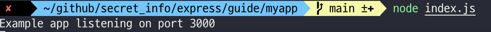

> [https://expressjs.com/en/starter/hello-world.html](https://expressjs.com/en/starter/hello-world.html)
{: .prompt-tip }

adflkajsdflkajsdlfkajsdflkj asdflkasdj flaksjdfl kj 

# Hello world 예제

> 아래에 포함되어 있는 것은 당신이 만들수 있는 가장 단순한 Express App입니다. 이는 단일 파일 앱입니다. 다양한 목적을 위한 수많은 js파일, jade 템플릿 및 하위 디렉토리가 포함된 전체 앱의 스캐폴딩을 생성하는 Express generator를 사용해서 얻을 수 있는것들이 아닙니다. 
>
> 😈 express generator 참고 : https://expressjs.com/en/starter/generator.html
>
> 😈 jade는 node.js용으로 만들어진 view 템플릿 엔진 ( 나중에 jade syntax 참조해봐야 할듯... )
>
> 😈 템플릿 엔진이란 동적인 파일과 정적인 파일의 장단점을 결합한 새로운 체계라고 한다. 
>
> 😈 스캐폴딩은 지지대, 뼈대 등으로 해석하면 될듯하다. 아래 참고 링크에 설명이 잘 되어있다.
>
> - [[방법론]Scaffolding 스케폴딩](https://yoonjong-park.tistory.com/entry/%EB%B0%A9%EB%B2%95%EB%A1%A0-Scaffolding-%EC%8A%A4%EC%BC%80%ED%8F%B4%EB%94%A9)
>
> - [스캐폴딩 코드(Scaffolding Code) 란 무엇인가 ?](https://snupi.tistory.com/61)


```javascript
const express = require('express')
const app = express()
const port = 3000

app.get('/', (req, res) => {
  res.send('Hello World!')
})

app.listen(port, () => {
  console.log(`Example app listening on port ${port}`)
})
```


이 앱(생성한 프로젝트 자체가 앱이다.)은 서버를 시작하고, 3000번 포트에서 연결을 위해 수신합니다. 이 앱은 루트 URL(`/`) 또는 경로에 대한 요청의 경우 "Hello World!"를 응답합니다. 그리고 다른 모든 경로의 경우 404 Not Found를 응답합니다. 

> 정의해둔 URL path가 없는 순수 초기 앱 그대로이기 때문에 404가 return


위의 예는 실제로 작동하는 서버입니다. 계속해서 표시된 URL을 클릭하세요. 페이지에서 실시간 로그가 포함되어있는 응답을 받게되고, 변경사항이 실시간으로 반영됩니다. 이는 웹 브라우저에서 실행되는 완전한 노드 환경에 연결된 대화형 javascript 플레이그라운드를 제공하는 RunKit에 의해 구동됩니다. 다음은 로컬에서 동일한 앱을 실행하기 위한 가이드입니다. 

> RunKit


# 로컬에서 실행하기 

> RunKit이 아닌 내 컴에서 직접 실행시켜보기

첫번째로 `myapp`이라고 이름 붙여진 디렉토리를 만들고, 해당 경로로 간다음 `npm init`을 수행한다. 그리고나면, 의존성으로서 `express`를 설치하세요.


`myapp` 디렉토리 안에, `app.js`라는 이름의 파일을 생성하고, 위의 예제 코드를 복사 붙여넣기 합니다. 


>`req(Request)`와 `res(Response)`는 Node가 제공하는 것과 정확히 동일한 객체이므로, `req.pipe()`, `req.on('data', callback)`을 호출할 수 있고 Express없이 수행할 수 있는 모든 것들은 호출할 수 있습니다.


다음 명령을 사용하여 앱을 실행합니다.

> 초기에 `npm init`과 `npm install express`을 수행해도 `index.js`,  `app.js`가 없다면 직접 만들고 위의 기본 소스를 추가한 뒤 아래 명령어를 실행하면 된다. 
>
> 🚨 package.json을 보면 애플리케이션의 메인 파일이 무엇인지 확인 할수 있으니, 그것을 확인하고 아래 명령어를 수행하면 됨

```shell
# app.js 혹은 index.js
$ node app.js
```


그리고나면, 그 결과물을 보기위해 브라우저에서 `http://localhost:3000/`을 불러오세요.




