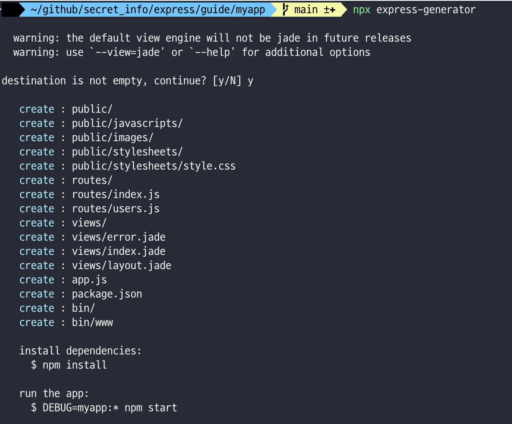
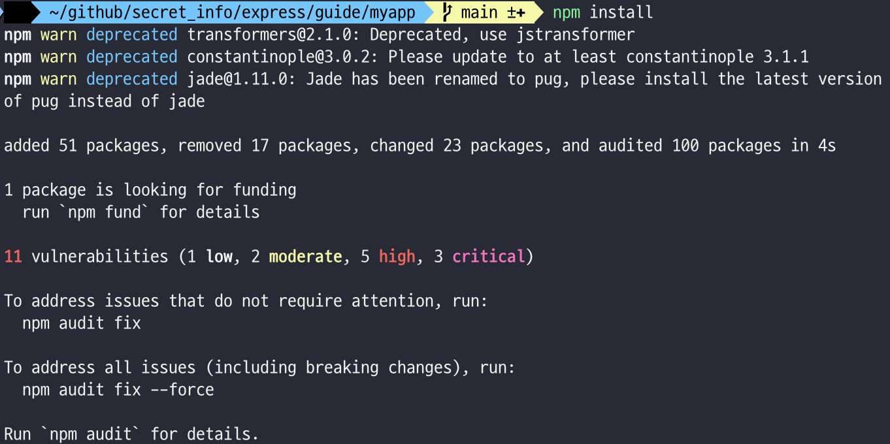
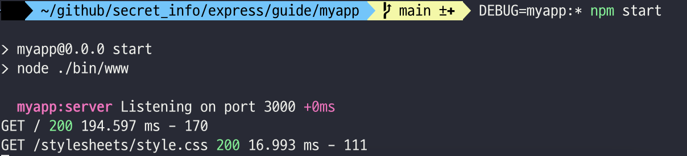
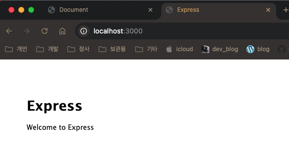

> [https://expressjs.com/en/starter/generator.html](https://expressjs.com/en/starter/generator.html)
{: .prompt-tip }


# Express 앱 생성기

만드려는 애플리케이션의 뼈대를 빠르게 작성하기 위해서 `express-generator` 애플리케이션 생성기를 사용하세요(이게 편하다).

> 지금까지 써본 거의 모든 프레임워크에 generator가 있었다(없는게 없는거 같다). 개발자가 불필요하게 디렉토리 구성을 할 필요 없이 각각의 표준에 맞는 뼈대를 만들어준다. 


`npx` 커맨드 ( Node.js 8.2.0 ~ 이용가능 ) 로 초기 프로젝트를 생성할 수 있다. 

```shell			
# 🚨 본인 프로젝트 경로 안에서 하세요~
$ npx express-generator
```




이전 Node 버전인 경우 애플리케이션 생성기를 전역 npm 패키지로 설치한 후 위의 명령어를 실행한다. 

```shell
$ npm install -g express-generator
$ express
```


`-h`옵션을 사용해서 명령어에 사용할 수 있는 옵션을 표시할 수 있다. 

```shell
$ express -h

  Usage: express [options] [dir]

  Options:

    -h, --help          output usage information
        --version       output the version number
    -e, --ejs           add ejs engine support
        --hbs           add handlebars engine support
        --pug           add pug engine support
    -H, --hogan         add hogan.js engine support
        --no-view       generate without view engine
    -v, --view <engine> add view <engine> support (ejs|hbs|hjs|jade|pug|twig|vash) (defaults to jade)
    -c, --css <engine>  add stylesheet <engine> support (less|stylus|compass|sass) (defaults to plain css)
        --git           add .gitignore
    -f, --force         force on non-empty directory
```


예를 들어, `myapp`이라는 Express 앱을 만들게되면, 앱은 현재 위치한 작업 디렉토리의 `myapp`이라는 폴더 이름으로 생성되고 뷰 엔진은 `Pug`로 설정됩니다. 

```shell
$ express --view=pug myapp

   create : myapp
   create : myapp/package.json
   create : myapp/app.js
   create : myapp/public
   create : myapp/public/javascripts
   create : myapp/public/images
   create : myapp/routes
   create : myapp/routes/index.js
   create : myapp/routes/users.js
   create : myapp/public/stylesheets
   create : myapp/public/stylesheets/style.css
   create : myapp/views
   create : myapp/views/index.pug
   create : myapp/views/layout.pug
   create : myapp/views/error.pug
   create : myapp/bin
   create : myapp/bin/www
```


그리고나서 종속성을 설치합니다. 

> 종속성, 의존성 모두 package.json에 명시되어있는 dependency list를 의미하고, `npm install`명령어로 설치할 수 있다. 

```shell
$ cd myapp
$ npm install
```




MacOS나 Linux에서는 다음 명령으로 앱을 실행합니다.

```shell
$ DEBUG=myapp:* npm start
```




윈도우 명령 프롬프트에서는 다음 명령을 사용합니다.

```shell
> set DEBUG=myapp:* & npm start
```


윈도우 powershell에서는 다음 명령을 사용합니다.

```shell
PS> $env:DEBUG='myapp:*'; npm start
```


그런 다음 브라우저에서 `http://localhost:3000/`을 입력하고 엔터! ( 앱에 액세스, 잘 뜬다! )




생성된 앱의 디렉터리 구조는 다음과 같습니다. 

> 제공해준 generator를 사용하면 이와 같이 편리하게 프로젝트를 구성할 수 있다.

```shell
.
├── app.js
├── bin
│   └── www
├── package.json
├── public
│   ├── images
│   ├── javascripts
│   └── stylesheets
│       └── style.css
├── routes
│   ├── index.js
│   └── users.js
└── views
    ├── error.pug
    ├── index.pug
    └── layout.pug

7 directories, 9 files
```


생성기에 의해 만들어진 앱의 구조(폴더, 파일 구조 모두 해당)는 Express앱을 구성하는 여러 방법중의 하나 일뿐입니다. 이 구조를 자유롭게 사용하거나 필요에 맞게 수정하십시오.
