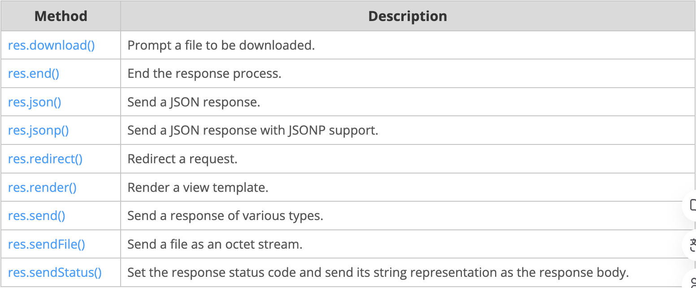

> [https://expressjs.com/en/guide/routing.html](https://expressjs.com/en/guide/routing.html)
{: .prompt-tip }


# Routing

라우팅은 애플리케이션의 엔드포인트가(URI) 클라이언트의 요청에 응답하는 방식을 나타냅니다. 라우팅에 대한 소개는 [기본 라우팅](https://bitnalchan92.github.io/posts/Express-%EA%B3%B5%EC%8B%9D%EB%AC%B8%EC%84%9C-4.-Getting-started(Basic-routing)/)을 참고!


HTTP 메서드에 해당하는 Express `app`객체의 메서드를 사용하여 라우팅을 정의합니다. 예를 들어 `app.get()`은 GET 요청을 처리하고 `app.post()`는 POST요청을 처리합니다. 전체 목록은 app.METHOD를 참조! app.all을 사용해서 모든 라HTTP를 처리하고 app.use를 사용해서 미들웨어를 콜백함수로 지정할 수 있음 ( 자세한 내용은 미들웨어 사용을 참조하세요 )

> 미들웨어는 Nestjs에서 사용해본적 있는데, 다음 포스팅에서 깊게 살펴보기로 하고, 쉽게 말해서 단어 그대로 "중간처리자"역할을 하는 함수정도로 생각하면 될듯하다. 어떤 요청에 응답하기 전 이 요청에 대해 검증을 해야할 부분이 있다면 그 부분에 미들웨어를 적용했던 적이 있다.


이러한 라우팅 방법은 애플리케이션이 지정된 경로(엔드포인트) 및 HTTP메서드에 대한 요청을 수신할 때 호출되는 콜백 함수("핸들러 함수"라고도 함)를 지정합니다. 즉, 애플리케이션은 지정된 경로 및 메서드와 일치하는 요청을 "수신"하고 일치 항목을 감지하면 지정된 콜백 함수(핸들러)를 호출합니다.


실제로 라우팅 메서드는 둘 이상의 콜백 함수를 인수로 가질 수 있습니다. 여러 콜백 함수를 사용하는 경우 콜백 함수에 대한 인수로 `next`를 제공한 다음 함수 본문 내에서 `next()`를 호출하여 제어권을 다음 콜백에 넘겨주는 것이 중요합니다.


다음 코드는 매우 기본적인 경로의 예입니다.

```javascript
const express = require('express')
const app = express()

// 홈페이지('/')에 대한 GET 요청이 들어오면 "hello world"를 응답합니다.
app.get('/', (req, res) => {
  res.send('hello world')
})
```


## Route methods

route method는 HTTP 메서드 중 하나에서 파생되며 `express` 클래스의 인스턴스에 연결됩니다. 


다음 코드는 애플리케이션 루트( = 홈페이지에 대한 Request )에 대한 GET 및 POST 메서드에 대해서 정의한 경로의 예제입니다.

```javascript
// GET method route
app.get('/', (req, res) => {
  res.send('GET request to the homepage')
})

// POST method route
app.post('/', (req, res) => {
  res.send('POST request to the homepage')
})
```


Express는 모든 HTTP 요청 메소드( `get` , `post` 등)에 해당하는 메소드를 지원합니다. 전체 목록은 [app.METHOD](https://expressjs.com/en/4x/api.html#app.METHOD) 를 참조하세요.


모든 HTTP 요청 메서드의 경로에 대해서 미들웨어로서의 역할을 할 수 있는 특수 Routing Method인 `app.all()`이 있습니다. 예를 들어서, `GET`, `POST`, `PUT`, `DELETE`또는 http 모듈에서 지원되는 기타 HTTP 요청 방법을 사용하는지 여부에 관계없이 `/secret`경로에 대한 요청에 대해서 다음 핸들러가 실행됩니다.

```javascript
app.all('/secret', (req, res, next) => {
  console.log('Accessing the secret section ...')
  next() // pass controll to the next handler 다음 핸들러에게 통제권을 넘겨줘야 한다. 위의 설명 참고!
})
```


## Route paths

요청 방법(Request Method)와 함께 Route 경로(Route paths)는 요청이 이루어질수 있는 엔드포인트를 정의합니다. ( 두개가 결합되어 하나의 엔드포인트가 됨). 경로는 문자열, 문자열패턴 또는 정규표현식일 수 있습니다. 


`?` , `+` , `*` 및 `()` 문자는 해당 정규 표현식의 하위 집합입니다. 하이픈(`-`)과 점(`.`)은 문자열 기반 경로에 의해 문자 그대로 해석됩니다.


만일 path에 달러문자(`$`)를 사용해야 한다면 `([` `])`내에 이스케이프 처리하여 묶습니다. 예를 들어, `/data/$book`의 요청인 경우 path는 `/data/([\$])book`이 됩니다.


> Express는 Route path를 매칭하기 위해 [path-to-regexp](https://www.npmjs.com/package/path-to-regexp)를 사용합니다. 가능한 모든 경로에 대한 것들은 문서를 확인하세요. [Express Route Tester](https://forbeslindesay.github.io/express-route-tester/)는 패턴 일치를 지원하지 않지만 기본 Express 경로를 테스트하는 데 편리한 도구입니다.


> 쿼리 문자열은 Route path의 일부가 아닙니다.


다음은 문자열을 기반으로 하는 Route path의 몇가지 예입니다.


이 Route path는 요청을 루트 경로(`/`)와 일치시킵니다.

```javascript
app.get('/', (req, res) => {
  res.send('root')
})
```


이 Route path는 요청을 루트 경로(`/about`)와 일치시킵니다.

```javascript
app.get('/about', (req, res) => {
  res.send('about')
})
```


이 Route path는 요청을 `/random.text` 과 일치시킵니다.

```javascript
app.get('/random.text', (req, res) => {
  res.send('random.text')
})
```


다음은 문자열 패턴을 기반으로하는 Route path의 몇가지 예제 입니다.


이 Route path는 `acd`, `abcd`와 일치합니다.

```javascript
// b? 이기 때문에 b는 있을수도 있고 없을수도 있다.
app.get('/ab?cd', (req, res) => {
  res.send('ab?cd')
})
```


이 Route path는 `abcd`, `abbcd`, `abbbcd`등과 일치합니다.

```javascript
// b+ 는 b가 1개 이상부터 여러개까지 올 수 있다. 
app.get('/ab+cd', (req, res) => {
  res.send('ab+cd')
})
```


이 경로는 `abcd`, `abxcd`, `abRANDOMcd`, `ab123cd`등과 일치합니다.

```javascript
app.get('/ab*cd', (req, res) => {
  res.send('ab*cd')
})
```


이 경로는 `/abe`, `/abcde`와 일치합니다.

```javascript
app.get('/ab(cd)?e', (req, res) => {
  res.send('ab(cd)?e')
})
```


정규식을 기반으로한 Route path의 예들...


이 Route path는 "a"가 포함된 모든 항목들과 일치합니다.

```javascript
app.get(/a/, (req, res) => {
  res.send('/a/')
})
```


이 Route path는 `butterfly`, `dragonfly`와 일치하지만, `butterflyman`, `dragonflyman`등과는 일치하지 않습니다.

```javascript
app.get(/.*fly$/, (req, res) => {
  res.send('/.*fly$/')
})
```


## Route parameters

Route parameters는 URL의 해당 위치에 지정된 값을 캡쳐하는데 사용되는 명명된 URL segment입니다. 캡쳐된 값은 해당 키로 경로에 지정된 route parameter의 이름으로 `req.params`개체에 채워집니다.

>✨ route path에 `:userId`와 `:bookId`라는 이름으로 정의해 두었기 때문에, Request 객체의 params를 확인해 보면 그와 동일한 이름으로 값이 들어가 있는 것을 확인할 수 있다. 
>
>
>
>Route path : /users/:userId/books/:bookId
>
>Request URL : http://localhost:3000/users/34/books/8989
>
>req.params : { "userId": "34", "bookId": "8989" }


Route parameters를 사용해서 Route를 정의하기 위해서는, 아래와 같이 Route path에 Route parameter를 지정하기만 하면됩니다.

> 일을 처음 시작할때 URL에 포함되어있는, `query string`과 `query parameter`를 헤깔렸는데, 이 설명을 잘 이해하고 넘어가면 그럴일이 없었을 것 같다. ( 당시에 나는 express가이드를 보지 않고, 바로 nest.js에 관한 책을 한 권 보고 시작했다. 지금 다시한번 돌아보니 조금더 이해가 잘 되는 것 같다. )

```javascript
app.get('/users/:userId/books/:bookId', (req, res) => {
  res.send(req.params) // 🚨 req.params에 넘어온 값을 가지고 db의 조회값으로 사용하는 등... 처리할 수 있다. 
})
```


> Route parameter의 이름은 "단어 문자"([A-Za-z0-9_])로 구성되어야 합니다.


하이픈(`-`)과 점(`.`)은 문자 그대로 해석되므로 유용한 목적으로 경로 매개변수와 함께 사용할 수 있습니다.

>Route path : /flights/:from-:to
>
>Request URL : http://localhost:3000/flights/LAX-SF0
>
>req.params : {"from": "LAX", "to": "SF0" }

>Route path : /plantae/:genus.:species
>
>Request URL : http://localhost:3000/plantae/Prunus.persica
>
>req.params : {"genus": "Prunus", "species": "persica"}


Route parameters와 일치할 수 있는 더 정확한 문자열을 효과적으로 제어하려면 `( )`안에 정규식을 추가하면 됩니다.

>Route path : /user/:userId(\d+)
>
>Request URL : http://localhost:3000/user/42
>
>req.params: {"userId": "42"}


> 정규식은 일반적으로 리터럴 문자열의 일부이므로 추가 백슬래시를 사용하여 `\` 문자를 이스케이프해야 합니다(예: `\\d+` ).


> Express 4.x에서 정규식의 `*` 문자는 일반적인 방식으로 해석되지 않습니다. 해결 방법으로 `*` 대신 `{0,}`을 사용하세요. 이 문제는 Express 5에서 수정될 것 같습니다.
>
> 🚨 정규식을 사용해서 Route parameter를 처리한 적이 난 없는데, 나중에 일하다가 보게 되면 이부분을 다시 훑어보면 될 것 같다. 


## Route handlers

요청을 처리하기 위해서, [미들웨어](https://expressjs.com/en/guide/using-middleware.html)처럼 작동하는 여러가지 콜백 함수를 제공할 수 있습니다. 유일한 예외는 이러한 콜백이 나머지 경로의 콜백을 우회하기 위해 `next('route')`를 호출할 수 있다는 것입니다. 이 메커니즘을 사용하여 특정 경로에 사전에 필요한 조건들을 적용한 다음에 현재 경로(route)를 진행할 이유가 없다면 다음(후속)경로로 제어를 전달할 수 있습니다.


Route handlers는 다음 예제와 같이, 함수 배열 또는 두 가지의 조합 형태일 수 있습니다.


단일 콜백 함수로는 Route를 아래와 같이 처리할 수 있습니다. 예를 들어...

```javascript
app.get('/example/a', (req, res) => {
  res.send('Hello from A!')
})
```


둘 이상의 콜백 함수가 특정 Route를 처리할 수 있습니다.(`next` 객체를 명시해야 합니다!) 예를 들어...

```javascript
app.get('/example/b', (req, res, next) => {
  console.log('다음 function에 의해 응답은 전송될 것입니다~')
  next()
}, (req, res) => {
  res.send('Hello From B!!!')
})
```


콜백 함수의 배열로 처리할 수도 있습니다. 예를 들어...

```javascript
const callback0 = function (req, res, next) {
  console.log('CB0')
  next()
}

const callback1 = function (req, res, next) {
  console.log('CB1')
  next()
}

const callback2 = function (req, res) {
  res.send('Hello From C!!!')
}

app.get('/example/c', [callback0, callback1, callback2])
```


독립적인 함수들과 함수 배열의 조합으로도 처리할 수 있습니다. 예를 들어...

```javascript
const callback0 = function (req, res, next) {
  console.log('CB0')
  next()
}

const callback1 = function (req, res, next) {
  console.log('CB1')
  next()
}

app.get('/example/d', [callback0, callback1], (req, res, next) => {
  console.log('다음 function에 의해 응답은 전송될 것입니다~')
  next()
}, (req, res) => {
  res.send('Hello From D!!!')
})
```


## Response methods

다음 표의 응답 객체(`res`)에 대한 메서드는 클라이언트에게 응답을 보내고, 요청-응답 cycle을 종료할 수 있습니다. Route Handler에서 이러한 메서드가 호출되지 않으면 클라이언트 요청이 중단된 상태로 유지됩니다.




## app.route()

`app.router()`를 사용하여 Route path에 대한 연결가능한 Route handler를 만들 수 있습니다. 경로가 단일 위치에 지정되기 때문에 모듈식 경로를 만드는것에 도움이 되며 중복성과 오타도 줄어듭니다. 이에 대한 자세한 설명은 [Router() documentation](https://expressjs.com/en/4x/api.html#router)를 참조하세요!


다음은 `app.route()`를 사용하여 정의된 chained route handler의 예제입니다.

```javascript
app.route('/book')
  .get((req, res) => {
    res.send('Get a random book')
  })
  .post((req, res) => {
    res.send('Add a book')
  })
  .put((req, res) => {
    res.send('Update the book')
  })
```


## express.Router

모듈식으로 마운트가 가능한 Route handler를 생성하려면 `express.Router` 클래스를 사용하세요. `Router` 인스턴스는 완전한 미들웨어 및 라우팅 시스템입니다. 이러한 이유들로, 종종 이는 "mini-app"이라고 불립니다.


다음 예에서는 라우터를 모듈로 생성하고, 그 안에 미들웨어 기능을 로드하고, 일부 경로를 정의하고, 기본 앱의 경로에 라우터 모듈을 탑재합니다.


앱 디렉토리에 다음 내용으로 `birds.js`라는 라우터 파일을 만듭니다.

```javascript
const express = require('express')
const router = express.Router()

// middleware that is specific to this router
const timeLog = (req, res, next) => {
  console.log('Time: ', Date.now())
  next()
}
router.use(timeLog)

// define the home page route
router.get('/', (req, res) => {
  res.send('Birds home page')
})
// define the about route
router.get('/about', (req, res) => {
  res.send('About birds')
})

module.exports = router
```


그 다음 app.js(루트파일)에서 라우터 모듈을 로드합니다.

```javascript
const birds = require('./birds')

// ...
app.use('/birds', birds)
```


이제 앱은 `/birds` 및 `/birds/about` 에 대한 요청을 처리할 수 있을 뿐만 아니라 해당 경로와 관련된 `timeLog` 미들웨어 함수를 호출할 수 있습니다.


그러나 상위 경로 `/birds`에 path parameter가 있는 경우, 기본적으로 하위 경로에서 액세스 할 수 없습니다. 액세스가 가능하게 하려면 `mergeParams`옵션을 Router 생성자 참조에 전달해야 합니다.

```javascript
const router = express.Router({ mergeParams: true })
```
