> 가이드의 미들웨어 작성법을 살펴보고 좀 찬찬히 이해해 보는 시간을 가져봅니다.
{: .prompt-tip }


## 초기 셋팅

* 현재 express app은 4000포트에서 실행중입니다.

```javascript
const express = require('express')
const app = express()
const port = 4000

app.get('/', (req, res) => {
  res.send('Hello World!')
})

app.listen(port, () => {
  console.log('Example app is listening on port ${port}')
})
```


## myLogger middleware 추가하기

### route handler이전에 작성하기

```javascript
const express = require('express')
const app = express()
const port = 4000

// ✨ added (myLogger middleware 작성)
const myLogger = function (req, res, next) {
  console.log('=== LOGGED ===')
  next()
}

// ✨ added (express의 instance인 app이 myLogger를 사용할수 있도록 추가, myLogger middleware를 로드함)
app.use(myLogger)

app.get('/', (req, res) => {
	res.send('/ called!')
})

app.get('/test', (req, res) => {
  res.send('/test called!')
})

app.listen(port, () => {
  console.log(`Example app is listening on port ${port}`)
})
```

- `/` 호출해보기

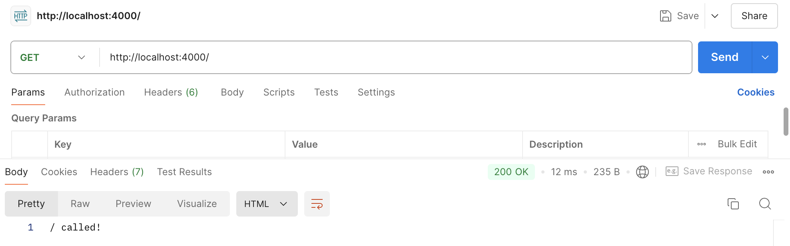

- `/test` 호출해보기

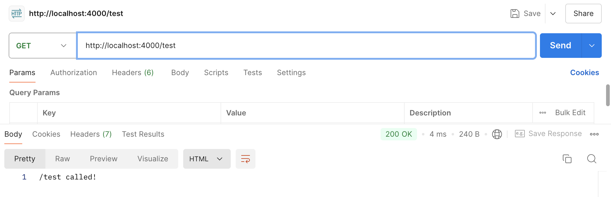

- 로그 확인해보기 ( => 두번 호출했는데 myLogger middleware가 그에 맞게 두번 호출된 것을 확인할 수 있었다. )

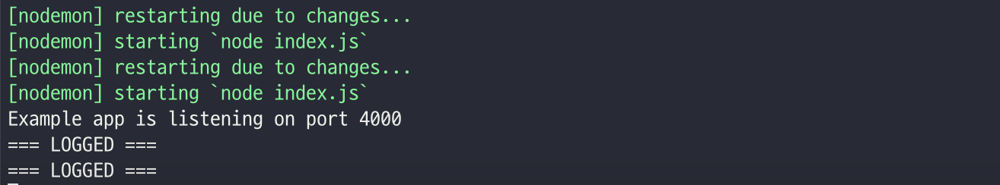


### route handler이후에 작성하기

```javascript
const express = require('express')
const app = express()
const port = 4000

// ✨ added (myLogger middleware 작성)
const myLogger = function (req, res, next) {
  console.log('=== LOGGED ===')
  next()
}

app.get('/', (req, res) => {
  res.send('/ called!')
})

app.get('/test', (req, res) => {
  res.send('/test called!')
})

// ✨ added (express의 instance인 app이 myLogger를 사용할수 있도록 추가, myLogger middleware를 로드함)
app.use(myLogger)

app.listen(port, () => {
  console.log(`Example app is listening on port ${port}`)
})
```

- `/` 호출해 보기

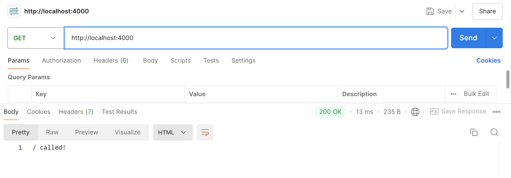

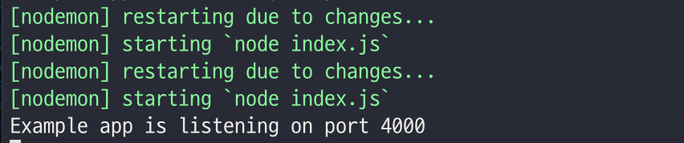

=> 이렇게 작성했을때 미들웨어가 호출되지 않는 것을 확인할 수 있다. ( middleware를 특정 route handler에 선행해서 적용하고자 한다면 handler가 정의되기 전에 미리 사용할 수 있도록 로드해야한다. )


## requestTime middleware 추가하기

```javascript
const express = require('express')
const app = express()
const port = 4000

const myLogger = function (req, res, next) {
  console.log('called myLogger middleware!!')
  next()
}

// ✨ added (requestTime middleware 작성)
const requestTime = function (req, res, next) {
  console.log('called requestTime middleware!!')
  req.requestTime = Date.now();
  next()
}

app.use(myLogger)

// ✨ added (express의 instance인 app이 requestTime를 사용할수 있도록 추가, requestTime middleware를 로드함)
app.use(requestTime)

app.get('/', (req, res) => {
  // ✨ added
  // 요청시 셋팅한 Request객체에 requestTime을 가져와 응답하는데 사용한다.
  let responseText = 'Hello World!<br>'
  responseText += `<small>Requested at : ${req.requestTime}</small>`
  res.send(responseText)
})

app.listen(port, () => {
  console.log(`Example app is listening on port ${port}`)
})
```

- `/` 호출해보기
  - 로그를 확인해보면, 먼저 로드된 myLogger가 호출되고 requestTime이 호출된 것을 볼 수 있다. (순서 확인!)
  - postMan으로 테스트해본 결과 `req.requestTime`값도 제대로 가져왔다.

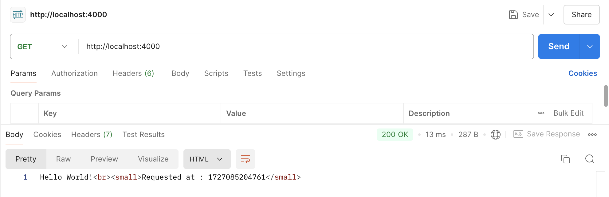

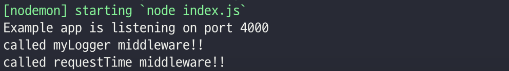


## validateCookies middleware 추가하기

> gpt를 참고해서 소스를 추가했다.

```javascript
const express = require('express')
const cookieParser = require('cookie-parser')
const app = express()
const port = 4000

const myLogger = function (req, res, next) {
  console.log('called myLogger middleware!!')
  next()
}

const requestTime = function (req, res, next) {
  console.log('called requestTime middleware!!')
  req.requestTime = Date.now();
  next()
}

// ✨ added (cookieValidator 함수 추가)
async function cookieValidator(cookies) {
  try {
    if (!cookies.testCookie) {
      throw new Error('testCookie is missing');
    }
    await new Promise((resolve, reject) => {
      setTimeout(() => {
        if (cookies.testCookie === 'valid') {
          resolve();
        } else {
          reject();
        }
      }, 100);
    });
  } catch {
    throw new Error('Invalid cookies');
  }
}

// ✨ added validateCookies middleware 작성
async function validateCookies(req, res, next) {
  console.log('called validateCookies middleware!!')
  try {
    await cookieValidator(req.cookies);
    next();
  } catch (err) {
    next(err);
  }
}

app.use(myLogger)
app.use(requestTime)

// ✨ added (express의 instance인 app이 validateCookies를 사용할수 있도록 추가, validateCookies middleware를 로드함)
app.use(cookieParser())
app.use(validateCookies)
app.use((err, req, res, next) => {
  res.status(400).send(err.message)
})

app.get('/', (req, res) => {
  // ✨ added
  // 요청시 셋팅한 Request객체에 requestTime을 가져와 응답하는데 사용한다.
  let responseText = 'Hello World!<br>'
  responseText += `<small>Requested at : ${req.requestTime}</small>`
  res.send(responseText)
})

app.listen(port, () => {
  console.log(`Example app is listening on port ${port}`)
})
```


### 쿠키 검증 함수 및 미들웨어

```javascript
/*
	- cookieValidator : testCookie가 존재하고 값이 'valid'인지 확인하는 함수입니다. 실제 검증 로직은 비동기로 작동하며, 여기서는 타임아웃을 통해 검증을 시뮬레이트합니다.
*/
async function cookieValidator(cookies) {
  try {
    if (!cookies.testCookie) {
      throw new Error('testCookie is missing');
    }
    await new Promise((resolve, reject) => {
      setTimeout(() => {
        if (cookies.testCookie === 'valid') {
          resolve();
        } else {
          reject();
        }
      }, 100);
    });
  } catch {
    // 유효하지 않은 쿠키인 경우 catch에서 잡히고, 해당 에러는 호출한 쪽으로 전달된다. (아래의 validateCookies의 catch에서 잡힘. )
    throw new Error('Invalid cookies');
  }
}

/*
	- validateCookiew : cookieValidator를 호출하여 쿠키를 검증하고, 검증에 실패하면 에러를 전달하는 미들웨어입니다.
*/
async function validateCookies(req, res, next) {
  console.log('called validateCookies middleware!!')
  try {
    await cookieValidator(req.cookies);
    next();
  } catch (err) {
    next(err);
  }
}
```

```javascript
/*
	- 에러처리 미들웨어를 추가하여 검증에 실패하면 400상태 코드와 에러 메세지를 응답합니다.
	- 이것도 미들웨어!!! next인자를 가지고 있다.
*/
app.use((err, req, res, next) => {
  res.status(400).send(err.message);
});
```


### 에러 처리 흐름

1. 쿠키 검증 실패 
   - `validateCookies` 미들웨어에서 `cookieValidator` 함수가 실패하면 에러가 발생한다.
   - `validateCookies` 미들웨어는 이 에러를 `next(err)`를 통해 전달한다.
2. 에러 처리 미들웨어 호출
   - 에러가 전달되면 Express는 에러 처리 미들웨어를 호출한다. 
   - 여기서 에러 처리 미들웨어는  `err`객체를 인수로 받는다.
3. 에러 응답 생성
   - 에러 처리 미들웨어는 `res.status(400)`으로 상태 코드를 설정하고 `send(err.message)`로 에러 메세지를 응답으로 보낸다.
   - 클라이언트는 `400 Bad Request` 상태 코드와 함께 에러메세지를 받게 된다.


### Test 했던 내용...

- postman cookies에 임시로 쿠키를 세팅해서 확인해 볼수 있다. (Send 버튼 밑에  Cookies)

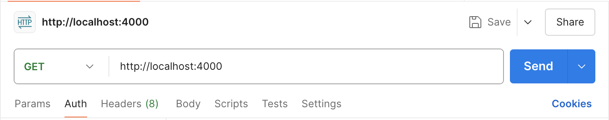


1. 쿠키가 유효하지 않은 경우

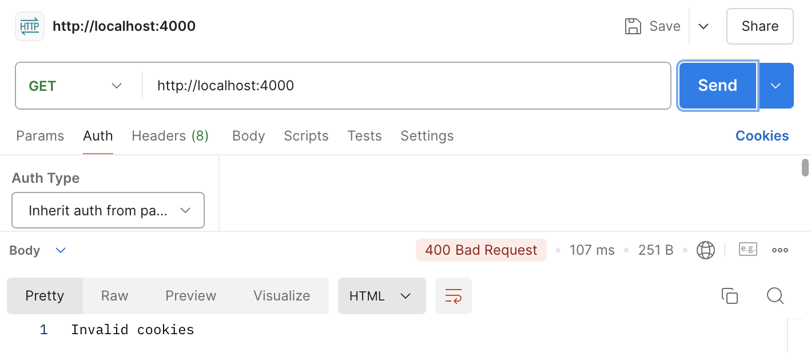


2. 쿠키가 유효한 경우 

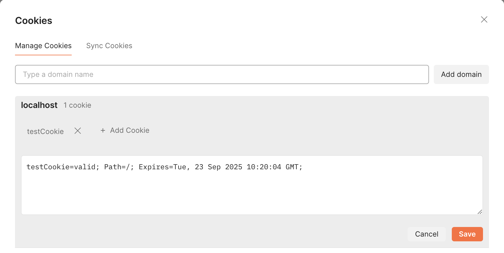

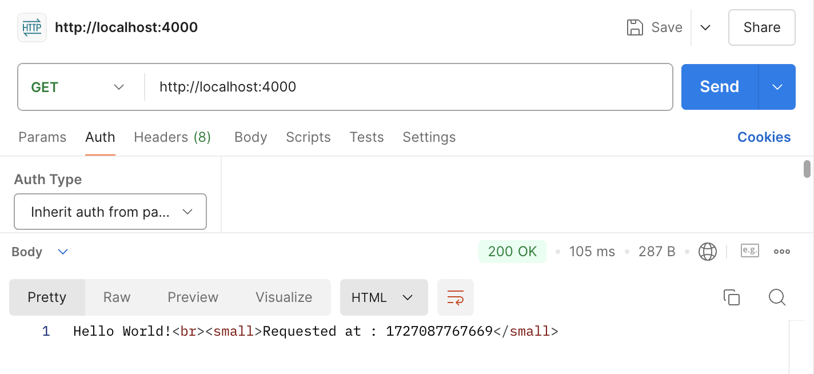


> 여기까지 한번 훑어봤는데, nest.js에서 interceptor와 middleware가 많이 생각났다. 빨리 훑어보고 좀더 깊이 있는 내용은  Nest.js에서 살펴보기로 하자.
