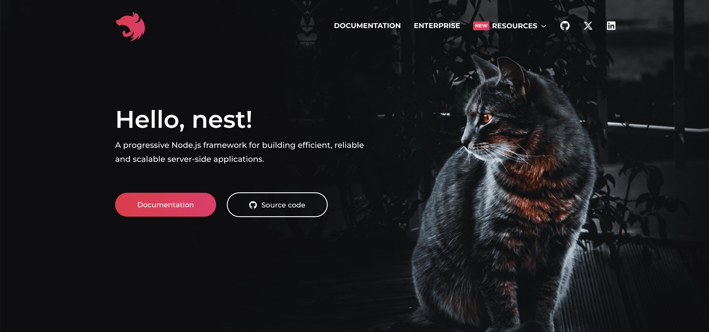

> [https://docs.nestjs.com/](https://docs.nestjs.com/)
{: .prompt-tip }




# Introduction

Nest(NestJS)는 효율적이고 확장 가능한 [Node.js](https://nodejs.org/) Server-side 애플리케이션을 구축하기 위한 프레임워크입니다. 이는 프로그래시브한 Javascript를 사용하고 Typescript로 구축되어 완벽하게 지원하며(여전히 순수 js로 코딩할 수 있음) OOP(Object Oriented Programming), FP(Functional Programming), and FRP(Functional Reactive Programming) 요소들을 결합합니다. 

내부적으로 Nest는  [Express](https://expressjs.com/)(Default)와 같은 강력한 HTTP 서버 프레임워크를 사용하며 선택적으로  [Fastify](https://github.com/fastify/fastify)를 사용하도록 구성할 수 있습니다.

Nest는 이러한 일반적인 Node.js 프레임워크(Express/Fastify)보다 높은 수준의 추상화를 제공하지만 해당 API를 개발자에게 직접 공개합니다. 이를 통해 개발자는 기본 플랫폼에서 사용할 수 있는 수많은 타사 모듈을 자유롭게 사용할 수 있습니다.


## <br>Philosophy

최근 몇 년 동안 Node.js 덕분에 JavaScript는 프런트엔드 애플리케이션과 백엔드 애플리케이션 모두에서 웹의 "언어"가 되었습니다. 이로 인해 개발자 생산성을 향상하고 빠르고 테스트 가능하며 확장 가능한 프런트엔드 애플리케이션을 생성할 수 있는  [Angular](https://angular.dev/), [React](https://github.com/facebook/react) 및  [Vue](https://github.com/vuejs/vue)와 같은 멋진 프로젝트가 탄생했습니다. 그러나 Node(및 서버측 JavaScript)를 위한 뛰어난 라이브러리, 도우미 및 도구가 많이 존재하지만 그 중 어느 것도 아키텍처의 주요 문제를 효과적으로 해결하지 못합니다.

Nest는 개발자와 팀이 고도로 테스트 가능하고 확장 가능하며 느슨하게 결합되고 유지 관리가 쉬운 애플리케이션을 만들 수 있는 즉시 사용 가능한 애플리케이션 아키텍처를 제공합니다. 아키텍처는 Angular에서 많은 영감을 받았습니다.


## <br>Installation

시작하려면 Nest CLI를 사용하여 프로젝트를 *스캐폴딩*하거나 시작 프로젝트를 복제할 수 있습니다(둘 다 동일한 결과를 생성함).

> 스캐폴딩 개념 참고
>  [[Express 공식문서] 2. Getting started(Hello World)](https://bitnalchan92.github.io/posts/Express-%EA%B3%B5%EC%8B%9D%EB%AC%B8%EC%84%9C-2.-Getting-started(Hello-World)/)


Nest CLI를 사용하여 프로젝트를 스캐폴딩하려면 다음 명령을 실행하세요. 그러면 새 프로젝트 디렉토리가 생성되고 초기 핵심 Nest 파일과 지원 모듈로 디렉토리가 채워져 프로젝트의 기존 기본 구조가 생성됩니다. 처음 사용하는 경우 Nest CLI를 사용하여 새 프로젝트를 만드는 것이 좋습니다. 우리는 첫 번째 단계에서 이 접근 방식을 계속할 것입니다.

```shell
$ npm i -g @nestjs/cli
$ nest new project-name
```


> 더 엄격한 기능세트(with stricter feature)를 가지고 있는 타입스크립트로 프로젝트를 생성하려면 `nest new`명령어를 수행할때 `--strict` 옵션을 같이 전달하세요.


## <br>Alternatives

또는 Git을 사용하여 TypeScript 시작 프로젝트를 설치하려면 다음을 수행합니다.

```shell
$ git clone https://github.com/nestjs/typescript-starter.git project
$ cd project
$ npm install
$ npm run start
```


>git history없이 저장소를 복제하려면 degit](https://github.com/Rich-Harris/degit)을 사용할 수 있습니다.


브라우저를 열고 `http://localhost:3000/` 으로 이동하세요.

시작 프로젝트의 JavaScript 버전을 설치하려면 위의 명령 시퀀스에서 `javascript-starter.git`을 사용하세요.

npm(또는 Yarn)을 사용하여 코어 및 지원 파일을 설치하여 처음부터 새 프로젝트를 수동으로 생성할 수도 있습니다. 물론 이 경우에는 프로젝트 상용구(boilerplate) 파일을 직접 생성해야 합니다.

```shell
$ npm i --save @nestjs/core @nestjs/common rxjs reflect-metadata
```
