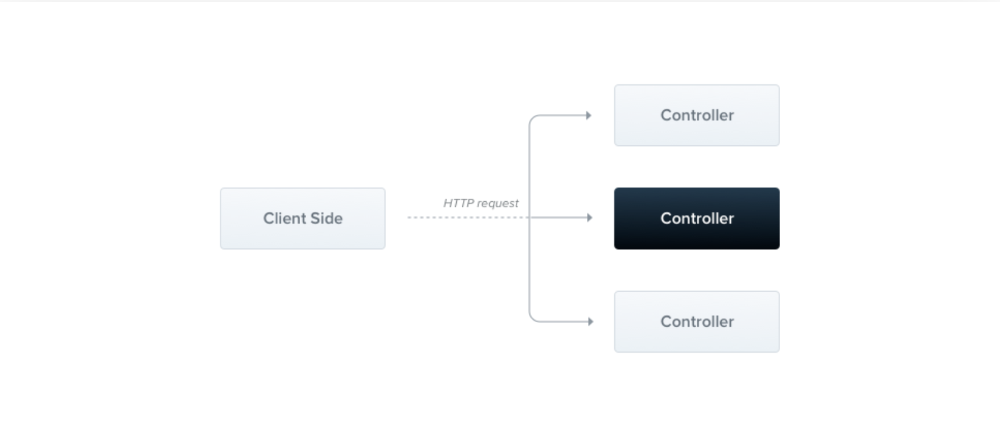

> [https://docs.nestjs.com/controllers](https://docs.nestjs.com/controllers)
{: .prompt-tip }


# Controllers

컨트롤러는 들어오는 요청을 처리하고 클라이언트에 응답을 반환하는 일을 담당합니다.



컨트롤러의 목적은 애플리케이션에 대한 특정 요청을 수신하는 것입니다. **라우팅** 메커니즘은 어떤 컨트롤러가 어떤 요청을 수신하는지 제어합니다. 각 컨트롤러에는 둘 이상의 경로가 있는 경우가 많으며, 서로 다른 경로가 서로 다른 작업을 수행할 수 있습니다.

기본 컨트롤러를 생성하기 위해 클래스와 데코레이터를 사용합니다. 데코레이터는 클래스를 필수 메타데이터와 연결하고 Nest가 라우팅 맵을 생성할 수 있도록 합니다(요청을 해당 컨트롤러에 연결).

<br>

>[validation](https://docs.nestjs.com/techniques/validation)을 포함한 CRUD컨트롤러를 빠르게 만들기 위해서는, CLI인 [CRUD generator](https://docs.nestjs.com/recipes/crud-generator#crud-generator)를 사용할 수 있습니다. 
>
><br>
>
>`nest g resource [name]`.


## <br>Routing

아래 예제에서는 기본 컨트롤러를 정의하는데 필요한 `@Controller` 데코레이터를 사용할 것입니다. `cats`의 선택적 Route 경로 접두사를 지정하겠습니다.  `@Controller`에 경로 접두사를 사용하게되면 경로의 집합을 쉽게 그룹화하고 반복적인 코드를 최소화 할 수 있습니다. 예를 들어, `/cats` 경로 아래에서 cat entity와 상호작용을 관리하는 라우트의 집합을 그룹화하도록 선택할 수 있습니다. 이 경우, 우리는 파일 내에 각각의 라우트에 경로 부분을 반복할 필요가 없도록 `@Controller` 데코레이터에 경로 접두사 `cats`를 지정할 수 있습니다.

```javascript
// cats.controller.ts
import { Controller, Get } from '@nestjs/common';

@Controller('cats')
export class CatsController {
  @Get()
  findAll(): string {
    return 'This action returns all cats';
  }
}
```

> CLI를 이용해서 컨트롤러를 생성하려면 다음 명령어를 실행하면 됩니다. 
>
> `$ nest g controller [name]`


`findAll()` 메서드 앞의 `@Get()` HTTP 요청 메서드 데코레이터는 Nest에게 HTTP요청에 대한 특정 엔드포인트에 대한 핸들러(함수)를 생성하도록 지시합니다. 엔드포인트는 HTTP 요청메서드(위의 경우는 GET)와 라우트 경로에 해당합니다. **라우트 경로(Route path)는 무엇입니까?** 핸들러의 라우트 경로는 컨트롤러에 대해 선언된 (선택적optional) 접두사와 메서드의 데코레이터에 지정된 경로를 연결(합쳐서)해서 결정됩니다. 모든 경로(`cats`)에 대한 접두사를 선언했고 데코레이터에 경로 정보를 추가하지 않았기 때문에 Nest는 `GET /cats` 요청을 이 핸들러에 매핑합니다. 언급한 대로 경로에는 선택적 컨트롤러 경로 접두사와 요청 메서드의 데코레이터에 선언된 경로 문자열이 모두 포함됩니다. 예를들어 데코레이터 `@Get('breed')`와 결합된 `cats`의 경로 접두사는 `GET /cats/breed`와 같은 요청에 대한 경로 매핑을 생성합니다.


위의 예제에서 이 엔드포인트에 GET요청이 이루어지면, Nest는 요청을 사용자가 정의한 핸들러인 findAll() 메서드로 라우팅합니다. 여기서 선택한 메서드 이름은 완전히 임의적입니다. 우린 명백히 경로를 바인딩할 메서드를 선언해야 하지만 Nest는 그러한 메서드 이름에 아무런 의미를 부여하지 않습니다. 


이 메서드는 `200 http status code`와 관련 응답을 반환합니다. 이 경우에는 문자열입니다. 왜 이럴까요? 설명을 위해서, 우리는 먼저 Nest가 사용하는 응답을 조작하기 위해 사용하는 두가지의 다른 옵션들을 소개하겠습니다. 

| options               | description                                                  |
| --------------------- | ------------------------------------------------------------ |
| Standard(recommended) | 이 built-in 메서드를 사용하면, 요청 핸들러가 Javascript 객체 또는 배열을 반환할 때 자동으로 JSON으로 직렬화해줍니다. `string`, `number`, `boolean`과 같은 JS 원시타입의 값을 리턴하면, Nest는 직렬화를 시도하지 않고, 값만 보냅니다. 이렇게되면 응답 처리가 간단해집니다. 값만 반환하면 나머지는 Nest가 처리합니다. <br />게다가, 응답의 상태 코드는 201을 사용하는 POST 요청을 제외하고는 기본적으로 항상 200입니다. 핸들러 수준에서 데코레이터를 추가하여 이 동작을 쉽게 변경할 수 있습니다(상태코드 참조). |
| Library-specific      | 메소드 핸들러 시그니처(예: `findAll(@Res() response)` )에서 `@Res()` 데코레이터를 사용하여 주입할 수 있는 라이브러리별(예: Express) [response object](https://expressjs.com/en/api.html#res)를 사용할 수 있습니다. 이 접근 방식을 사용하면 해당 개체에 의해 노출된 기본 응답 처리 메서드를 사용할 수 있습니다. 예를 들어 Express를 사용하면 `response.status(200).send()` 와 같은 코드를 사용하여 응답을 구성할 수 있습니다. |

> Nest는 핸들러가 `@Res()` 또는 `@Next()`를 사용하고 있는지 감지하여, 라이브러리 특정 옵션을 선택했음을 나타냅니다. 두 접근법이 동시에 사용되면, 표준 접근법은 이 단일 라우트에 대해 자동으로 비활성화되며 예상대로 작동하지 않게 됩니다. 두 접근법을 동시에 사용하려면 (예를 들어, 응답 객체를 주입하여 쿠키/헤더만 설정하고 나머지는 프레임워크에 맡기는 경우), `@Res({ passthrough: true })` 데코레이터에서 `passthrough` 옵션을 `true`로 설정해야 합니다.


## <br>Request object

핸들러는 종종 클라이언트 요청의 세부사항에 접근해야할 필요가 있습니다. Nest는 기본적으로 Express인 근본적인 플랫폼의 [request object](https://expressjs.com/en/api.html#req)에 대한 접근을 제공합니다. 우리는 핸들러 시그니처에 `@Req()` 데코레이터를 추가하여 Nest에 요청 객체를 삽입하도록하여 요청 객체에 접근할 수 있습니다.

```javascript
// cats.controller.ts
import { Controller, Get, Req } from '@nestjs/common';
import { Request } from 'express';

@Controller('cats')
export class CatsController {
  @Get()
  findAll(@Req() request: Request):string {
    return 'This action returns all cats';
  }
}
```

> Express 타이핑을 활용하려면 (위의 request: Request 파라미터 예제와 같이), @types/express 패키지를 설치해야 합니다.


요청 객체는 HTTP 요청을 나타내고, 쿼리 문자열, 매개변수, HTTP 헤더 및 본문에 대한 속성을 갖습니다.(자세한 내용은 [here](https://expressjs.com/en/api.html#req)를 참조). 대부분의 경우, 이러한 속성을 수동으로 직접 가져올 필요는 없습니다. 대신 기본적으로 제공되는 `@Body()` 또는 `@Query()`와 같은 전용 데코레이터를 사용할 수 있습니다. 다음은 제공된 데코레이터와 이들이 나타내는 일반 플랫폼별 객체 목록입니다. 

| provided decorators        | objects they represent              |
| -------------------------- | ----------------------------------- |
| `@Request()`, `@Req()`     | `req`                               |
| `@Response(), @Res()`***** | `res`                               |
| `@Next()`                  | `next`                              |
| `@Session()`               | `req.session`                       |
| `@Param(key?: string)`     | `req.params` / `req.params[key]`    |
| `@Body(key?: string)`      | `req.body` / `req.body[key]`        |
| `@Query(key?: string)`     | `req.query` / `req.query[key]`      |
| `@Headers(name?: string)`  | `req.headers` / `req.headers[name]` |
| `@Ip()`                    | `req.ip`                            |
| `@HostParam()`             | `req.hosts`                         |

`*` 기본 HTTP 플랫폼(예: Express | Fastify) 전반으로 입력하는 내용의 호환성을 위해서, Nest는 `@Res()` 및 `@Response()` 데코레이터를 제공합니다. `@Res()`는 단순히 `@Response()`의 별칭입니다. 둘 다 기본 네이티브 플랫폼 `response` 객체의 인터페이스를 직접 노출합니다. 이를 사용할 때 최대한 활용하려면 기본 라이브러리(예: `@types/express`)도 가져와야(import) 합니다. 메서드 핸들러에  `@Res()` 또는 `@Response()`를 삽입하면 Nest를 해당 핸들러에 대한 특정 라이브러리 모드로 놓게 되고, 응답을 관리하게 됩니다. 그렇게 하게되면,  `response`객체(예: `res.json(...) | res.send(...)`)를 호출해서 응답을 반환해야 합니다. 그렇지 않으면  HTTP 서버는 멈추게 될 것입니다.

> 직접 데코레이터를 만드려면 이 챕터[this](https://docs.nestjs.com/custom-decorators)를 확인하세요.


## <br>Resources

앞서 우리는 cats 리소스(GET 라우트)를 가져오기 위한 엔드포인트를 정의했습니다. 또한 일반적으로 새 레코드를 생성하는 엔드포인트를 제공하려고 합니다. 이를 위해 POST 핸들러를 생성해 보겠습니다. 

```javascript
// cats.controller.ts
import { Controller, Get, Post } from '@nestjs/common';

@Controller('cats')
export class CatsController {
  @Post() 
  create(): string {
    return 'This action adds a new cat';
  }

	@Get()
  findAll(): string {
    return 'This action returns all cats';
  }
}
```

간단합니다. Nest는 모든 표준 HTTP 메서드에 대한 데코레이터를 제공합니다. : `@Get()`, `@Post()`, `@Put()`, `@Delete()`, `@Patch()`, `@Options()`, 그리고 `@Head()`. 게다가 `@All()`은 이를 모두 처리하는 엔드포엔트를 정의합니다. 


## <br>Route wildcards

패턴 기반 라우트경로도 지원합니다. 예를들어 별표는 와일드카드로 사용되며 모든 문자 조합과 일치합니다. 

```javascript
@Get('ab*cd')
findAll() {
  return 'This route uses a wildcard';
}
```

`'ab*cd'` Route path는 `abcd` , `ab_cd` , `abecd` 등과 일치합니다. `?` , `+` , `*` 및 `()` 문자는 Route path에 사용될 수 있으며 해당 정규 표현식의 하위 집합입니다. . 하이픈( `-` )과 점(`.` )은 문자열 기반 경로로 문자 그대로 해석됩니다.

> 경로 중간에 있는 wildcard는 express에서만 적용됩니다. 


## <br>Status code

언급한대로, 응답 상태코드는 201인 POST요청을 제외하고는 기본적으로 항상 **200**입니다. 핸들러 수준에서 `@HttpCode(...)` 데코레이터를 추가하면 이 동작을 쉽게 변경할 수 있습니다. 

```javascript
@Post
@HttpCode(204)
create() {
  return 'This action adds a new cat';
}
```

> `@nestjs/common` 패키지에서 `HttpCode`를 import하세요.


종종, 당신의 상태코드는 아니지만 다양한 요인에 따라 달라지는 경우가 많습니다. 이 경우 라이브러리별 응답(`@Res()`을 사용하여 삽입) 객체를 사용할 수 있습니다.(또는 오류가 발생하는 경우는 예외가 발생함.)


## <br>Headers

사용자 정의 응답 헤더를 지정하려면 `@Header()` 데코레이터나 라이브러리별 응답 객체를 사용하고 `res.header()`을 직접 호출하면 됩니다.

```javascript
@Post()
@Header('Cache-Control', 'none')
create() {
  return 'This action adds a new cat';
}
```

> `@nestjs/common` 패키지에서 `Header`를 import하세요.


## <br>Redirection

응답을 특정 URL로 리다이렉션하려면 `@Redirect()` 데코레이터나 라이브러리 별 응답 객체를 사용하고 `res.redirect()`를 직접 호출하면 됩니다. 


`@Redirect()` 는 두개의 매개변수를 가지는데, `url`과 `statusCode`이고 둘다 선택 사항입니다. 생략할 경우 `statusCode`의 기본 값은 `302(Found)` 입니다.

```javascript
@Get()
@Redirect('https://nestjs.com', 301)
```

> 때로는 HTTP 상태 코드나 리디렉션 URL을 동적으로 확인해야 할 수도 있습니다. `HttpRedirectResponse` 인터페이스(from `@nestjs/common`)의 객체를 반환하여 이를 수행할 수 있습니다.


반환된 값은 `@Redirect()` 데코레이터에 전달된 모든 인수를 재정의합니다. 예를 들어:

```javascript
/*
이 코드는 NestJS의 라우팅 및 리다이렉션 기능을 사용한 예제입니다.  

@Get('docs') 데코레이터는 'docs' 경로에 대한 HTTP GET 요청을 처리하는 라우트 핸들러를 정의합니다.  
@Redirect('https://docs.nestjs.com', 302) 데코레이터는 이 라우트가 호출되면 사용자를 'https://docs.nestjs.com' URL로 리다이렉션하도록 설정합니다. 

302는 HTTP 상태 코드로, 일시적인 리다이렉션을 나타냅니다.  

getDocs(@Query('version') version)는 'getDocs'라는 메소드를 정의하고 있습니다. 이 메소드는 HTTP 요청의 쿼리 파라미터 중 'version' 파라미터를 인자로 받습니다.  메소드 내부에서는 'version' 파라미터가 존재하고 그 값이 '5'인지 확인합니다. 만약 그렇다면, 리다이렉션 URL을 'https://docs.nestjs.com/v5/'로 변경합니다. 이는 NestJS의 버전 5 문서로 사용자를 리다이렉션하려는 의도로 보입니다.  따라서 이 코드는 사용자가 'version' 쿼리 파라미터를 통해 특정 버전의 문서를 요청할 수 있도록 하는 기능을 제공합니다.
*/

@Get('docs')
@Redirect('https://docs.nestjs.com', 302)
getDocs(@Query('version') version) {
  if (version && version === '5') {
    return { url: 'https://docs.nestjs.com/v5/' }
  }
}
```
