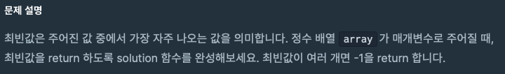
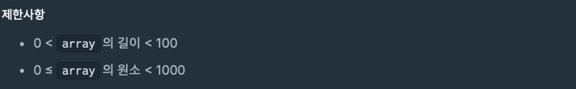
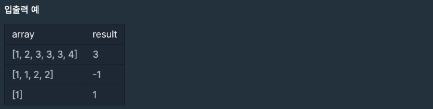
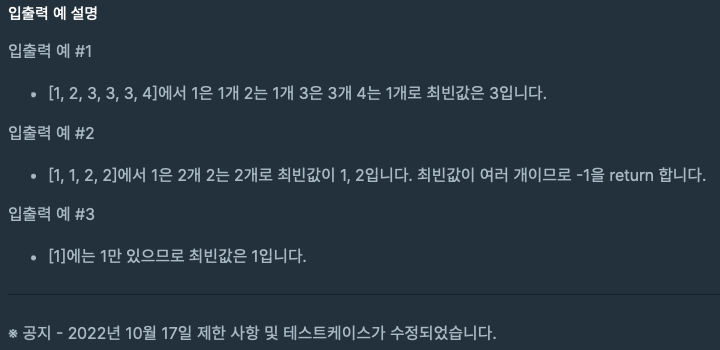

> https://school.programmers.co.kr/learn/courses/30/lessons/120812


## <br>문제 설명




## <br>제한사항




## <br>입출력 예




## <br>입출력 예 설명




## <br> 풀이

#### 1차

```java
import java.util.*;

/**
	올바른 풀이가 아님, 런타임 에러!
*/
class Solution {
    public int solution(int[] array) {
        int answer = 0;
        
        HashMap<Integer, Integer> m = new HashMap<>();
        for ( int i = 0; i < array.length; i++ ) {
            int k = array[i];
            int v = m.getOrDefault(k, 0) + 1;
            
            m.put(k, v);
        }
        
        int mostKey = Integer.MIN_VALUE; // 최빈값 
        for ( int k : m.keySet() ) {
            if ( m.get(k) > mostKey ) {
                mostKey = m.get(k);
            }
        }
        
        int mostValue = m.get(mostKey);
        int cnt = 0;
        for ( int k : m.keySet() ) {
            if ( m.get(k) == mostValue ) cnt++;
        }
        
        if ( cnt > 1 ) {
            answer = -1;
        } else {
            answer = mostKey;
        }
        
        return answer;
    }
}
```


#### 2차

```java
import java.util.*;

class Solution {
    public int solution(int[] array) {
        int answer = 0;
        
        // 숫자의 값이 key, 해당 값이 있는 빈도(count)가 value
        HashMap<Integer, Integer> m = new HashMap<>(); 
        
        // 최빈값
        int max = Integer.MIN_VALUE; 
        
        /**
           배열의 길이만큼 순회하면서, map에 put을 하기 시작한다. 
           위에서 max 변수를 선언해놨기 때문에, 순회하면서 최빈값을 구할 수 있고,,,

           if문 내부에서는 max값을 최신화하면서 동시에 return해야할 answer에 key값을 할당한다. 
           else if문에서 순회도중 max와 같은 value를 만나게되면 answer에는 -1을 할당한다.
         */
        for ( int i = 0; i < array.length; i++ ) {
            int k = array[i];
            int v = m.getOrDefault(k, 0) + 1;
            
          	/**
          		이 부분이 조금 헤깔렸음 ( max값을 구하고, answer 변수를 셋팅하는 로직의 위치를 잘 생각해봐야 할 듯 하다!)
          	*/
            if ( v > max ) {
                max = v;
                answer = k;
            } else if ( v == max ) {
                answer = -1;
            }            
            
            m.put(k, v);
        }
        
        return answer;
    }
}
```


