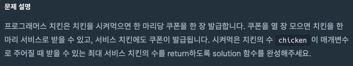
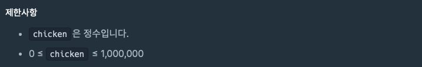
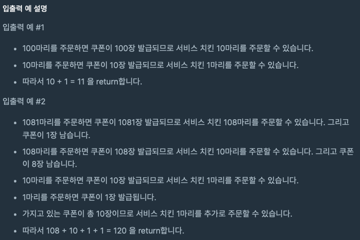

> https://school.programmers.co.kr/learn/courses/30/lessons/120884


## <br>문제




## <br>제한사항




## <br> 입출력 예


## <br> 입출력 예 설명




## <br>풀이

```java
class Solution {
    public int solution(int chicken) {
        int serviceChickenTotalCnt = 0; // result, 서비스로 받은 치킨의 수가 -1이 될수 없기 때문에 0으로 초기화
        int couponCnt = chicken; // 시켜먹은 치킨 수 만큼 쿠폰을 받는다.
        
        while (couponCnt >= 10) {
            // 이번 반복 수행에서 쿠폰으로 얻게된 서비스 치킨의 수 
            int serviceCnt = couponCnt / 10; 
            
            // 서비스 치킨의 수를 최종 결과 변수에 더한다. 
            serviceChickenTotalCnt += serviceCnt; 
            
            // 남은 쿠폰의 수는 쿠폰의 수를 10으로 나눈 나머지(결국 1의자리 수) + 이번 반복에서 서비스로 받은 치킨의 수
            // ==> 109마리를 주문해서 첫 반복 수행에서 10마리를 서비스로 받았다면 
            //     남은 쿠폰의 수는 109를 10으로 나눈 나머지 9와 서비스로 받은 치킨의 수 10을 더해서 "19"가 된다.
            //     해당 값을 쿠폰 갯수에 다시 할당한 뒤 위 반복을 다시 수행한다. 
            couponCnt = (couponCnt % 10) + serviceCnt;
        }
        
        return serviceChickenTotalCnt;
    }
}
```

