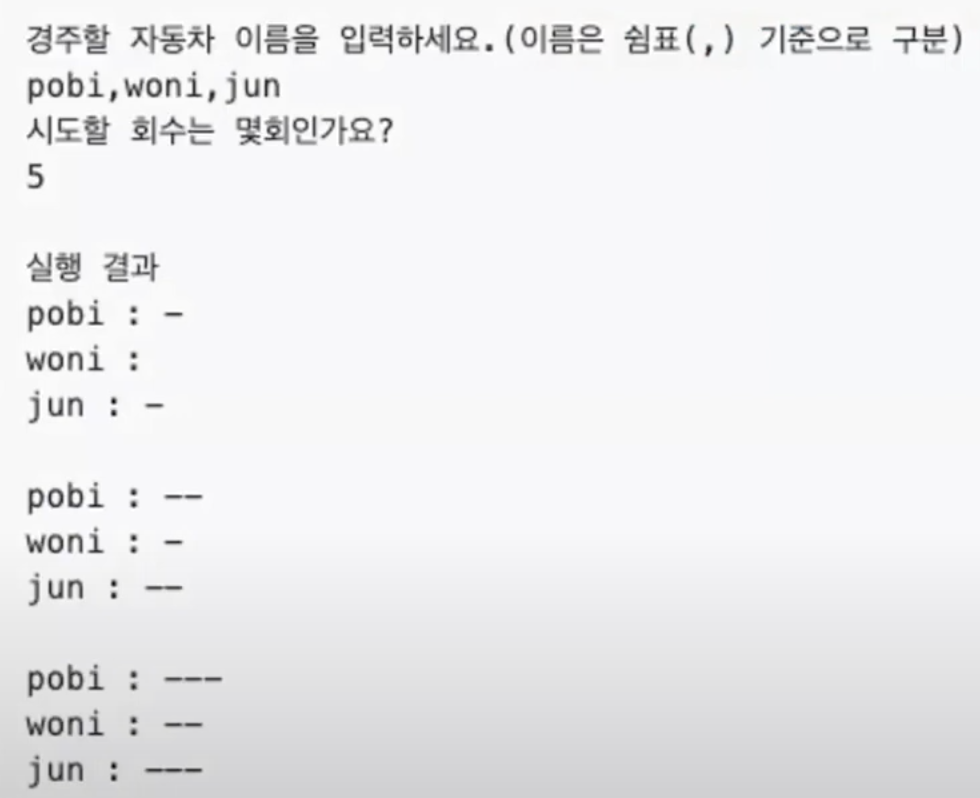
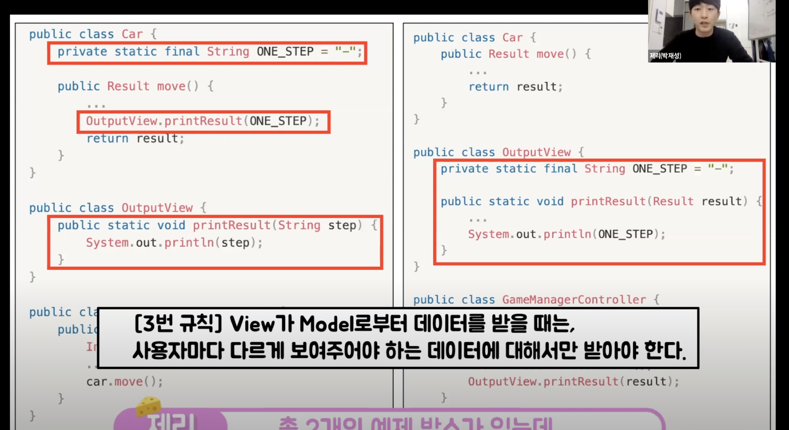
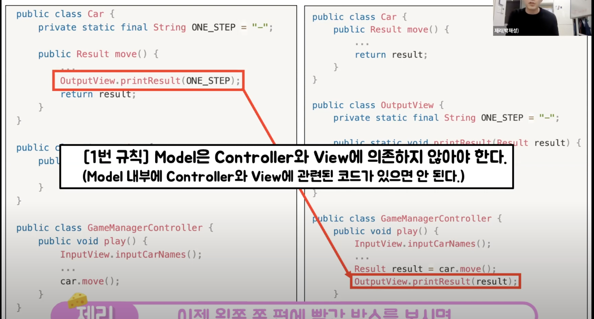

1. **MVC가 생겨난 이유**

        1. 과거는...
        2. 코드가 너무 많아져서 유지보수가 불편해짐
               2. 근데 이렇게 하다보니 편하더라 하는 패턴이 보이기 시작...
                     3. 이 패턴을 공식처럼 만들어 논문으로 발표하며
                         4. MVC가 생기게 됨

2. 모델

      1. 데이터와 관련된 일을 하는 곳

3. 컨트롤러

      1. 모델과 뷰의 중개자 역할 ( Model과 View를 이어주는 부분 )

4. 뷰

      1. 사용자에게 보여지는 부분을 담당

5. **MVC를 지키면서 코딩하는 방법**

      1. Model은 Controller와 View에 의존하지 않아야한다.
            1. Model내부에 Controller와 View에 관련된 코드가 있으면 안된다.

      2. View는 Model에만 의존해야하고, Controller에는 의존하면 안된다.
            1. View내부에 Model의 코드만 있을 수 있고, Controller의 코드가 있으면 안된다.

      3. View가 Model로부터 데이터를 받을때는, 사용자마다 다르게 보여주어야 하는 데이터에 대해서만 받아야한다
      4. Controller는 Model과 View에 의존해도 된다.
            1. Controller내부에는 Model과 View의 코드가 있을 수 있다.

      5. View가 Model로부터 데이터를 받을 때, 반드시 Controller에서 받아야한다.

      6. 예제 설명

         1. 아래가 학생분들이 미션으로 수행한 내용이고 두번째 & 세번째 사진은 샘플소스인데 왼쪽이 MVC를 지키지 않은 소스이고 오른쪽이 MVC를 지킨 소스이다.

         > 항상 염두하고 작성하면 좋을 내용인듯...

   

> 이분 내가 인프런에서 봤던 박재성님인거 같은데, 얼굴이 비슷한거 같은데 4년전이라 확실치 않네... 좋은 내용이였던거 같다. 
