> 📍 출처 : https://www.youtube.com/watch?v=_UI8YDU_mfg

- 인덱스란... 인덱스가 사용되는 곳
  - 서비스 구현에서 get / post api요청은 빠른 처리 속도를 요한다. 

- 캐시 & 인덱스 ( 데이터베이스의 속도를 높일수 있는 방법 대표적 2가지 => 본 발표에서는 인덱스에 대해 알아본다. )

- 인덱스란? 

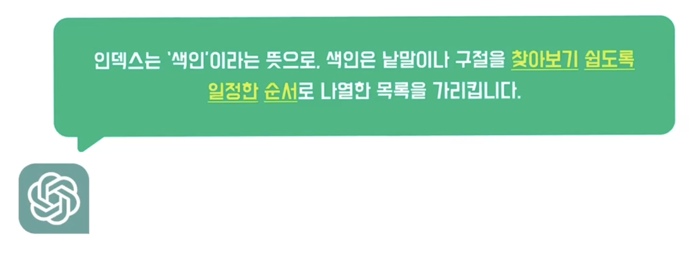

- B-Tree

  - 트리 구조의 일종

  - B-Tree의 탐색 과정

    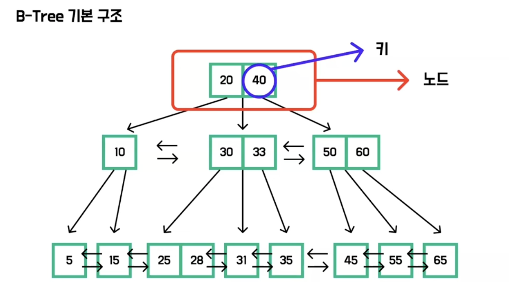

    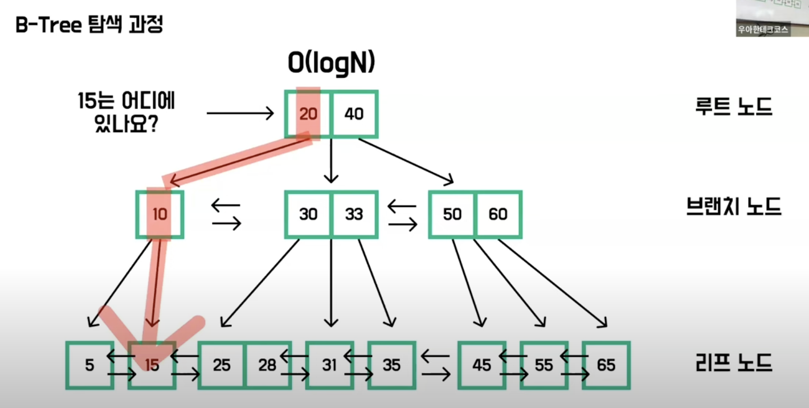

- full table scan 방식과 다르게! 일부 데이터만 탐색해 O(logN)의 시간 복잡도를 가진다.

- MySql의 B-Tree

  - **프라이머리 키 인덱스**

    - 프라이머리 키 인덱스의 리프노드는 레코드를 가지고 있다.

      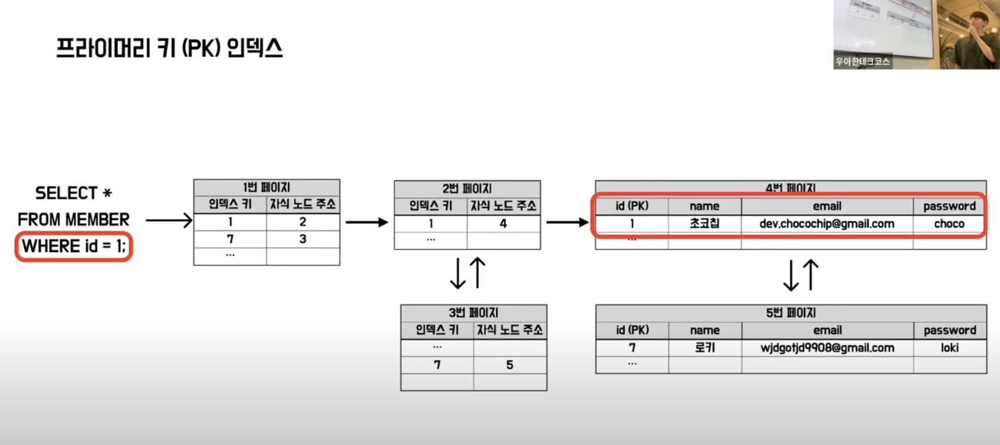

  - **세컨더리 인덱스**

    - 프라이머리 키를 제외한 다른키로 인덱스를 생성 ( `create index ~ ` )

      - 프라이머리 키 인덱스를 제외한 모든 인덱스는 세컨더리 인덱스라 볼 수 있다

    - 탐색 과정

      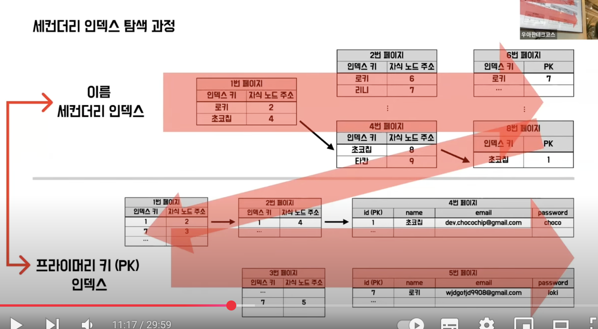

      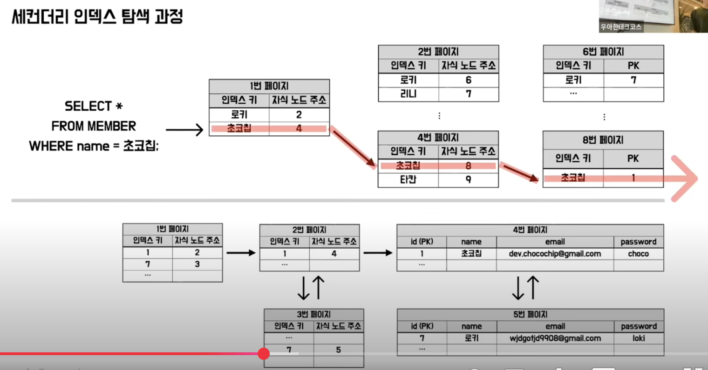

      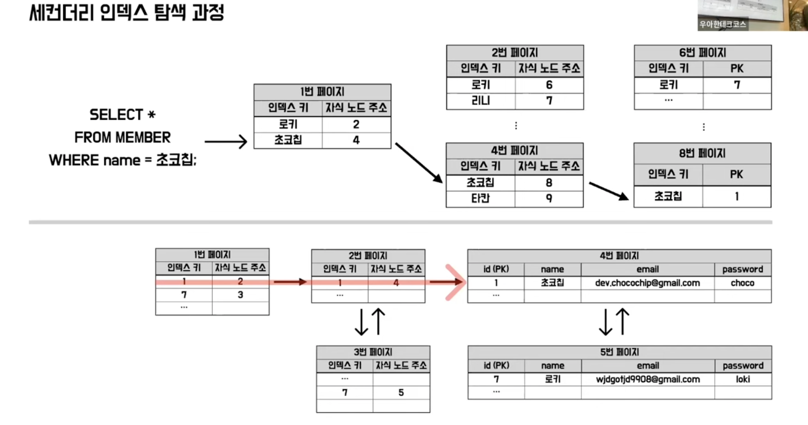

      - 아까 프라이머리 키 인덱스와 달리 세컨더리 인덱스의 리프노드는 PK값을 가지고 있다. 

- 만약 세컨더리 인덱스의 리프노드가 PK가 아니라면?
  - PK인덱스의 리프노드인 레코드의 값이 변경되면 그에 따라 나머지 세컨더리 인덱스에 리프노드에 있는 레코드의 값도 변경이 같이 이루어져야하는 오버헤드가 발생한다. 

- **인덱스의 주의사항**
  - Create / Update 의 오버헤드
  - 디스크 사용량
    - `SHOW TABLE STATUS FROM product;`

- 인덱스 스캔

  1. 카테고리, 가격 필터링 쿼리

     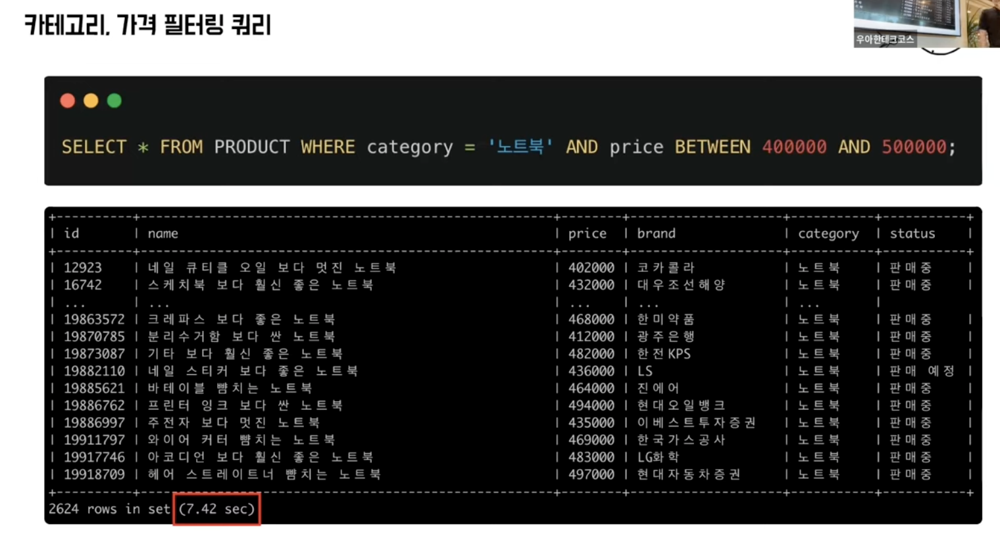

     - 무엇을 기준으로 정렬해야 빠르게 찾을 수 있을까?

     - category,,, price,,, 필요하지 않은 정보가 너무 많이 따라와 비효율적이다...

     - 이때 필요한게 `복합 인덱스`

       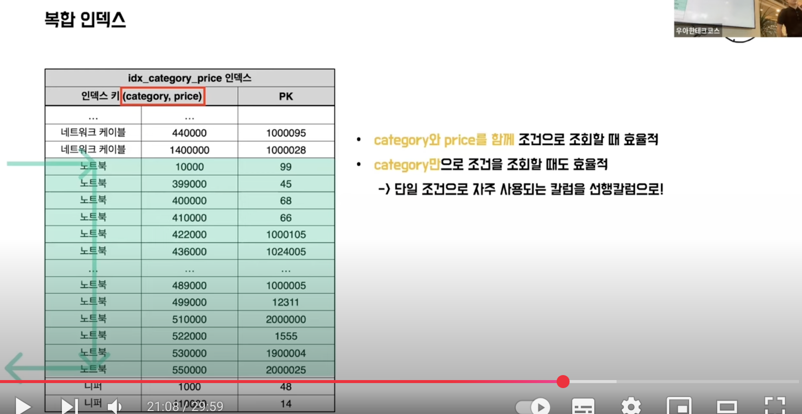

- 인덱스 레인지 스캔

  - 필요한 범위만 읽는 효율적인 스캔 방식

    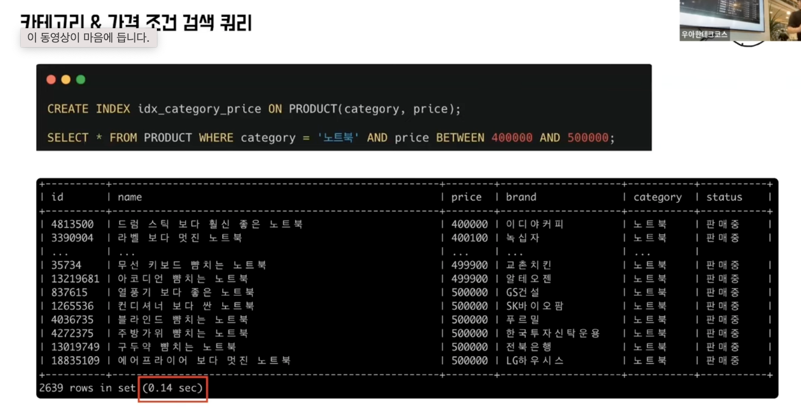

- 레코드의 일부 정보만 필요하다면?
  - 커버링 인덱스 : 쿼리에서 필요한 모든 칼럼을 포함하는 인덱스 
    - 리프노드에서 PK를 구해와서 추가적으로 필요한 컬럼을 조회하고자 할때 랜덤I/O가 발생하는데 이때 자칫하면 인덱스를 사용하지 못하고 table full scan을 해야하는 상황이 발생할 수 있다. 
    - 이를 방지하기 위해 커버링 인덱스를 활용
    - 인덱스에 이미 필요한 컬럼값이 존재하기 때문에 랜덤I/O가 발생하지 않는다.

- 이름 전체 조회 쿼리 

  - 인덱스가 없을때...

    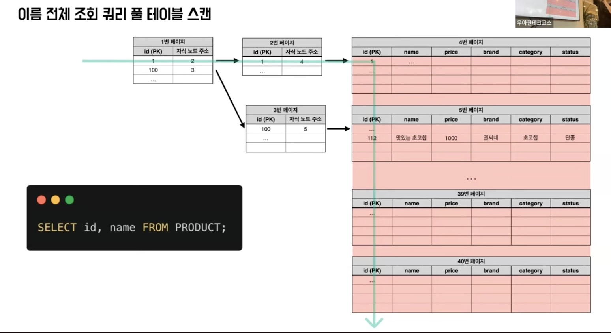

  - 인덱스가 있었다면 이름에 대해서...

    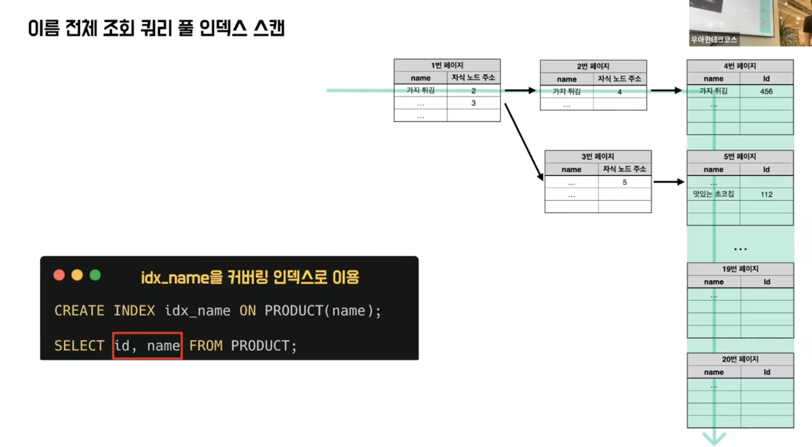

    - 이름 인덱스를 쭉 읽으면 되겠죠? 이게 바로 `풀 인덱스 스캔`

- 풀 인덱스 스캔 ( 모든 레코드를 다 읽어야하기 때문에 효과가 드라마틱하진 않다. )

  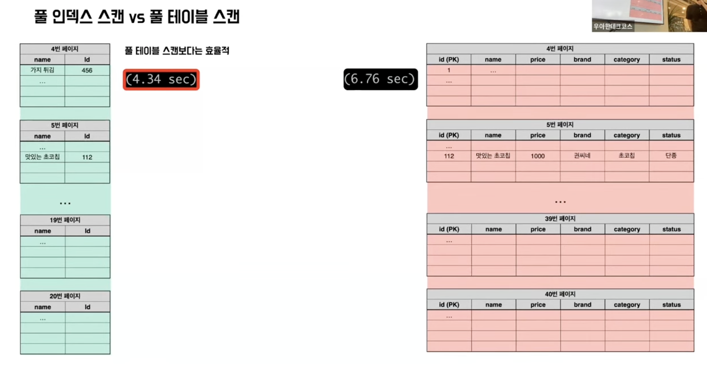

- 카테고리별 최저 가격 조회 쿼리 

  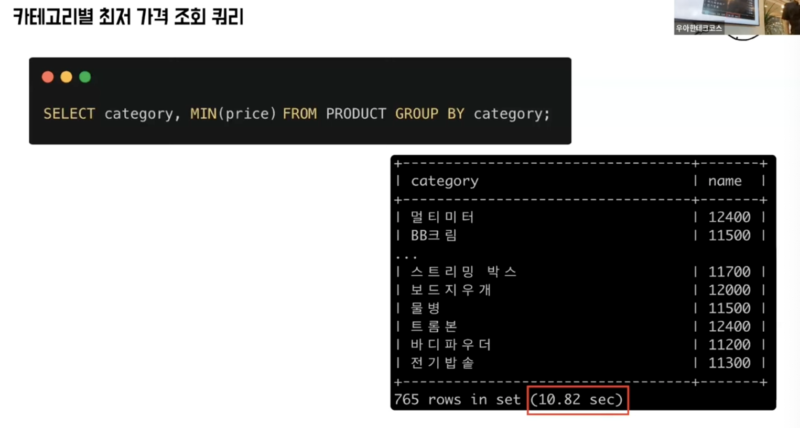

  - 복합 인덱스를 재활용!

    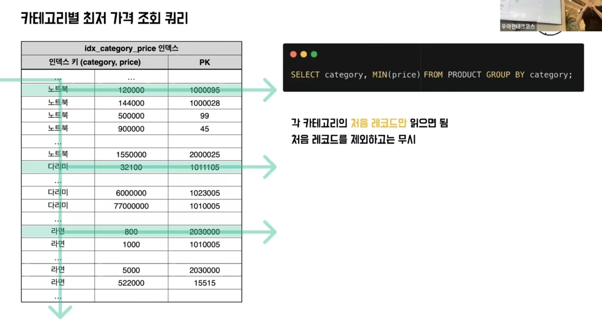

    - 루스 인덱스 스캔 ( <-> 타이트 인덱스 스캔(인덱스 레인지 스캔) )

      - 인덱스를 듬성듬성 읽음 

        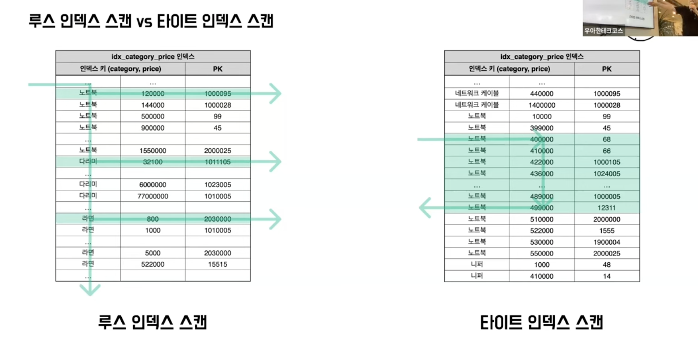

        - 공식문서에선 루스 인덱스 스캔을 그룹바이를 처리하는 가장 효율적인 방식이라 하고 있다. 

- 인덱스 스캔방식 정리

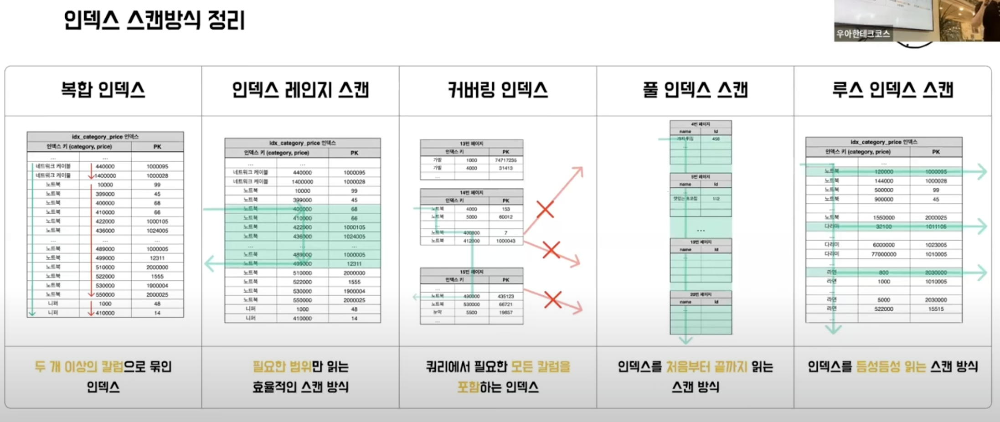

