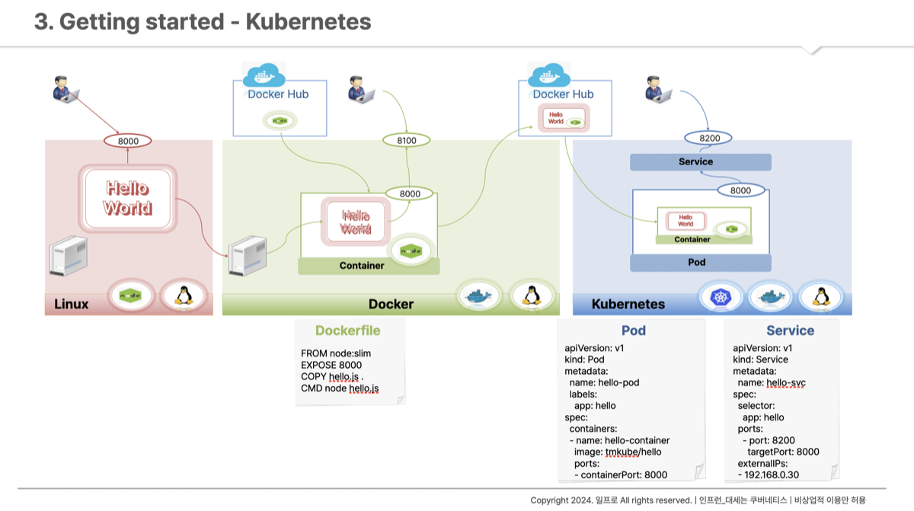
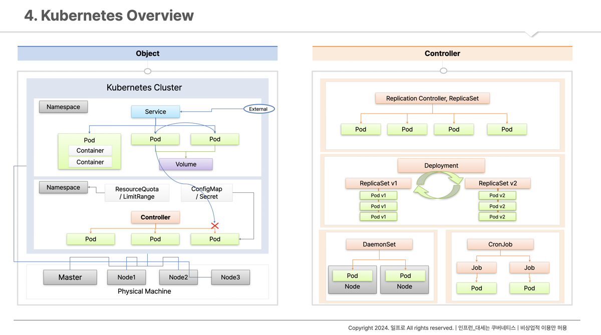

## 들어가며

Docker는 단일 서비스를 컨테이너로 가상화하는 데 탁월하지만, 수많은 컨테이너를 효율적으로 관리하고 운영하는 기능은 제공하지 않습니다. 이러한 한계를 극복하기 위해 등장한 것이 바로 **컨테이너 오케스트레이터**인 쿠버네티스(Kubernetes)입니다.

쿠버네티스는 Auto Scaling, Auto Healing, 배포 자동화 등 대규모 컨테이너 환경 운영에 필요한 다양한 편의 기능을 제공하여, 현대적인 클라우드 네이티브 애플리케이션 개발의 핵심 도구로 자리잡았습니다.

### Docker만으로 부족한 이유

Docker Compose로 여러 컨테이너를 함께 운영할 수 있지만, 한계가 있습니다.

| 상황 | Docker (단독) | 쿠버네티스 |
|---|---|---|
| 컨테이너가 죽으면 | 수동으로 재시작 | 자동 재시작 (Auto Healing) |
| 트래픽이 갑자기 늘면 | 수동으로 컨테이너 추가 | 자동 스케일 아웃 (Auto Scaling) |
| 새 버전 배포 시 | 서비스 중단 발생 | 무중단 배포 (Rolling Update) |
| 여러 서버에 분산 운영 | 별도 구성 필요 | 클러스터로 자동 관리 |

---

## 실습 환경 구성


*인프런 - 대세는 쿠버네티스*

본 실습에서는 Linux, Docker, Kubernetes 환경에서 간단한 Node.js 애플리케이션을 배포하는 과정을 단계별로 진행합니다.

### 1. Linux 환경

- Node.js를 설치하고 8000번 포트로 Hello World 애플리케이션을 실행합니다.

### 2. Docker 환경

- Docker를 이용하여 컨테이너를 생성합니다.
- Docker Hub에서 공식 Node.js 컨테이너 이미지를 가져옵니다.
- Hello World 애플리케이션을 컨테이너에 포함시킵니다.
- 컨테이너를 실행하여 외부에서 8100번 포트로 접근할 수 있도록 설정합니다.

### 3. Kubernetes 환경

- 앞서 생성한 컨테이너 이미지를 Docker Hub에 업로드합니다.
- Kubernetes에서 Pod와 Container를 생성할 때 Docker Hub의 이미지를 참조합니다.
- Pod를 외부에 노출시키기 위해 **Service** 리소스를 사용합니다.
- External IP를 통해 외부에서 애플리케이션에 접근할 수 있습니다.

---

## 쿠버네티스 아키텍처


*인프런 - 대세는 쿠버네티스*

### 클러스터 구조

쿠버네티스는 **하나의 마스터 노드**와 **여러 개의 워커 노드**로 구성된 클러스터 형태로 운영됩니다.

- **Master 노드 (Control Plane)**
  - 클러스터 전반의 의사결정을 담당합니다.
  - `kube-apiserver`: 모든 요청의 진입점. `kubectl` 명령도 여기를 거칩니다.
  - `etcd`: 클러스터 상태를 저장하는 분산 키-값 저장소.
  - `kube-scheduler`: 새로 생성된 Pod를 어느 노드에 배치할지 결정합니다.
  - `kube-controller-manager`: 원하는 상태(Desired State)를 유지하도록 계속 감시합니다.

- **Worker 노드**
  - 실제 애플리케이션 컨테이너가 실행되는 자원을 제공합니다.
  - `kubelet`: 마스터 노드의 지시를 받아 Pod를 실제로 실행합니다.
  - `kube-proxy`: 네트워크 트래픽을 적절한 Pod로 라우팅합니다.

### 주요 구성 요소

#### Pod

쿠버네티스에서 배포 가능한 가장 작은 단위입니다. 하나 이상의 컨테이너를 포함하며, 같은 Pod 안의 컨테이너는 네트워크와 스토리지를 공유합니다.

```yaml
# Pod 정의 예시
apiVersion: v1
kind: Pod
metadata:
  name: my-app
spec:
  containers:
  - name: app
    image: my-app:1.0
    ports:
    - containerPort: 8080
```

Pod는 단독으로 사용하기보다 Controller를 통해 관리하는 것이 일반적입니다. Pod 자체는 죽으면 자동으로 재시작되지 않기 때문입니다.

#### Namespace

쿠버네티스 오브젝트들을 논리적으로 독립된 공간으로 분리합니다. 팀별, 프로젝트별, 환경별(개발/스테이징/운영)로 리소스를 격리할 수 있습니다.

```sh
# Namespace 생성
kubectl create namespace production

# 특정 Namespace에서 Pod 목록 확인
kubectl get pods -n production
```

#### Volume

Pod가 재생성되면 컨테이너 내부의 데이터가 소실됩니다. 데이터 영속성을 보장하기 위해 **Volume**을 사용합니다. DB 데이터, 업로드 파일 등 영구 보존이 필요한 데이터는 Volume에 저장해야 합니다.

---

## Controller

컨트롤러는 Pod의 생명주기를 관리하는 핵심 구성 요소입니다. 원하는 상태(Desired State)를 정의하면 컨트롤러가 실제 상태를 그에 맞게 유지합니다.

### ReplicaSet

- Pod가 종료되면 자동으로 감지하여 재생성합니다. (Auto Healing)
- `replicas` 값을 조정하여 Pod 개수를 동적으로 늘리거나 줄입니다. (Scale In/Out)

### Deployment

실무에서 가장 자주 사용하는 컨트롤러입니다. ReplicaSet을 래핑하여 배포 기능을 추가합니다.

```yaml
apiVersion: apps/v1
kind: Deployment
metadata:
  name: my-app
spec:
  replicas: 3
  selector:
    matchLabels:
      app: my-app
  template:
    metadata:
      labels:
        app: my-app
    spec:
      containers:
      - name: app
        image: my-app:2.0  # 버전 변경 시 Rolling Update 자동 진행
```

- **Rolling Update**: 새 버전 Pod를 하나씩 교체하며 무중단으로 배포합니다.
- **Rollback**: 배포 후 문제가 생기면 `kubectl rollout undo` 명령으로 이전 버전으로 즉시 돌아갈 수 있습니다.

### DaemonSet

- 각 노드에 Pod가 정확히 하나씩만 실행되도록 보장합니다.
- 새 노드가 클러스터에 추가되면 자동으로 해당 Pod도 생성됩니다.
- 주로 로그 수집(Fluentd), 모니터링 에이전트(Prometheus Node Exporter) 등에 사용됩니다.

### Job / CronJob

- **Job**: 특정 작업을 수행하고 종료해야 하는 배치 작업에 사용합니다. 작업이 완료되면 Pod가 종료됩니다.
- **CronJob**: Job을 주기적으로 실행합니다. Linux의 Cron과 동일한 스케줄 문법(`0 2 * * *`)을 사용합니다.

```yaml
# 매일 새벽 2시에 실행되는 CronJob
apiVersion: batch/v1
kind: CronJob
metadata:
  name: daily-report
spec:
  schedule: "0 2 * * *"
  jobTemplate:
    spec:
      template:
        spec:
          containers:
          - name: report
            image: report-generator:1.0
          restartPolicy: OnFailure
```

---

## 실습 환경 네트워크 구성


*인프런 - 대세는 쿠버네티스*

> 실습 환경 설치 방법은 강의 자료와 강사님의 네이버 카페를 참고하시기 바랍니다.

---

## 자주 쓰는 kubectl 명령어

```sh
# Pod 목록 확인
kubectl get pods

# Pod 상세 정보 (문제 발생 시 원인 파악에 유용)
kubectl describe pod <pod-name>

# Pod 로그 확인
kubectl logs <pod-name>

# Deployment 목록 확인
kubectl get deployments

# 이미지 버전 업데이트 (Rolling Update 자동 진행)
kubectl set image deployment/my-app app=my-app:2.0

# 이전 버전으로 롤백
kubectl rollout undo deployment/my-app
```

---

## 마치며

쿠버네티스는 처음 접하면 구성 요소가 많아 복잡하게 느껴지지만, 핵심은 단순합니다. **"원하는 상태를 선언하면, 쿠버네티스가 그 상태를 유지해준다"**는 것입니다. 다음 글에서는 실제 쿠버네티스 클러스터에서 Pod와 Service를 생성하여 애플리케이션을 배포하는 실습을 진행하겠습니다.

---

## 참고 자료

- [대세는 쿠버네티스 - 인프런](https://inf.run/Lv5RV)
