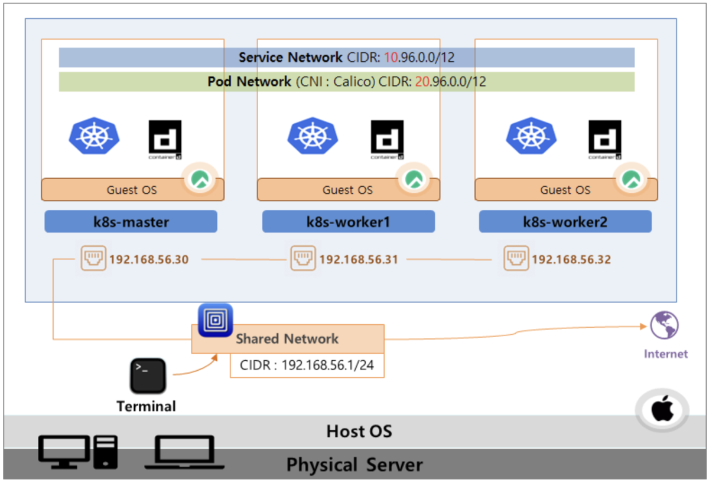

## 들어가며

Docker는 단일 서비스를 컨테이너로 가상화하는 데 탁월하지만, 수많은 컨테이너를 효율적으로 관리하고 운영하는 기능은 제공하지 않습니다. 이러한 한계를 극복하기 위해 등장한 것이 바로 **컨테이너 오케스트레이터**인 쿠버네티스(Kubernetes)입니다.

쿠버네티스는 Auto Scaling, Auto Healing, 배포 자동화 등 대규모 컨테이너 환경 운영에 필요한 다양한 편의 기능을 제공하여, 현대적인 클라우드 네이티브 애플리케이션 개발의 핵심 도구로 자리잡았습니다.

---

## 실습 환경 구성

*인프런 - 대세는 쿠버네티스*

본 실습에서는 Linux, Docker, Kubernetes 환경에서 간단한 Node.js 애플리케이션을 배포하는 과정을 단계별로 진행합니다.

### 1. Linux 환경

- Node.js를 설치하고 8000번 포트로 Hello World 애플리케이션을 실행합니다.

### 2. Docker 환경

- Docker를 이용하여 컨테이너를 생성합니다.
- Docker Hub에서 공식 Node.js 컨테이너 이미지를 가져옵니다.
- Hello World 애플리케이션을 컨테이너에 포함시킵니다.
- 컨테이너를 실행하여 외부에서 8100번 포트로 접근할 수 있도록 설정합니다.

### 3. Kubernetes 환경

- 앞서 생성한 컨테이너 이미지를 Docker Hub에 업로드합니다.
- Kubernetes에서 Pod와 Container를 생성할 때 Docker Hub의 이미지를 참조합니다.
- Pod를 외부에 노출시키기 위해 **Service** 리소스를 사용합니다.
- External IP를 통해 외부에서 애플리케이션에 접근할 수 있습니다.

---

## 쿠버네티스 아키텍처

*인프런 - 대세는 쿠버네티스*

### 클러스터 구조

쿠버네티스는 **하나의 마스터 노드**와 **여러 개의 워커 노드**로 구성된 클러스터 형태로 운영됩니다.

- **Master 노드**
  - 쿠버네티스 클러스터의 전반적인 관리와 제어를 담당합니다.

- **Worker 노드**
  - 실제 애플리케이션 컨테이너가 실행되는 자원을 제공합니다.
  - 클러스터의 전체 자원을 늘리고 싶다면 워커 노드를 추가하면 됩니다.

### 주요 구성 요소

#### Namespace
- 쿠버네티스 오브젝트들을 논리적으로 독립된 공간으로 분리합니다.
- 팀별, 프로젝트별, 환경별(개발/스테이징/운영)로 리소스를 격리할 수 있습니다.

#### Volume
- Pod가 재생성되면 컨테이너 내부의 데이터가 소실됩니다.
- 데이터 영속성을 보장하기 위해 **Volume**을 사용합니다.

#### Controller
컨트롤러는 Pod의 생명주기를 관리하는 핵심 구성 요소입니다.

##### Replication Controller / ReplicaSet
- Pod가 종료되면 자동으로 감지하여 재생성합니다.
- Scale In/Out을 통해 Pod의 개수를 동적으로 조절합니다.
- 가장 기본적인 형태의 컨트롤러입니다.

##### Deployment
- 배포 후 Pod를 새로운 버전으로 업데이트하는 기능을 제공합니다.
- 무중단 배포(Rolling Update)와 간편한 롤백을 지원합니다.

##### DaemonSet
- 각 노드에 Pod가 정확히 하나씩만 실행되도록 보장합니다.
- 주로 로그 수집, 모니터링 에이전트 등에 사용됩니다.

##### Job
- 특정 작업을 수행하고 종료해야 하는 배치 작업에 사용됩니다.
- 작업이 완료되면 Pod가 종료됩니다.

##### CronJob
- Job을 주기적으로 실행해야 할 때 사용하는 컨트롤러입니다.
- Linux의 Cron과 유사한 스케줄링 기능을 제공합니다.

---

## 실습 환경 네트워크 구성

*인프런 - 대세는 쿠버네티스*

> 실습 환경 설치 방법은 강의 자료와 강사님의 네이버 카페를 참고하시기 바랍니다.

---

## 마치며

이번 글에서는 쿠버네티스의 기본 개념과 주요 아키텍처 구성 요소에 대해 학습했습니다. 다음 글에서는 실제 쿠버네티스 클러스터를 구축하고, Pod와 Service를 생성하여 애플리케이션을 배포하는 실습을 진행하겠습니다.

---

## 참고 자료

- [대세는 쿠버네티스 - 인프런](https://inf.run/Lv5RV)
