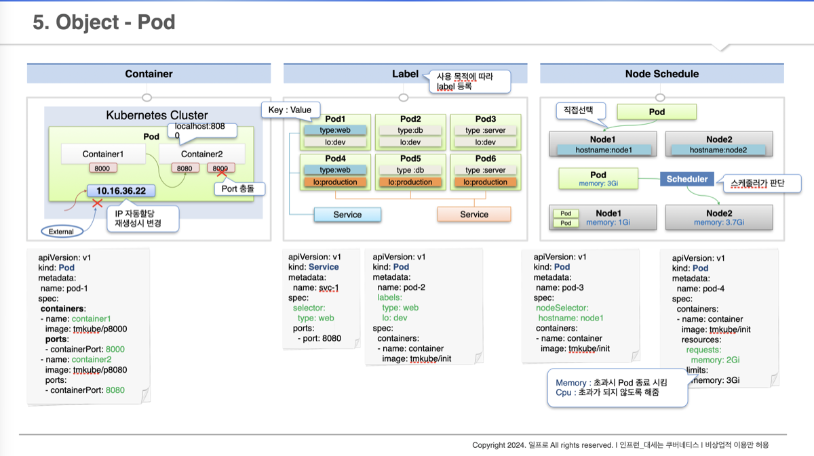
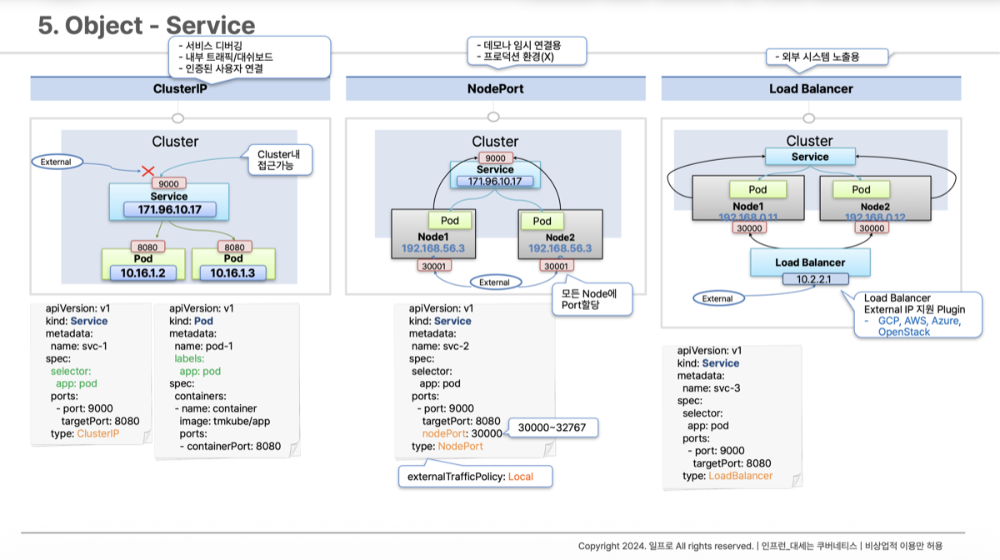
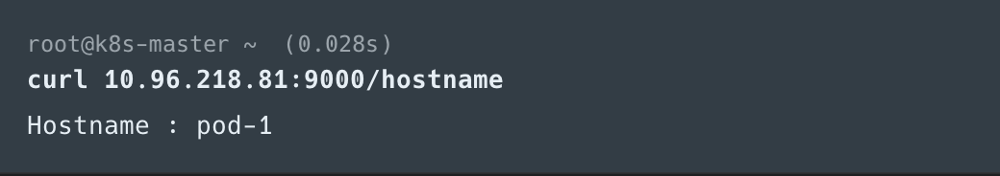
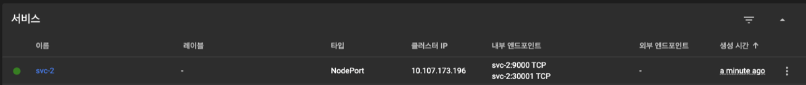
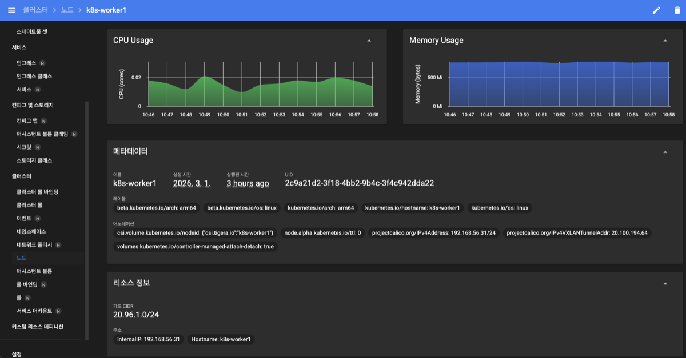
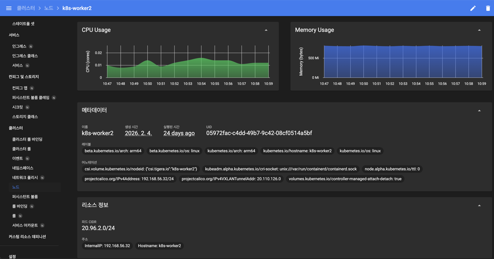
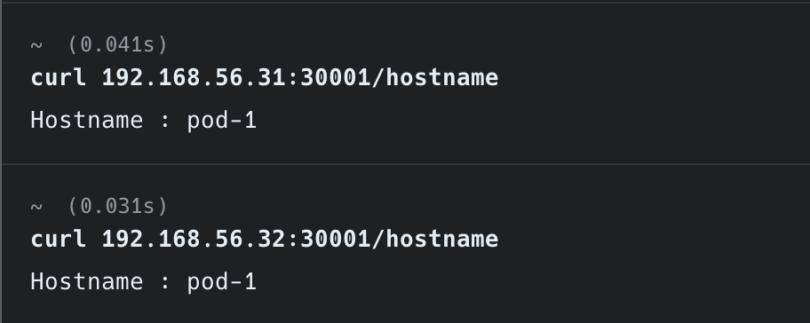
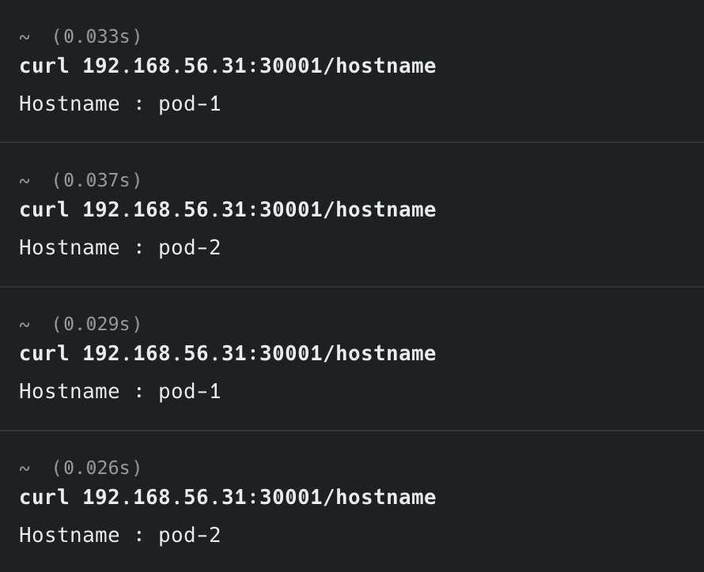
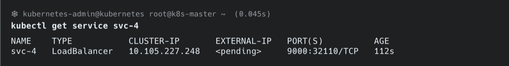
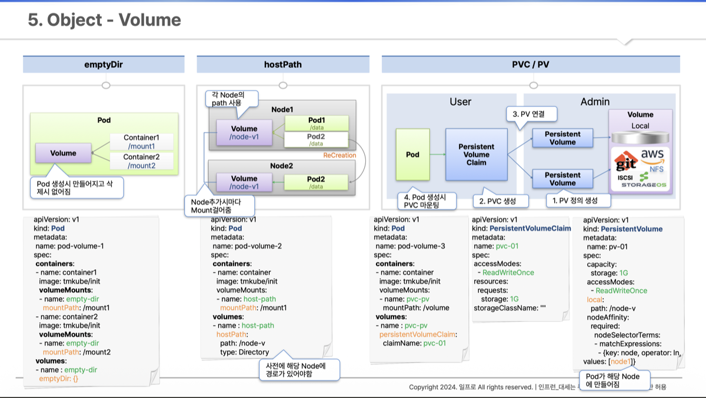

## Pod



*인프런_대세는 쿠버네티스*

Pod는 쿠버네티스에서 배포할 수 있는 가장 작은 단위입니다. 하나의 Pod 안에는 하나 이상의 컨테이너가 존재하며, 각 컨테이너는 독립적인 서비스를 구동합니다.

### 컨테이너와 포트

- 각 컨테이너는 서비스에 연결될 수 있도록 포트를 가지고 있다.
- 한 컨테이너가 여러 개의 포트를 가질 수 있지만, **같은 Pod 내에서 포트가 중복될 수는 없다.**
- 중복된 포트로 컨테이너 생성을 요청하면 로그에서 포트 중복 오류를 확인할 수 있다.

### Pod의 IP

- Pod가 생성될 때 고유의 IP가 할당된다.
- 이 IP는 **쿠버네티스 클러스터 내에서만** 접근 가능하며, 외부에서는 접근할 수 없다.
- Pod가 재생성되면 IP도 새로 할당된다. 따라서 Pod의 IP를 직접 사용하는 것은 신뢰성이 떨어진다.

### Label

- Pod뿐만 아니라 모든 쿠버네티스 오브젝트에 부여할 수 있다.
- `Key: Value` 쌍으로 구성되며, 오브젝트를 분류하고 선택하는 데 사용된다.
- Service를 생성할 때 Label의 셀렉터를 통해 특정 Pod를 선택하여 연결할 수 있다.

### Node Schedule

- Pod는 여러 노드 중 하나의 노드에 배치되어야 한다.
- 배치 방법은 두 가지다.
  - **직접 선택** : `nodeSelector`를 사용하여 특정 노드를 지정
  - **스케줄러에 의한 자동 선택** : 쿠버네티스 스케줄러가 각 노드의 자원 상황을 평가하여 최적의 노드를 결정
- Pod 생성 시 요청 메모리(`requests.memory`)를 지정할 수 있으며, 스케줄러는 이 값을 기준으로 충분한 자원이 있는 노드를 선택한다.

---

## Service



*인프런_대세는 쿠버네티스*

Service는 Pod에 안정적으로 접근하기 위한 추상화 계층이다. Service는 자체적으로 클러스터 IP를 가지며, 이 IP를 통해 연결된 Pod에 접근할 수 있다.

**왜 Service를 통해 접근해야 할까?**

Pod는 시스템 장애나 스케일링 등의 이유로 언제든 재생성될 수 있고, 그때마다 IP가 변경된다. 반면 Service는 사용자가 명시적으로 삭제하지 않는 한 IP가 유지되므로, 안정적인 연결을 보장할 수 있다.

### ClusterIP

가장 기본적인 Service 타입이다. (`type: ClusterIP`는 기본값이므로 생략 가능)

- **클러스터 내부에서만** 접근할 수 있으며, 외부에서는 접근이 불가능하다.
- 여러 개의 Pod를 연결하면 Service가 자동으로 트래픽을 분산시켜 준다.
- 인가된 사용자(운영자, 내부 시스템)만 접근해야 하는 서비스에 적합하다.

**실습 결과**



*클러스터 내부에서 Service IP에 접근하면 정상적으로 응답을 받을 수 있다. 하지만 브라우저에서 `10.96.x.x`로 접근하면, 내부망이긴 하지만 클러스터 내부는 아니기 때문에 접근할 수 없다.*

### NodePort

ClusterIP의 기능을 포함하면서, **외부에서 노드의 IP와 지정된 포트를 통해 접근**할 수 있도록 해주는 타입이다.

- 클러스터에 연결된 **모든 노드에 동일한 포트가 할당**되어, 어느 노드로든 해당 포트로 접근하면 Service에 연결된다.
- 기본적으로 트래픽이 들어온 노드와 관계없이 다른 노드의 Pod에도 트래픽을 전달할 수 있다.
  - `externalTrafficPolicy: Local` 옵션을 설정하면, 트래픽이 들어온 노드에 있는 Pod에만 요청을 전달한다.
- 보통 내부망 안에서의 일시적인 외부 연결 용도로 사용된다.

**실습**

1. NodePort 타입의 Service 생성

   ```yaml
   apiVersion: v1
   kind: Service
   metadata:
     name: svc-2
   spec:
     selector:
       app: pod
     ports:
     - port: 9000
       targetPort: 8080
       nodePort: 30001
     type: NodePort
   ```

   

   *내부 엔드포인트를 보면 두 개의 엔드포인트가 있다. `svc-2:9000 TCP`는 클러스터 IP로 접근할 때 사용하는 포트이고, `svc-2:30001 TCP`는 노드를 통해 외부에서 접근할 때 사용하는 노드 포트이다.*

2. Node의 InternalIP 확인

   

   *k8s-worker1 노드의 InternalIP: 192.168.56.31*

   

   *k8s-worker2 노드의 InternalIP: 192.168.56.32*

3. Local PC에서 접근 테스트

   

   *각 노드의 포트를 통해 Pod에 정상적으로 접근되는 것을 확인할 수 있다.*

4. Pod를 추가한 뒤 트래픽 분산 확인

   ```yaml
   apiVersion: v1
   kind: Pod
   metadata:
     name: pod-2
     labels:
       app: pod
   spec:
     nodeSelector:
       kubernetes.io/hostname: k8s-worker2
     containers:
     - name: container
       image: kubetm/app
       ports:
       - containerPort: 8080
   ```

   

   *`192.168.56.31:30001/hostname`으로 요청을 보내면, k8s-worker1 노드로 트래픽이 들어가지만 응답에는 pod-1과 pod-2가 번갈아 나타난다. Service가 트래픽을 분산시키고 있음을 확인할 수 있다.*

### LoadBalancer

NodePort의 기능을 포함하면서, 앞단에 **로드밸런서가 추가**되어 각 노드로 들어오는 트래픽을 분산시켜 준다.

- 로드밸런서에 접근하기 위한 **외부 IP(External IP)는 별도의 플러그인이 필요**하다. 쿠버네티스를 직접 설치한 환경에서는 자동으로 생기지 않는다.
- GCP, AWS 같은 클라우드 환경에서는 클라우드 프로바이더가 외부 IP를 자동으로 할당해 준다.
- 실제로 외부에 서비스를 노출해야 할 때 사용한다.

**실습 결과**



*별도의 플러그인이 설치되지 않아 EXTERNAL-IP가 `<pending>` 상태임을 확인할 수 있다.*

---

## Volume



*인프런_대세는 쿠버네티스*

쿠버네티스에서 Volume은 컨테이너의 데이터를 보존하거나 공유하기 위한 저장소이다. 볼륨의 종류에 따라 데이터의 생명주기와 접근 범위가 달라진다.

### emptyDir

- 같은 Pod 내의 **컨테이너들끼리 데이터를 공유**하기 위해 사용하는 볼륨이다.
- 이름 그대로 볼륨이 최초 생성될 때 내용이 비어 있다.
- Pod 내부에 생성되므로, **Pod가 삭제되면 볼륨도 함께 삭제**된다.
- 언제 삭제되어도 상관없는 임시 데이터를 보관하는 데 적합하다.

### hostPath

- Pod가 올라가 있는 **노드의 파일 시스템 경로**를 볼륨으로 사용하는 방식이다.
- emptyDir와 달리 Pod가 삭제되어도 노드에 데이터가 남아 있다.
- **문제점** : Pod가 재생성될 때 스케줄러에 의해 다른 노드에 배치될 수 있다. 이 경우 기존 노드의 볼륨 데이터에 접근할 수 없게 된다.
  - 운영자가 리눅스의 마운트 시스템을 사용해 노드 간 볼륨을 연결할 수는 있지만, 자동화 흐름에 사람이 개입한다는 점에서 권장하지 않는다.

### PVC / PV

Pod에 **영속성 있는 볼륨**을 제공하기 위한 구조이다.

- **PV(Persistent Volume)** : 실제 볼륨(로컬 디스크, NFS, 클라우드 스토리지 등)을 쿠버네티스 오브젝트로 등록한 것
- **PVC(Persistent Volume Claim)** : Pod가 PV를 사용하기 위해 요청하는 오브젝트

PV와 PVC를 분리한 이유는 쿠버네티스가 볼륨 관리의 역할을 **Admin 영역과 User 영역으로 구분**하기 때문이다.

- **Admin(쿠버네티스 운영자)** : PV를 생성하고 실제 스토리지를 관리
- **User(서비스 담당자)** : PVC를 통해 필요한 볼륨 스펙을 요청하고 Pod에 연결

이러한 분리 덕분에 서비스 담당자는 실제 스토리지의 세부 구현을 알 필요 없이, 필요한 용량과 접근 방식만 명시하면 된다.

---

## 참고 자료

- [대세는 쿠버네티스 - 인프런](https://inf.run/Lv5RV)
