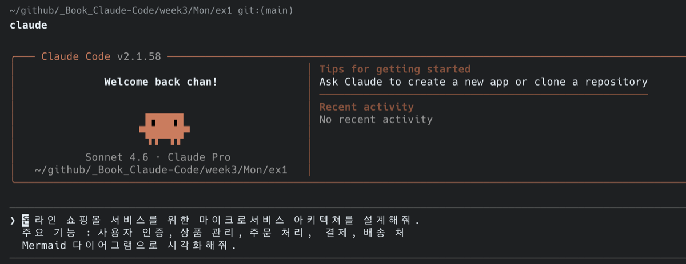
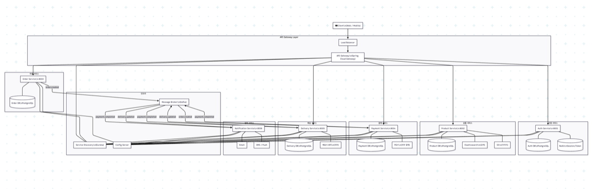
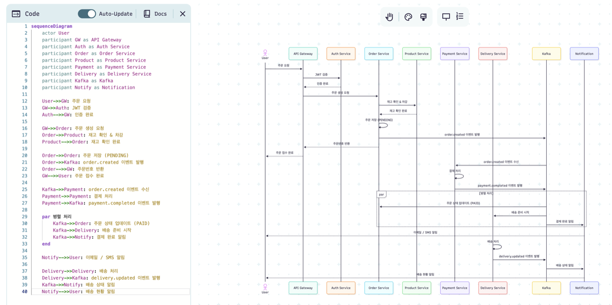
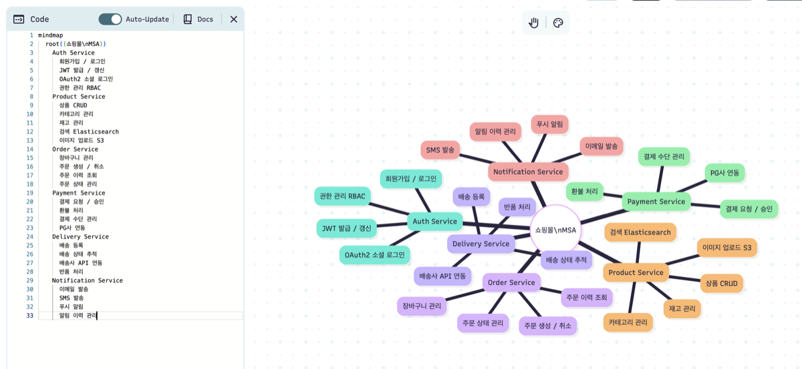

> "한걸음 앞선 개발자가 지금 꼭 알아야할 클로드코드" 보는 중...

---

프로젝트를 설계하다 보면 작성해야 할 문서가 생각보다 많다.

특히 기존 팀원이 아닌 신규 인원이 투입될 때마다 온보딩에 상당한 시간이 소요된다. 이 비용을 줄이려면 설계 단계에서부터 문서를 체계적으로 정리해두는 습관이 중요하다.

Claude를 활용하면 기획 초기 단계부터 기술 스택 선정, 예상 리스크 검토 등 다양한 부분에서 도움을 받을 수 있다.

이 포스트에서는 평소 낯설었던 **WBS**와 **ADR**의 개념을 정리하고, Claude에게 프로젝트 아키텍처 설계를 부탁해본 결과를 공유한다.

---

## WBS (Work Breakdown Structure)

WBS는 **프로젝트의 전체 범위를 관리 가능한 단위로 분해하는 기법**이다.

작업을 잘게 나눔으로써 일정 예측이 정교해지고, 리소스 배분을 균형 있게 조율할 수 있다. 과거에는 PM이 중심이 되어 수행하던 역할이지만, 지금은 Claude 같은 AI 도구가 초안 작성을 상당 부분 도와줄 수 있다.

---

## ADR (Architecture Decision Record)

ADR은 **아키텍처상의 주요 결정을 체계적으로 기록하는 방법**이다.

시스템 설계 과정에서는 수많은 기술적 선택이 이루어진다. 이를 기록해두지 않으면, 시간이 지나 "왜 이 구조를 선택했지?"라는 의문이 생길 때 답을 찾기 어렵다. 이는 불필요한 리팩토링이나 기술 부채로 이어질 수 있다.

### ADR이 주는 이점

| 항목 | 설명 |
|------|------|
| **트레이드오프 명시** | Y-Statement 형식: _"X를 선택함으로써 우리는 Y를 얻는 대신 Z를 감수한다."_ |
| **미래의 팀을 위한 기록** | 결정 당시의 맥락이 사라지지 않도록 보존 |
| **온보딩 속도 향상** | 신규 인원이 설계 의도를 빠르게 파악 |
| **기술 부채 관리** | 의사결정 근거가 명확하면 리팩토링 범위를 합리적으로 판단 가능 |

모든 기술적 결정에는 트레이드오프가 존재한다. ADR은 그 트레이드오프를 직시하고 기록하는 습관을 만들어준다.

---

## Claude에게 프로젝트 아키텍처 설계 부탁하기

### 요청



### 결과

Claude가 마이크로서비스 기반의 온라인 쇼핑몰 아키텍처를 Mermaid 다이어그램으로 생성해주었다.

```
⏺ 온라인 쇼핑몰 마이크로서비스 아키텍처

  전체 시스템 아키텍처

  graph TB
    Client["🖥️ Client\n(Web / Mobile)"]

    subgraph Gateway["API Gateway Layer"]
        AG["API Gateway\n(Spring Cloud Gateway)"]
        LB["Load Balancer"]
    end

    subgraph Auth["인증 서비스"]
        AS["Auth Service\n:8001"]
        AuthDB[("Auth DB\nPostgreSQL")]
        Redis[("Redis\nSession/Token")]
    end

    subgraph Product["상품 서비스"]
        PS["Product Service\n:8002"]
        ProductDB[("Product DB\nPostgreSQL")]
        ES["Elasticsearch\n(검색)"]
        S3["S3\n(이미지)"]
    end

    subgraph Order["주문 서비스"]
        OS["Order Service\n:8003"]
        OrderDB[("Order DB\nPostgreSQL")]
    end

    subgraph Payment["결제 서비스"]
        PAY["Payment Service\n:8004"]
        PayDB[("Payment DB\nPostgreSQL")]
        PG["PG사\n(외부 결제)"]
    end

    subgraph Delivery["배송 서비스"]
        DS["Delivery Service\n:8005"]
        DeliveryDB[("Delivery DB\nPostgreSQL")]
        Carrier["배송사 API\n(외부)"]
    end

    subgraph Notification["알림 서비스"]
        NS["Notification Service\n:8006"]
        Email["Email"]
        SMS["SMS / Push"]
    end

    subgraph Infra["인프라"]
        MQ["Message Broker\n(Kafka)"]
        SD["Service Discovery\n(Eureka)"]
        CF["Config Server"]
    end

    Client --> LB --> AG
    AG --> AS & PS & OS & PAY & DS
    AS --- AuthDB & Redis
    PS --- ProductDB & ES & S3
    OS --- OrderDB
    PAY --- PayDB & PG
    DS --- DeliveryDB & Carrier

    OS -->|"order.created"| MQ
    MQ -->|"order.created"| PAY
    PAY -->|"payment.completed"| MQ
    MQ -->|"payment.completed"| DS
    MQ -->|"payment.completed"| NS
    DS -->|"delivery.updated"| MQ
    MQ -->|"delivery.updated"| NS
    NS --- Email & SMS

    AG --- SD
    AS & PS & OS & PAY & DS & NS --- SD
    AS & PS & OS & PAY & DS & NS --- CF

  주문 처리 플로우

sequenceDiagram
    actor User
    participant GW as API Gateway
    participant Auth as Auth Service
    participant Order as Order Service
    participant Product as Product Service
    participant Payment as Payment Service
    participant Delivery as Delivery Service
    participant Kafka as Kafka
    participant Notify as Notification

    User->>GW: 주문 요청
    GW->>Auth: JWT 검증
    Auth-->>GW: 인증 완료

    GW->>Order: 주문 생성 요청
    Order->>Product: 재고 확인 & 차감
    Product-->>Order: 재고 확인 완료

    Order->>Order: 주문 저장 (PENDING)
    Order->>Kafka: order.created 이벤트 발행
    Order-->>GW: 주문번호 반환
    GW-->>User: 주문 접수 완료

    Kafka->>Payment: order.created 이벤트 수신
    Payment->>Payment: 결제 처리
    Payment->>Kafka: payment.completed 이벤트 발행

    par 병렬 처리
        Kafka->>Order: 주문 상태 업데이트 (PAID)
        Kafka->>Delivery: 배송 준비 시작
        Kafka->>Notify: 결제 완료 알림
    end

    Notify-->>User: 이메일 / SMS 알림

    Delivery->>Delivery: 배송 처리
    Delivery->>Kafka: delivery.updated 이벤트 발행
    Kafka->>Notify: 배송 상태 알림
    Notify-->>User: 배송 현황 알림

  서비스별 책임 정의

mindmap
  root((쇼핑몰\nMSA))
    Auth Service
      회원가입 / 로그인
      JWT 발급 / 갱신
      OAuth2 소셜 로그인
      권한 관리 RBAC
    Product Service
      상품 CRUD
      카테고리 관리
      재고 관리
      검색 Elasticsearch
      이미지 업로드 S3
    Order Service
      장바구니 관리
      주문 생성 / 취소
      주문 이력 조회
      주문 상태 관리
    Payment Service
      결제 요청 / 승인
      환불 처리
      결제 수단 관리
      PG사 연동
    Delivery Service
      배송 등록
      배송 상태 추적
      배송사 API 연동
      반품 처리
    Notification Service
      이메일 발송
      SMS 발송
      푸시 알림
      알림 이력 관리
```

### mermaid.live에서 확인

Mermaid 코드를 [mermaid.live](https://mermaid.live)에 붙여넣으면 다이어그램을 바로 시각화할 수 있다.







---

프로젝트 설계 단계에서 고민해야 할 내용들을 Claude가 베스트 프랙티스를 기반으로 정리해주기 때문에, 시행착오를 줄이고 검토 시간을 확보하는 데 실질적인 도움이 된다. WBS·ADR과 같은 문서화 습관, 그리고 AI를 설계 파트너로 활용하는 방식을 함께 갖추면 팀 전체의 생산성에도 긍정적인 영향을 줄 수 있다고 생각한다.
