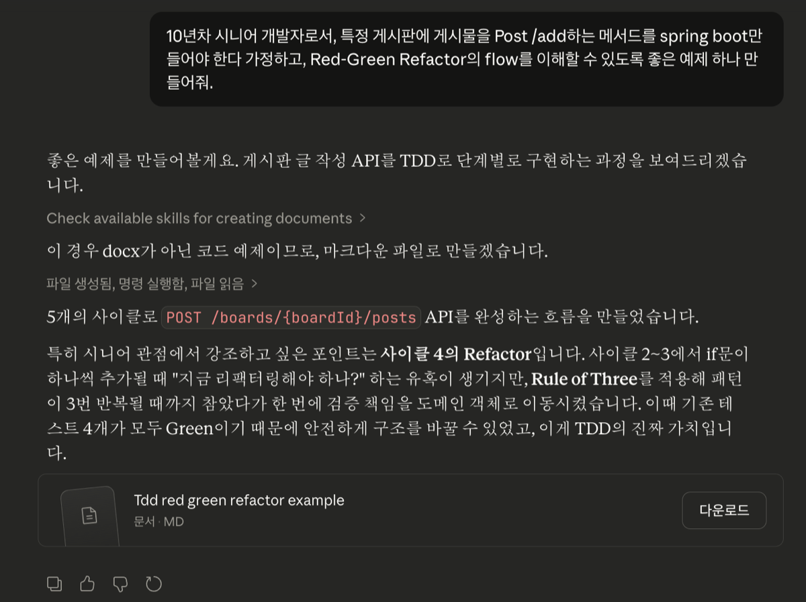

> "한걸음 앞선 개발자가 지금 꼭 알아야할 클로드코드" 책을 읽으면서 정리한 내용입니다.

---

## TDD란

테스트는 소프트웨어 품질을 보장하는 핵심 요소 중 하나다. TDD(Test-Driven Development)는 테스트를 먼저 작성하고, 그 테스트를 통과하는 코드를 구현하는 개발 방법론이다. Claude Code를 활용하면 테스트 전략을 효과적으로 수립하고, 작성하는 데 걸리는 시간을 크게 줄일 수 있다.

---

## Red-Green-Refactor 사이클

TDD의 핵심은 아래 세 단계를 반복하는 것이다.

1. **Red** — 실패하는 테스트 작성
   아직 구현되지 않은 기능에 대한 테스트를 먼저 작성한다. 테스트는 당연히 실패한다. 이 단계의 목적은 요구사항을 명확하게 정의하는 것이다.

2. **Green** — 최소한의 코드로 테스트 통과시키기
   테스트를 통과시키는 데 필요한 최소한의 코드만 작성한다. 코드 품질보다 **테스트 통과**가 우선이다.

3. **Refactor** — 코드 품질 개선
   테스트가 통과하는 상태에서 코드의 구조와 품질을 개선한다. 테스트가 안전망 역할을 하기 때문에 안심하고 리팩터링할 수 있다.

---

## Claude Code에게 실전 예제 요청해보기

Claude Code에 직접 TDD 실전 예제를 요청해봤다. 아래는 그 결과다.

> 사이드 프로젝트에 바로 적용해봐야겠다.



---

## TDD Red-Green-Refactor 실전 예제

### 시나리오: 게시판 게시물 작성 API (`POST /boards/{boardId}/posts`)

> 시니어 개발자의 관점에서, 하나의 기능을 TDD로 구현하는 전체 흐름을 보여준다. 각 사이클마다 **Red → Green → Refactor**가 어떻게 돌아가는지에 집중해보자.

#### 요구사항

- 특정 게시판(`boardId`)에 게시물을 작성한다.
- 제목과 본문은 필수이며, 제목은 100자 이내여야 한다.
- 존재하지 않는 게시판에 글을 쓸 수 없다.
- 성공 시 201 Created와 함께 생성된 게시물을 반환한다.

#### 프로젝트 구조 (Clean Architecture)

```
src/
├── main/java/com/example/board/
│   ├── controller/PostController.java
│   ├── service/PostService.java
│   ├── domain/Post.java
│   ├── dto/CreatePostRequest.java
│   └── repository/PostRepository.java
└── test/java/com/example/board/
    ├── service/PostServiceTest.java          ← 단위 테스트 (우리의 주 무대)
    └── controller/PostControllerTest.java    ← 통합 테스트
```

---

### 사이클 1: 게시물 생성의 기본 흐름

#### Red — 실패하는 테스트 작성

가장 기본적인 성공 케이스부터 시작한다. **"제목과 본문이 주어지면, 게시물이 생성되어야 한다."**

```java
@ExtendWith(MockitoExtension.class)
class PostServiceTest {

    @Mock
    private PostRepository postRepository;

    @Mock
    private BoardRepository boardRepository;

    @InjectMocks
    private PostService postService;

    @Test
    @DisplayName("유효한 요청이 주어지면 게시물이 생성된다")
    void shouldCreatePost_WhenRequestIsValid() {
        // given
        Long boardId = 1L;
        CreatePostRequest request = new CreatePostRequest("첫 번째 글", "안녕하세요, 반갑습니다.");

        given(boardRepository.existsById(boardId)).willReturn(true);
        given(postRepository.save(any(Post.class)))
            .willAnswer(invocation -> {
                Post post = invocation.getArgument(0);
                return Post.builder()
                    .id(1L)
                    .boardId(post.getBoardId())
                    .title(post.getTitle())
                    .content(post.getContent())
                    .build();
            });

        // when
        Post result = postService.createPost(boardId, request);

        // then
        assertThat(result.getId()).isEqualTo(1L);
        assertThat(result.getBoardId()).isEqualTo(boardId);
        assertThat(result.getTitle()).isEqualTo("첫 번째 글");
        assertThat(result.getContent()).isEqualTo("안녕하세요, 반갑습니다.");
        then(postRepository).should().save(any(Post.class));
    }
}
```

이 시점에서는 **컴파일조차 안 된다.** `PostService`, `CreatePostRequest`, `Post` 전부 없으니까. 이것이 정상이다. Red는 "실패"를 확인하는 단계다.

#### Green — 테스트를 통과시키는 최소한의 코드

컴파일 에러를 해결하고, 테스트가 통과할 만큼만 구현한다.

```java
// CreatePostRequest.java
public record CreatePostRequest(
    String title,
    String content
) {}

// Post.java
@Getter
@Builder
@AllArgsConstructor
public class Post {
    private Long id;
    private Long boardId;
    private String title;
    private String content;
}

// PostService.java
@Service
@RequiredArgsConstructor
public class PostService {

    private final PostRepository postRepository;
    private final BoardRepository boardRepository;

    public Post createPost(Long boardId, CreatePostRequest request) {
        Post post = Post.builder()
            .boardId(boardId)
            .title(request.title())
            .content(request.content())
            .build();

        return postRepository.save(post);
    }
}
```

**테스트 결과: ✅ GREEN**

> `boardRepository.existsById()` 검증 로직은 아직 없다. Green 단계에서는 **현재 테스트를 통과시키는 것**에만 집중한다. 게시판 존재 여부 검증은 다음 사이클에서 별도 테스트로 추가한다.

#### Refactor — 현 시점에서는 할 것 없음

코드가 워낙 단순하므로 리팩터링 대상이 없다. Refactor는 "반드시 해야 하는 것"이 아니다. 필요할 때만 한다.

---

### 사이클 2: 존재하지 않는 게시판 예외 처리

#### Red

```java
@Test
@DisplayName("존재하지 않는 게시판이면 예외가 발생한다")
void shouldThrowException_WhenBoardNotFound() {
    // given
    Long invalidBoardId = 999L;
    CreatePostRequest request = new CreatePostRequest("제목", "본문");

    given(boardRepository.existsById(invalidBoardId)).willReturn(false);

    // when & then
    assertThatThrownBy(() -> postService.createPost(invalidBoardId, request))
        .isInstanceOf(BoardNotFoundException.class)
        .hasMessageContaining("999");
}
```

**테스트 결과: ❌ RED** — `BoardNotFoundException` 클래스도 없고, 검증 로직도 없으니 당연히 실패한다.

#### Green

```java
// BoardNotFoundException.java
public class BoardNotFoundException extends RuntimeException {
    public BoardNotFoundException(Long boardId) {
        super("게시판을 찾을 수 없습니다. boardId=" + boardId);
    }
}

// PostService.java — 검증 로직 추가
public Post createPost(Long boardId, CreatePostRequest request) {
    if (!boardRepository.existsById(boardId)) {          // ← 추가
        throw new BoardNotFoundException(boardId);        // ← 추가
    }

    Post post = Post.builder()
        .boardId(boardId)
        .title(request.title())
        .content(request.content())
        .build();

    return postRepository.save(post);
}
```

**테스트 결과: ✅ GREEN** (사이클 1 테스트도 여전히 통과)

#### Refactor — 여전히 깔끔하므로 패스

---

### 사이클 3: 제목 빈 값 검증

#### Red

```java
@Test
@DisplayName("제목이 비어있으면 예외가 발생한다")
void shouldThrowException_WhenTitleIsBlank() {
    // given
    Long boardId = 1L;
    CreatePostRequest request = new CreatePostRequest("", "본문");

    given(boardRepository.existsById(boardId)).willReturn(true);

    // when & then
    assertThatThrownBy(() -> postService.createPost(boardId, request))
        .isInstanceOf(IllegalArgumentException.class)
        .hasMessageContaining("제목");
}
```

**테스트 결과: ❌ RED** — 빈 제목이 그대로 통과해버린다.

#### Green

```java
// PostService.java
public Post createPost(Long boardId, CreatePostRequest request) {
    if (!boardRepository.existsById(boardId)) {
        throw new BoardNotFoundException(boardId);
    }

    if (request.title() == null || request.title().isBlank()) {   // ← 추가
        throw new IllegalArgumentException("제목은 필수입니다.");    // ← 추가
    }

    Post post = Post.builder()
        .boardId(boardId)
        .title(request.title())
        .content(request.content())
        .build();

    return postRepository.save(post);
}
```

**테스트 결과: ✅ GREEN**

#### Refactor — 아직은 참는다

검증 로직이 2개인데, 아직 리팩터링하기엔 이르다. **Rule of Three** — 패턴이 3번 반복될 때까지 기다린다.

---

### 사이클 4: 제목 길이 제한 (100자)

#### Red

```java
@Test
@DisplayName("제목이 100자를 초과하면 예외가 발생한다")
void shouldThrowException_WhenTitleExceedsMaxLength() {
    // given
    Long boardId = 1L;
    String longTitle = "가".repeat(101);
    CreatePostRequest request = new CreatePostRequest(longTitle, "본문");

    given(boardRepository.existsById(boardId)).willReturn(true);

    // when & then
    assertThatThrownBy(() -> postService.createPost(boardId, request))
        .isInstanceOf(IllegalArgumentException.class)
        .hasMessageContaining("100자");
}
```

**테스트 결과: ❌ RED**

#### Green

```java
// PostService.java
public Post createPost(Long boardId, CreatePostRequest request) {
    if (!boardRepository.existsById(boardId)) {
        throw new BoardNotFoundException(boardId);
    }
    if (request.title() == null || request.title().isBlank()) {
        throw new IllegalArgumentException("제목은 필수입니다.");
    }
    if (request.title().length() > 100) {                               // ← 추가
        throw new IllegalArgumentException("제목은 100자 이내여야 합니다."); // ← 추가
    }

    Post post = Post.builder()
        .boardId(boardId)
        .title(request.title())
        .content(request.content())
        .build();

    return postRepository.save(post);
}
```

**테스트 결과: ✅ GREEN**

#### Refactor — 이제 할 때가 됐다

검증 로직이 3개로 늘어났다. Service에 검증 책임이 비대해지고 있다. **도메인 객체에 검증 책임을 이동시킨다.**

```java
// Post.java — 도메인 객체가 자기 자신을 검증
@Getter
public class Post {
    private Long id;
    private Long boardId;
    private String title;
    private String content;

    @Builder
    public Post(Long id, Long boardId, String title, String content) {
        validateTitle(title);
        validateContent(content);
        this.id = id;
        this.boardId = boardId;
        this.title = title;
        this.content = content;
    }

    private void validateTitle(String title) {
        if (title == null || title.isBlank()) {
            throw new IllegalArgumentException("제목은 필수입니다.");
        }
        if (title.length() > 100) {
            throw new IllegalArgumentException("제목은 100자 이내여야 합니다.");
        }
    }

    private void validateContent(String content) {
        if (content == null || content.isBlank()) {
            throw new IllegalArgumentException("본문은 필수입니다.");
        }
    }
}

// PostService.java — 검증 로직이 사라져 훨씬 깔끔해졌다
@Service
@RequiredArgsConstructor
public class PostService {

    private final PostRepository postRepository;
    private final BoardRepository boardRepository;

    public Post createPost(Long boardId, CreatePostRequest request) {
        if (!boardRepository.existsById(boardId)) {
            throw new BoardNotFoundException(boardId);
        }

        Post post = Post.builder()
            .boardId(boardId)
            .title(request.title())
            .content(request.content())
            .build();

        return postRepository.save(post);
    }
}
```

**리팩터링 후 전체 테스트 실행: ✅ 4개 모두 GREEN**

> 이것이 Refactor의 핵심이다. **동작은 바꾸지 않고, 구조만 개선한다.** 테스트가 보호막 역할을 하기 때문에 리팩터링이 안전하다.

---

### 사이클 5: Controller 통합 테스트

Service 로직이 안정되었으니, 이제 HTTP 레이어를 테스트한다.

#### Red

```java
@WebMvcTest(PostController.class)
class PostControllerTest {

    @Autowired
    private MockMvc mockMvc;

    @MockBean
    private PostService postService;

    @Autowired
    private ObjectMapper objectMapper;

    @Test
    @DisplayName("POST /boards/{boardId}/posts → 201 Created")
    void shouldReturn201_WhenPostCreated() throws Exception {
        // given
        Long boardId = 1L;
        CreatePostRequest request = new CreatePostRequest("제목", "본문");
        Post savedPost = Post.builder()
            .id(1L).boardId(boardId).title("제목").content("본문")
            .build();

        given(postService.createPost(eq(boardId), any(CreatePostRequest.class)))
            .willReturn(savedPost);

        // when & then
        mockMvc.perform(post("/boards/{boardId}/posts", boardId)
                .contentType(MediaType.APPLICATION_JSON)
                .content(objectMapper.writeValueAsString(request)))
            .andExpect(status().isCreated())
            .andExpect(jsonPath("$.id").value(1L))
            .andExpect(jsonPath("$.title").value("제목"))
            .andExpect(jsonPath("$.content").value("본문"));
    }

    @Test
    @DisplayName("POST /boards/{boardId}/posts → 404 Not Found (존재하지 않는 게시판)")
    void shouldReturn404_WhenBoardNotFound() throws Exception {
        // given
        Long boardId = 999L;
        CreatePostRequest request = new CreatePostRequest("제목", "본문");

        given(postService.createPost(eq(boardId), any(CreatePostRequest.class)))
            .willThrow(new BoardNotFoundException(boardId));

        // when & then
        mockMvc.perform(post("/boards/{boardId}/posts", boardId)
                .contentType(MediaType.APPLICATION_JSON)
                .content(objectMapper.writeValueAsString(request)))
            .andExpect(status().isNotFound());
    }
}
```

**테스트 결과: ❌ RED** — `PostController` 자체가 없으니까.

#### Green

```java
// PostController.java
@RestController
@RequiredArgsConstructor
@RequestMapping("/boards/{boardId}/posts")
public class PostController {

    private final PostService postService;

    @PostMapping
    public ResponseEntity<Post> createPost(
            @PathVariable Long boardId,
            @RequestBody CreatePostRequest request) {

        Post post = postService.createPost(boardId, request);
        return ResponseEntity.status(HttpStatus.CREATED).body(post);
    }
}

// GlobalExceptionHandler.java
@RestControllerAdvice
public class GlobalExceptionHandler {

    @ExceptionHandler(BoardNotFoundException.class)
    public ResponseEntity<String> handleBoardNotFound(BoardNotFoundException e) {
        return ResponseEntity.status(HttpStatus.NOT_FOUND).body(e.getMessage());
    }

    @ExceptionHandler(IllegalArgumentException.class)
    public ResponseEntity<String> handleIllegalArgument(IllegalArgumentException e) {
        return ResponseEntity.status(HttpStatus.BAD_REQUEST).body(e.getMessage());
    }
}
```

**테스트 결과: ✅ GREEN**

#### Refactor

Controller 응답을 `Post` 도메인 객체 대신 `PostResponse` DTO로 분리할 수 있다. 하지만 현 시점에서는 YAGNI(You Ain't Gonna Need It) 원칙에 따라, 다음 요구사항이 생길 때까지 보류한다.

---

## 전체 흐름 요약

```
사이클 1: 기본 생성         🔴 컴파일 에러  → 🟢 최소 구현        → 🔵 패스
사이클 2: 게시판 존재 검증  🔴 예외 미발생  → 🟢 if문 추가        → 🔵 패스
사이클 3: 제목 빈 값 검증   🔴 예외 미발생  → 🟢 if문 추가        → 🔵 참는다 (Rule of Three)
사이클 4: 제목 길이 검증    🔴 예외 미발생  → 🟢 if문 추가        → 🔵 도메인으로 검증 이동
사이클 5: Controller 통합  🔴 컴파일 에러  → 🟢 Controller 구현  → 🔵 DTO 분리는 보류 (YAGNI)
```

---

## 시니어 관점에서의 핵심 포인트

### 1. 테스트가 설계를 이끈다

사이클 4에서 검증 로직이 3개가 되자 자연스럽게 "이건 도메인의 책임이다"라는 판단이 내려졌다. TDD를 하면 설계 결정이 **감이 아닌 코드의 냄새(Code Smell)**로부터 나온다.

### 2. Red에서 "얼마나 작게" 시작하느냐가 기술이다

"게시물 생성 + 검증 + 예외처리"를 한 번에 테스트하지 않았다. 한 테스트에 하나의 행위. 이것이 사이클을 빠르게 돌릴 수 있는 비결이다.

### 3. Refactor는 "안 해도 되는 단계"가 아니라 "때를 기다리는 단계"

사이클 2~3에서 참았다가 사이클 4에서 한 번에 리팩터링한 것처럼, **충분한 패턴이 보일 때까지 기다렸다가 확신이 생기면 움직인다.**

### 4. 테스트가 없는 리팩터링은 도박이다

사이클 4에서 검증 로직의 위치를 Service → Domain으로 옮겼지만, 기존 4개의 테스트가 전부 통과했기 때문에 **안전하게** 구조를 바꿀 수 있었다.
