> [📌 보러가기](https://www.inflearn.com/challenge/%EB%AC%B4%EB%A3%8C-live-2026-%EB%B0%B1%EC%97%94%EB%93%9C-%EA%B0%9C%EB%B0%9C%EC%9E%90?cid=340917)

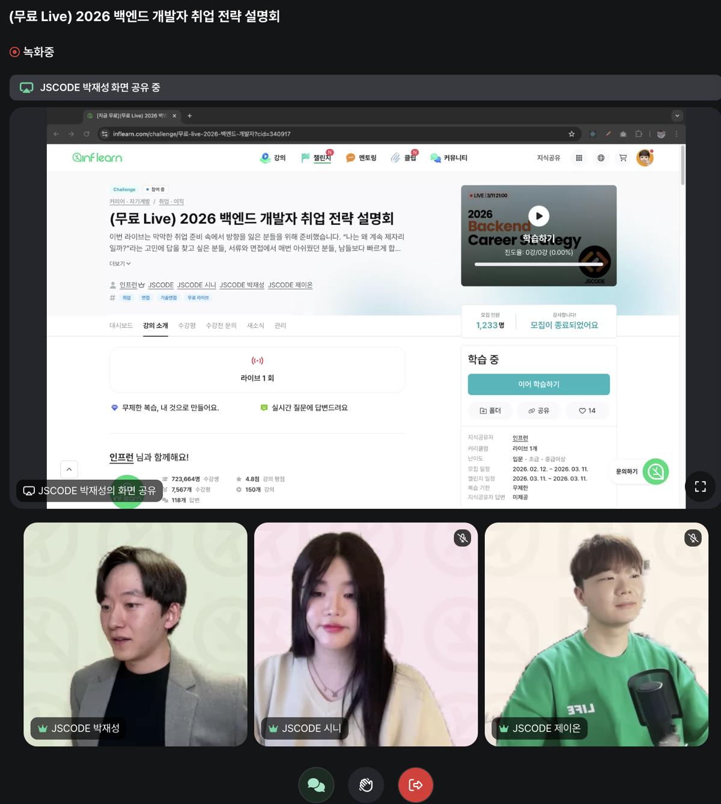

1. 시니님

- AI의 활용과 튼튼한 기본기
  - 누구나 AI를 곁에...
  - 얼마나 이것을 잘 쓰는지가 중요
  - 그래서 AI... 이 도구를 얼마나 잘 쓸 수 있냐?
    - 내 역량이 50인데 이것을 사용하면 어디까지 끌어올릴 수 있냐? 이제 면접관은 이게 궁금할 수도
  - 거인의 어깨에 올라타라
  - but, 복붙이 답은 아니다.
  - 코드가 빠르고 그럴듯하게 짜는건 이미 AI가 다 하는걸 누구나 (+면접관) 알고 있다.
  - 중요한건, 근본... 문제가 발생했을때 어떻게 해결할 것인가.
  - 취업 전략...
    - 일단은 AI를 사용해서 퀄리티를 최대한 올릴 것
    - 그리고 사용하면서 결정한 것들에 대해서 왜 이걸 선택했는지 치열하게 고민해 볼것

- 지원 전략

  - wanted, programmers, rallit, saramin -> 여기에 올라온 기업들은 사실 전체 기업의 1%정도밖에 안된다 ( 실제로 여기 올리는 기업들은 그만큼의 중개 수수료를 지불할 역량이 있다는 것 )

    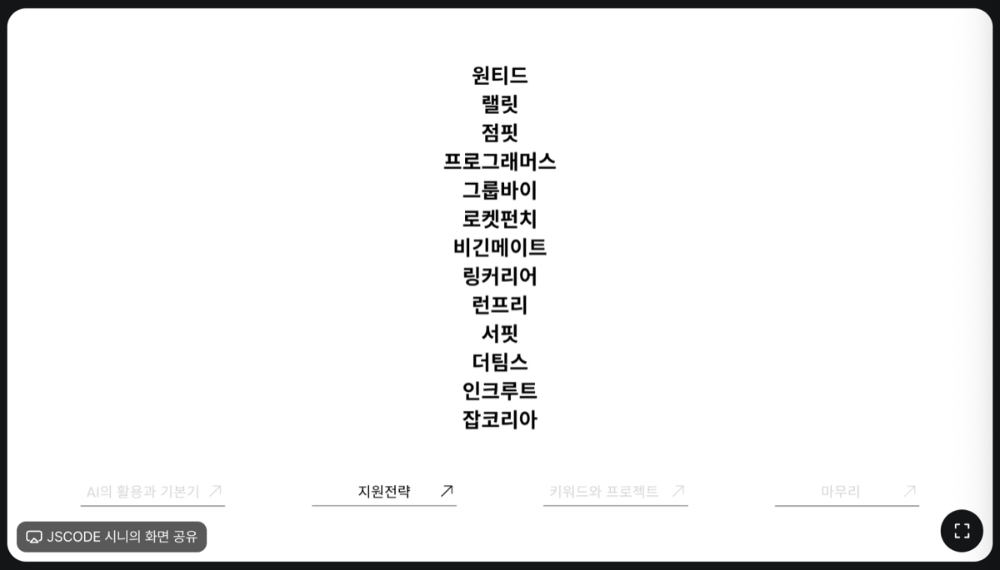

  - 가고 싶은 회사를 딱 5개 추리기

    - 대기업이 아니어도 됨, 중견 + 스타트업
    - 수시로 들어가서 상시채용을 노리는것도 전략
    - 자사 사이트에 공고를 올리는 곳도 많다.
    - 독취사 + 전산실사람들 => 여기도 비공식 루트로 올라오는 채용공고가 많다.

  - 멘토님 느낌상... 채용이 안되는 사람들 보면 자신이 올라운더가 되려고함.

    - 면접관 입장에서는 필요한 인력이 올라운더가 아닐 수도 있다.

- 키워드 & 프로젝트

  - 키워드
    - 취업은 소개팅과 같다...
    - 나의 키워드와 회사가 원하는 키워드가 찰떡같이 맞아야 한다.
    - 그래서 100개 200개 지원하는게 아니라, 우대사항 채용공고의 기술스택 꼼꼼히 뜯어보고 매칭이 많이 되는 곳을 지원하는 게 중요하다!
    - 불합격하는애들 특, 걍 지원하는 애들...
  - 프로젝트
    - 멘토님 보기에는...
      - 취업 못하는 사람들 특징을 보고 그 사람이 하는걸 안하면 됨
      - 합격자 특징은?
        - 가고싶은 채용공고 싹 다 분석
        - 여기서 이력서에 어필할 스택을 뽑아냄
        - 이력서에 작성할 스토리를 만들고!
        - 그걸 이뤄낼 수 있는 맞춤형 프로젝트를 진행
          - 여기에 AI를 적극적으로 사용 ( 여기서 특히 복붙해서 끝내는게 아니라, 내것으로 만드는게 중요 )

---

2. 제이온님

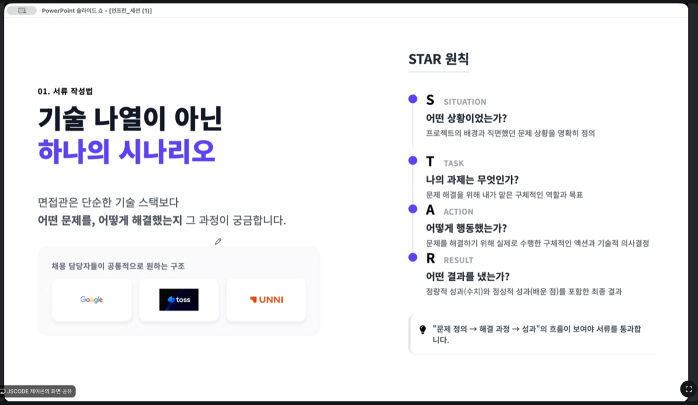

- 면접관은 어떤 문제를 어떻게 해결했는지? 궁금하다.
  - 문제정의 -> 해결과정 -> 성과가 잘 보여야 합격률이 높아진다.

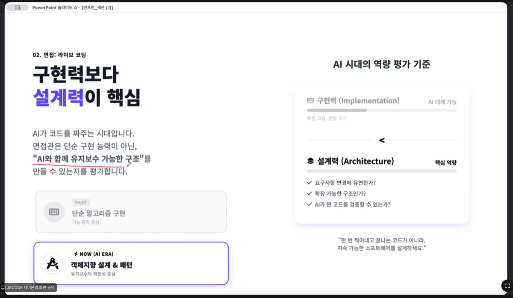

- AI가 작성해준 소스를 내가 지속가능한 소스로 만들어낼 수 있는지가 중요함....

- 직무면접 Keyword

  - 문제 해결력

    - 실무에서 주어지는 문제가 언제나 명확하지 않다. 모호함...ambiguity

    - 모호한 문제를 질문을 통해 점점 좁혀하고, 해결가능한 방법을 찾아내는것.

    - 거기엔 여러 옵션이 있을 수 있는데 면접관은 여러가지 선택지 중 왜 최적의 가성비인지 설명할 줄 알아야 한다.

      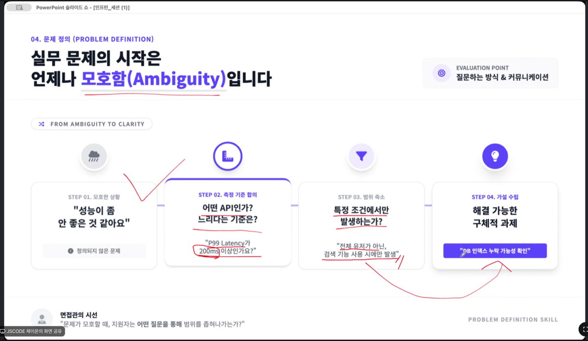

      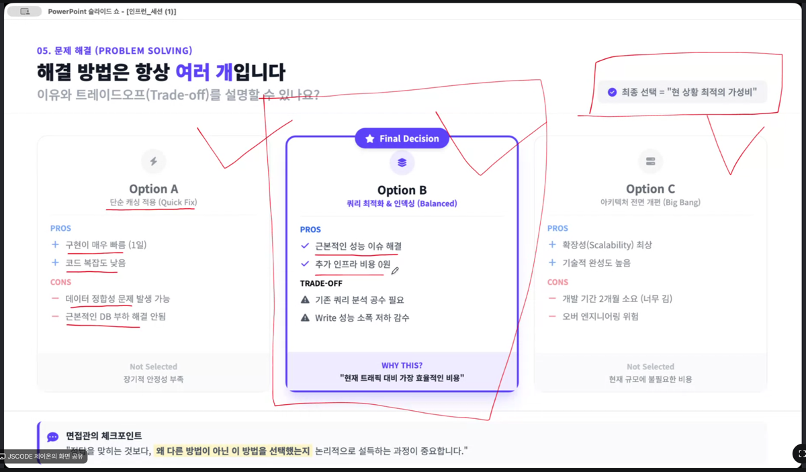

- 그럼 왜 면접관이 문제해결력을 보냐?

  - AI, 내가 모두 이해할 수 있도록 sync를 맞춤

  - 문제를 작게 쪼개서 해결하려 한다.

    > 이거 책에서 본 내용인데? chain of thought, sequential thinking

  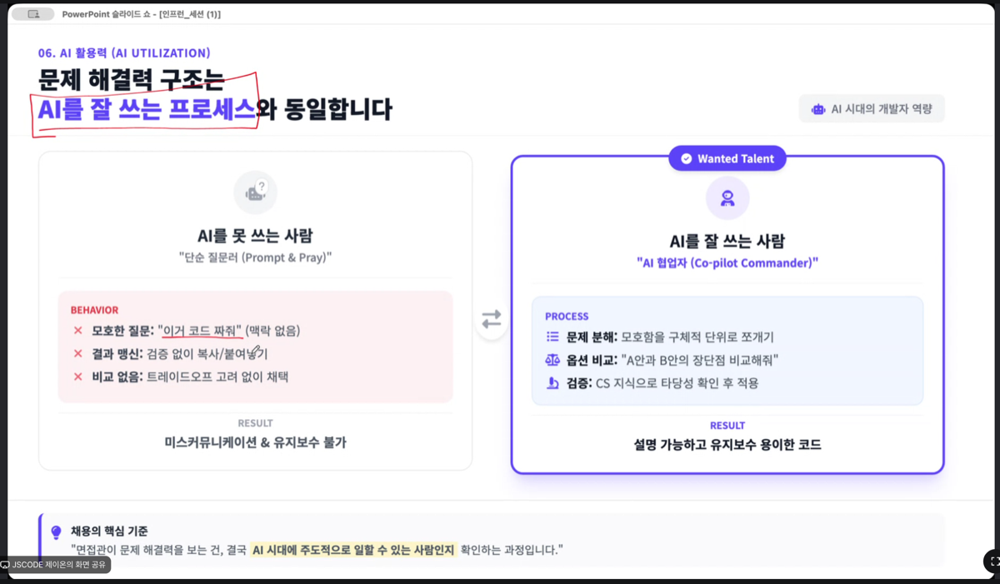

- AI가 다 아는데 CS 공부를 해야하나?

  - AI가 답변한 내용을 검증하려면 결국 CS 지식이 중요...
  - AI답변 검증의 3가지 기준
    - 자료구조 & 알고리즘
    - OS & 운영체제
    - 데이터베이스
  - CS지식이 깊을수록,,, AI를 사용해도 더 깊은(정교한) 질문을 할 수 있다.

- 마무리

  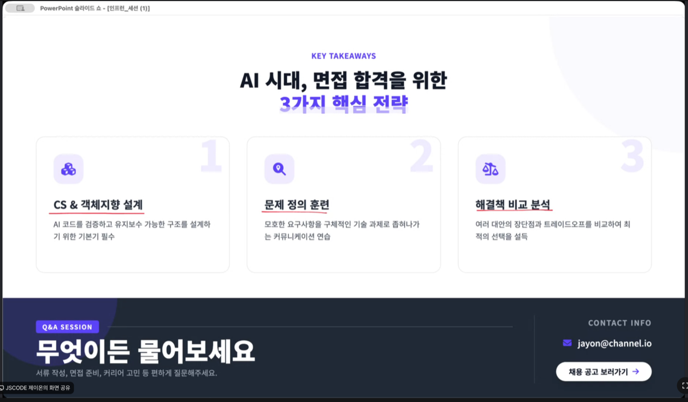

---

3. 박재성님

- 대부분의 취준생들이 잘 모르는 쉽게 취업하는 루트

- 2026년엔?

  - 운영 및 유지보수 경험이 유리한 스펙
  - AI 가 등장하면서 일일이 구현하는 비중이 낮아지고, "실제 서비스를 운영하며 만날 수 있는 문제를 어떻게 해결했는지... "
  - 이는 결국 경력직을 뽑는 추세와 비슷한 맥락이다.

- 완전 신생 스타트업에 들어가서 운영을 경험해보는게 좋을 수도 있다.

  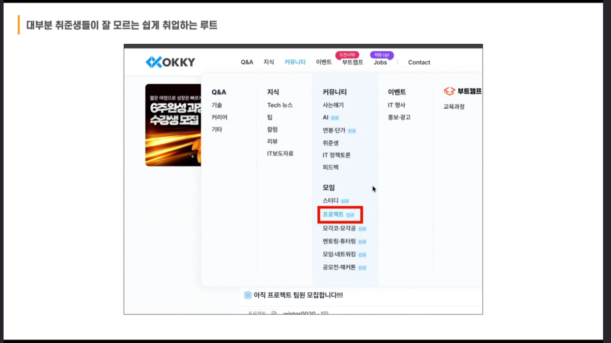

  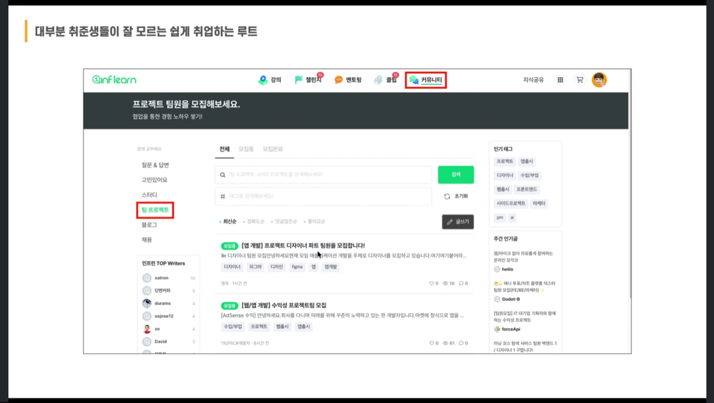

  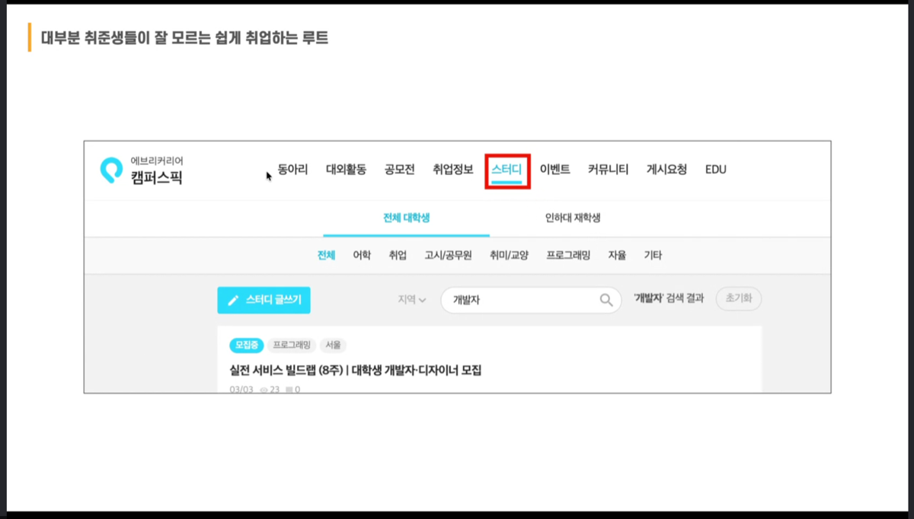

  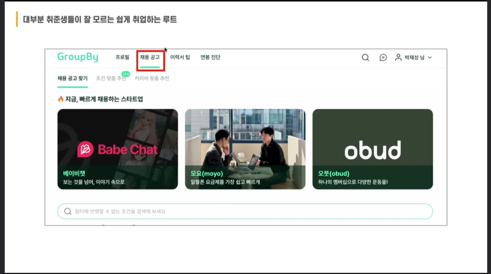

---

## 후기

불안하고 공백기가 너무 길어서, 뭐라도 봐야겠다 해서 보게된 세미나였는데 Q&A 시간의 여러 질문들을 보니 나와 같은 고민을 하고 계신분들이 많았다.

심지어 나보다 더 나이가 있으신분 같은데 이전 직장에서 나와 개발자로서의 삶을 살아보려 도전하시는 분들도 많았고, 어떤 친구는 이제 막 졸업한 학생같은데 어디서부터 어떻게 준비해야 할지 막막해 하는 사람들도 있었고, 아무튼 참 여러가지 고민을 가진 사람들이 세미나를 보러 온 것 같았다.

세미나를 보면서 공통의 관심사였다고 생각이 드는 것은 "이제 다들 AI를 활용해 개발을 하는데, 이력서 준비는 어떻게 해야하고 다른 사람들과 차별점을 어떻게 만들어야 하는지?" 이 부분을 많은 분들이 궁금해 하는 것 같았다.

강사님들은 CS와 같은 근본을 중요시 하기도 했고, 누구나 구현하는게 맞으니 이제 그 구현된걸 자신이 유지보수 할 수 있는 역량이 있는지 포커스를 맞출 필요가 있다는 얘기도 했다. 요즘 하도 바이브코딩 ~ 바이브코딩 하다보니 간간히 여러 유튜브를 봐도 이게 참 너무 좋은데 막상 손대보려 하면 코드가 너무 뒤죽박죽 섞여 있고, 그렇다보니 한쪽을 수정했을때 그 영향도가 어디까지 뻗쳐 나갈지 짐작이 안간다는 거였다. 개발자가 아니셨던 분들은 이제 운영은 좀 되는거같은데 어느 한 부분을 손을 대려 하니 어디서부터 손대야 하지 막막해서 그런 부분에 하소연하시던 영상을 많이 봤는데 개발자인 사람도 마찬가지 아닌가? 하는 생각이 들었다. 어느 한 친구 질문은 이제 AI도움 없이는 스프링 소스 한줄도 어디서부터 작성해야 할지 모르겠다 하는 얘기가 있었는데 그럴법도 하지 않을까 했다.

그니까 중요한건 퍼포먼스는 이제 누구나 어느 평균선까지 올리는건 어렵지 않으니, 그걸 좀 더 효율적으로 운영하고 유지보수 하는 것! 거기서 더 나아가 회사입장에서 중요한 비용과 효율을 고려한 그런 것들이 개개인의 매력포인트가 아닐까? 하는 생각이 들었다.

...

저녁 늦게 들어와서 밥먹고 샤워하다가 배가 너무 고파서 나중에 볼까 하다가, 잠깐 보는 사이에 앉아서 끝까지 봐버렸다. 나름대로 알찬 내용이었고 실제로 취업준비 뿐만 아니라 프로젝트를 진행하는데 있어서도 도움을 받을 내용이 많아서 좋았던 세미나였다고 생각한다. 박재성님 강의를 이전에 몇개 본 적 있는데 수강생들이 듣기 편한 말투와 속도로 강의를 하시는거 같았는데 역시나 이번에도 다른 멘토 분들과 좋은 세미나를 만들어 주셨네...

영상을 보고 일말의 희망을 얻긴했지만 대충 4~6개월? 정도 안되면, 개발을 어떻게 해야할지 고민을 하고 있다. 남들처럼 자리도 잡고 이것저것 해야 할 나이인데 92년생 35살인 지금 많이 늦지 않았나 생각이 들기 때문이다. 마지막 몇개월을 좀더 효율적으로 시간을 보내보자. 이것저것 많이 보고 소화하고 이해하고, 스펙트럼을 너무 넓힌다기보다 일단의 취업을 위해 강점을 빠른 시일내에 만드는데 집중해야 할 것 같다.
