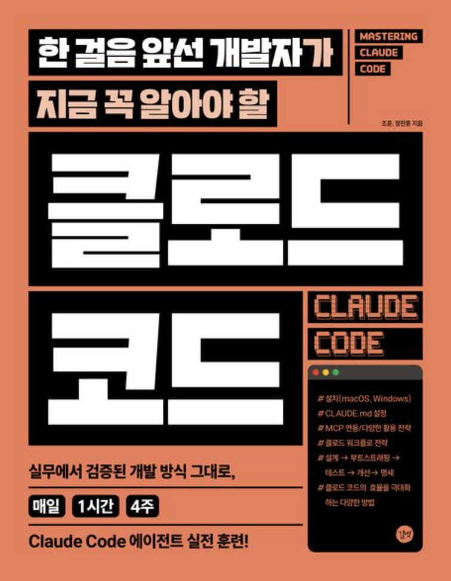

  
  

    <strong>한 걸음 앞선 개발자가 지금 꼭 알아야 할 클로드코드</strong>
     저자: 조훈, 정찬훈
     출판사: 길벗
     출간일: 2025.09.12
     ISBN: 9791140715725
  

클로드 코드를 처음 접한 것은 코드팩토리라는 유튜버님의 영상에서였다. ChatGPT에 구현해야 할 기능을 물어보고 거기에 대한 소스를 받으면 복사 붙여넣기를 한 뒤, 기능이 제대로 동작하는지 체크하고 수정하고 배포하는 식을 경험해본 나로서는 정말 다른 신세계가 여기 있었구나 싶었다.

사실 취업을 다시 준비하는 입장에서 추가 비용을 들여가며 이렇게 무언가를 사용한다는 게 부담스럽긴 했지만 월 20달러에 이 정도 사용성을 보장한다면, 단순히 에이전트 코딩 이외에도 공부용으로도 많이 사용될 수 있겠다 싶어 개인적으로는 만족하며 사용하는 중이다.

이 책은 4주라는 시간 동안 클로드 코드의 여러 활용법에 대해서 말하고 있다. 설치부터, 맨 마지막에서는 회사를 위한 자체 MCP 서버 구축이 필요한 이유와 메인 에이전트를 돕는 서브 에이전트의 역할과 사용법까지 심도 깊은 내용을 말하고 있다. 마지막 주차에 가까워질수록 실습이 조금 줄어드는 느낌이 들긴 했지만 전반적으로 내가 클로드 코드를 사용하면 앞으로 이러이러한 것들을 해볼 수 있겠구나 가이드를 잡는 데 좋은 역할을 해준 책이었단 생각이 든다.

개인적으로 책을 끝까지 읽고 느낀 건... 요새 조금 불안하긴 했다. AI가 세상에 너무 널리 퍼지면서 나의 일자리가 이젠 진짜 없어질 수도 있겠다라는 생각이 들었기 때문이다. 이제 주니어 개발자도 AI를 활용해서 쉽게 기능을 구현하고, 코드 리뷰까지 전문가 수준의 동료를 자기 옆에 24시간 두고 일을 할 수 있게 됐고, 아이디어가 있는 누구나 자기가 원하는 것을 만들 수 있는 세상이 됐기 때문에 그런 생각이 들었던 거 같다. 그러면서 저자는 책의 마지막 장에서 "인공지능은 완벽할 수 없다는 점"을 다시 한번 말하고 있다. 세상에 개발자는 많고 앞으로 회사는 단순히 개발만 하는 사람보다 이제 AI에게 올바르게 일을 시킬 수 있는 개발자를 뽑을 것이다라는 이야기와 함께

> 따라서 많은 분이 걱정하고 우려하는 '나의 일자리가 사라진다'라는 것은 '나의 일자리의 형태가 바뀐다'로 보는 것이 좀 더 적합하며, 사실 이를 위해서 더 많은 범위의 학습이 필요합니다.

라고 말하고 있다. 일자리가 없어질 거라 고민하는 나에 대한 당근인가...

AI가 개발직을 포함해 다양한 직종에 앞으로 더더욱 많은 영향을 미치겠지만, 99%의 답을 준다고 해도 그것을 판단하고 실행하고 책임져야 하는 몫은 여전히 인간에게 있다라는 말을 뒷받침해주는 듯 하다. 그렇듯 꾸준히 이쪽에 관심을 두고 자신이 어떻게 활용하여 자신의 업무 효율성을 늘릴 수 있을 것인가. 단순히 오늘내일 동일하게, 비슷하게 살아가려는 마음가짐보다 꾸준히 자신에게 적용해본다면 그럴 걱정은 아직 하지 않아도 된다고 말하고 있는 듯했다.

클로드 코드를 비롯해 바이브코딩, 에이전트 AI 등 여러 가지 키워드로 요새 책이 여러 가지 많이 나오고 있는 것 같은데, 사실 코드팩토리님이 작성하신 클로드 코드 관련 책은 밀리의 서재에서 읽는 게 가능해 이 책을 구매했고, 지금 당장 책의 모든 내용을 적용한다기보다 기억해 뒀다가 내가 앞으로 진행할 여러 가지 일들에 조금씩 사용해보면 좋을 거 같다.

