최근에 앱인토스 웨비나를 보고 실습을 한번 해보았다!


# 러버블을 사용해 프로토타입 제작하기

## 프롬프트

```markdown
"알바페이"라는 이름을 가진 토스 안의 미니앱인 앱인토스 앱을 하나 만들어보고자 해.
일단 MVP 단계까지만 기능을 구현하려 하고, 점차 앱을 발전시키며 여러 기능을 붙이고자 해.

* 앱 이름 : 알바페이
* 앱 설명 : 고용주가 알바생에게 급여를 자동으로 계산하고 지급할 수 있는 앱
* 타겟 사용자:
  - 자영업자 (고용주)
  - 아르바이트생

0. 이 앱은 뭐하는 앱인가 : 앱인토스에 출시할 미니앱으로, 한마디로 별다른 수고 없이 고용주가 알바생에게 급여를 자동 지급하는 앱

1. pain point : 한국에서 자영업을 하시는 분들은 여러 아르바이트생을 고용해서 사용하는데, 개개인에게 급여를 지급할 때 수기로 작성하는 경우가 많기 때문에 계산상 오류가 발생할 수 있고, 심지어 알바생이 여러 명이며 급여 날짜도 다르다면 매달 이러한 번거로운 과정을 거쳐야 한다.

2. targetting app customer : 사업장을 운영 중이고 아르바이트생을 고용한 고용주, 그리고 그들에게 급여를 받는 아르바이트생

3. mvp 단계에서 구현되어야 할 것
1) 고용주 입장
  - 사업장 등록
  - 고용자(알바생) 추가
  - 급여 정보 등록 ( 급여지급일, 시급 등 )
  - 근무 기록 (알바생이 근무일지 등록하면 시간 확인 후 승인)
  - 급여 지급 버튼 (승인된 근무일지에 따라 고용주가 알바생별 지급 금액 확인 후 버튼 누르면 이체)

2) 알바생 입장
  - 사업장 검색
  - 근무일지 기록 (일자, 시간 기록 가능)
  - 계좌정보 등록

4. 사용자 흐름

[고용주]
회원가입 → 사업장 등록 → 알바생 추가 → 급여 설정 → 근무일지 확인 → 승인 → 급여 지급

[알바생]
회원가입 → 사업장 검색 → 등록 요청 → 승인 → 근무일지 작성 → 급여 수령

5. 사용자 역할

- 고용주 (사업장 관리자)
- 알바생 (근무자)

각 역할에 따라 화면과 기능이 다르게 보여야 함

6. 데이터 구조 (간단)

- 사업장
  - 이름
  - 사업자 정보
  - 소속 알바생 리스트

- 알바생
  - 이름
  - 계좌정보
  - 소속 사업장

- 근무일지
  - 날짜
  - 근무 시작/종료 시간
  - 승인 여부

- 급여정보
  - 시급
  - 지급일

7. 상태 관리:

- 근무일지 상태: 작성됨 / 승인됨 / 반려됨
- 급여 상태: 지급 예정 / 지급 완료

8. 디자인:
- 모바일 UX 최적화
- 직관적이고 간단한 UI => 앱인토스 디자인 가이드 최대한 따르길 권장
  - 참고 : https://developers-apps-in-toss.toss.im/design/components.html

9. 요청:
- MVP 수준의 클릭 가능한 프로토타입 생성
- 화면 간 이동이 자연스럽게 연결
- 실제 서비스처럼 흐름이 이어지도록 구성
- 급여 지급 버튼 관련(중요):
  - 고용주가 승인한 알바생이 기입한 근무일지 기록을 기반으로 "지급 예정 금액" 계산
  - 지급 버튼 클릭 시 실제 이체는 앱인토스에서 처리함
```


# MVP 개발 명세 작성하기

러버블 크레딧을 충전해야 해서, 일단 무료로 진행해보기 위해 최초 프로토타입을 테스트해봤는데 괜찮게 뽑혀서 디자인 수정은 요청하지 않았다. GitHub에 소스를 업로드하고 아래의 개발 명세만 뽑아달라고 요청했다.


## 개발 명세서

### 1. 핵심 기능 (Feature Overview)

#### 👥 공통

- 회원가입 / 로그인 (이름, 전화번호 기반)
- 역할 선택 (고용주 / 알바생, 가입 시 1회 확정)

---

#### 🧑‍💼 고용주 (Owner)

**사업장 관리**

- 사업장 등록 (상호명, 사업자번호, 주소)

**알바생 관리**

- 알바생 등록 / 초대
- 등록 요청 승인 / 거절
- 시급 / 지급일 설정

**근무일지 관리**

- 알바생 근무일지 조회
- 승인 / 반려 처리

**급여 지급**

- 승인된 근무일지 기반 자동 계산
- 지급 금액 확인
- 지급 버튼 클릭 → 앱인토스 이체 화면 호출

---

#### 👷 알바생 (Worker)

**사업장 연결**

- 사업장 검색
- 등록 요청 및 승인 대기

**근무일지**

- 날짜 / 시작 / 종료 시간 수기 입력
- 메모 작성
- 상태 확인 (작성됨 / 승인됨 / 반려됨)

**급여**

- 이번 달 예상 급여 확인
- 지급 완료 내역 조회

**계좌**

- 은행 / 계좌번호 등록

---

### 2. 데이터 구조 (Core Models)

```
type Role = "owner" | "worker";
```

**🏢 사업장 (Workplace)**

```typescript
type Workplace = {
  id: string;
  name: string;
  bizNumber: string;
  address: string;
  ownerId: string;
};
```

**👷 알바생 (Worker)**

```typescript
type Worker = {
  id: string;
  name: string;
  phone: string;
  workplaceId: string;
  hourlyWage: number;
  payday: number; // 1~31
  status: "pending" | "approved";
  bank?: string;
  account?: string;
};
```

**📝 근무일지 (Worklog)**

```typescript
type Worklog = {
  id: string;
  workerId: string;
  workplaceId: string;
  date: string;      // YYYY-MM-DD
  start: string;     // HH:mm
  end: string;       // HH:mm
  memo?: string;
  status: "submitted" | "approved" | "rejected";
};
```

**💰 급여 지급 (Payout)**

```typescript
type Payout = {
  id: string;
  workerId: string;
  workplaceId: string;
  amount: number;
  paidAt: string; // ISO
  period: string; // YYYY-MM
};
```

**👤 현재 사용자 (Session)**

```typescript
type CurrentUser = {
  id: string;
  name: string;
  phone: string;
  role: Role;
  workplaceId?: string;
  workerId?: string;
};
```

---

### 3. API 설계 (Backend Required)

**🔐 Auth**

- `POST /auth/register`
- `POST /auth/login`
- `GET /auth/me`

**🏢 Workplace**

- `POST /workplaces`
- `GET /workplaces/:id`

**👷 Worker**

- `POST /workers`
- `GET /workers/:id`
- `PATCH /workers/:id`
- `POST /workers/:id/approve`

**📝 Worklog**

- `POST /worklogs`
- `GET /worklogs`
- `POST /worklogs/:id/approve`
- `POST /worklogs/:id/reject`

**💰 Payout**

- `GET /payouts`
- `GET /payouts/calculate`
- `POST /payouts/pay`

**🟦 App-in-Toss**

- `POST /toss/transfer` → 실제 이체는 SDK로 처리

---

### 4. 화면 구조 (Routes)

**📱 공통**

- `/` → 스플래시
- `/onboarding`
- `/signup`
- `/role`
- `/demo`
- `/settings`

**🧑‍💼 고용주 (하단 탭)**

- `/owner` → 홈
- `/owner/workplace/new`
- `/owner/workers`
- `/owner/workers/new`
- `/owner/workers/:id`
- `/owner/worklogs`
- `/owner/payroll`

**👷 알바생 (하단 탭)**

- `/worker` → 홈
- `/worker/search`
- `/worker/worklogs`
- `/worker/payroll`
- `/worker/me`

---

### 5. 핵심 로직

**💰 급여 계산**

```
지급 예정 금액 = Σ (승인된 근무일지의 근무시간 × 시급)
```

**🔄 상태 흐름**

- 근무일지: submitted → approved / rejected
- 급여: 예정 → 지급 완료

**💳 지급 프로세스**

1. 고용주가 금액 확인
2. 지급 버튼 클릭
3. 앱인토스 이체 화면 호출
4. 성공 시 payout 생성

---

### 6. MVP 범위 (확정)

**포함**

- 전체 UI 흐름
- 역할 분리
- 급여 계산
- 지급 플로우 (목업)

**제외**

- 실제 인증
- 실제 DB
- 실제 이체
- 푸시 알림
- 외부 API


# 앱인토스에 앱 등록해보기

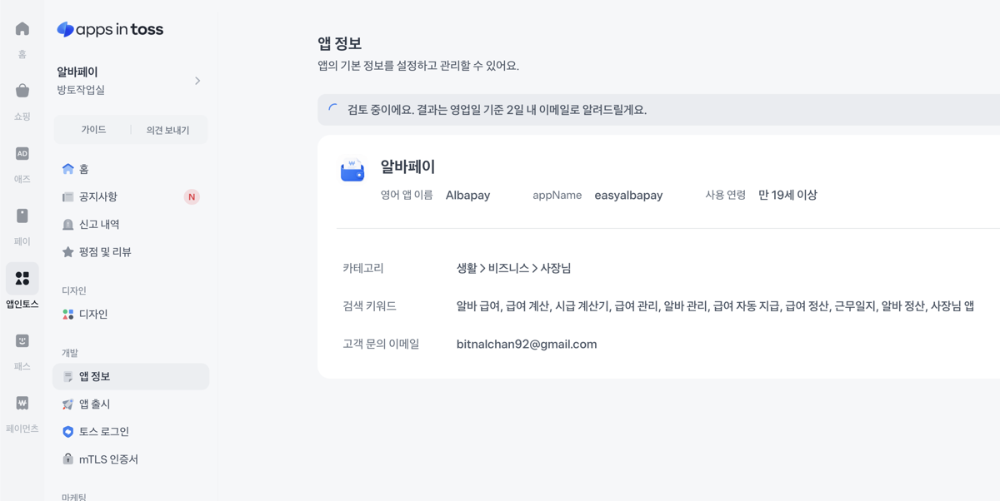

일단 등록하긴 했는데, 돈이 왔다 갔다 하는 기능이라 심사에 통과할 수 있을지 모르겠다. 일단 기다려본다!


# 이후는 터미널에서 작업

## 앱인토스 프레임워크 설치

```bash
npm install @apps-in-toss/web-framework@2.3.0
```

```bash
npx ait init
```

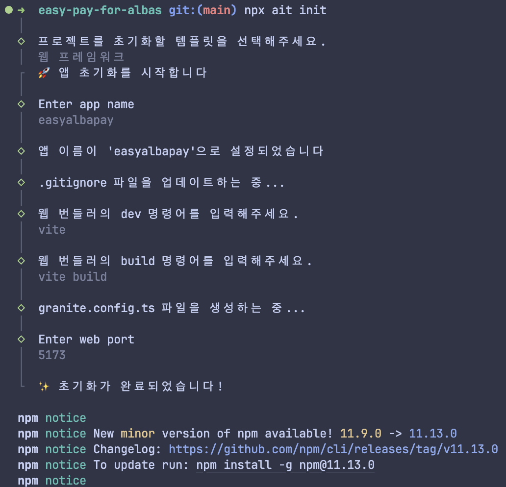

이렇게 하면 개발 준비가 완료된다.


## 코덱스로 작업 시작

### 1. 그라나이트 파일 셋팅

```bash
granite.config.ts 파일을 수정해줘.
 
한글 앱네임은 알바페이로 수정하고, icon이미지 주소는 https://static.toss.im/appsintoss/13053/b8e8d740-9807-4607-8798-e42f1098dd81.png로 수정하고 우리 앱을 분석해서 만약 필요한 permission이 있다면 적절하게 설명해주세요.

아래 공식 문서를 반드시 참고해서:
https://developers-apps-in-toss.toss.im/

1. granite.config.ts 설정 작성
2. 필요한 permission 정리
3. 앱 실행 구조 설명

공식 문서를 기준으로 정확하게 작성해줘.
모르면 추측하지 말고 필요한 부분을 질문해줘. 
```

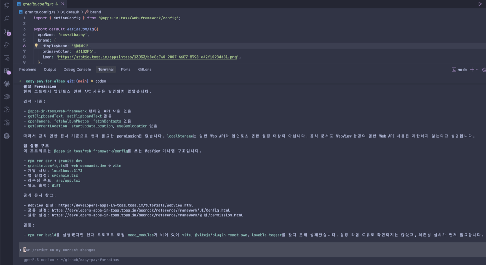


### 2. 스킬 준비

#### 1) Apps In Toss Skills 설치

- [가이드](https://developers-apps-in-toss.toss.im/development/llms.html#apps-in-toss-skills%E1%84%85%E1%85%A1%E1%86%AB)
- docs-search와 project-validator 스킬 설치

```bash
# 아래 소스를 코덱스 프롬프트창에 복사해서 실행하기
install GitHub repo toss/apps-in-toss-skills path apps-in-toss
```

```bash
• 저장소에는 apps-in-toss 디렉터리가 없고, 설치 가능한 스킬은 skills/docs-search와 skills/project-validator 두 개입니다. 요청 의도에 맞게 이 저장소의 실제 스킬 두 개를 설치하겠습니다.

✔ You approved codex to run python3 /Users/chankim/.codex/skills/.system/skill-installer/scripts/install-... this time

• Ran python3 /Users/chankim/.codex/skills/.system/skill-installer/scripts/install-skill-from-github.py --repo toss/apps-in-toss-skills --path skills/docs-search skills/project-validator
  │ --method git
  └ Installed docs-search to /Users/chankim/.codex/skills/docs-search
    Installed project-validator to /Users/chankim/.codex/skills/project-validator

• Waited for background terminal

설치 완료.

  설치된 스킬:
  - docs-search → /Users/chankim/.codex/skills/docs-search
  - project-validator → /Users/chankim/.codex/skills/project-validator

  참고로 요청하신 apps-in-toss 경로는 저장소에 없어서, 실제 존재하는 skills/docs-search와 skills/project-validator를 설치했습니다.

  Restart Codex to pick up new skills.
```

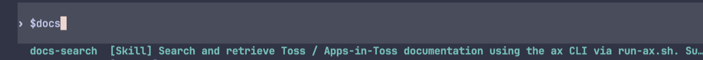

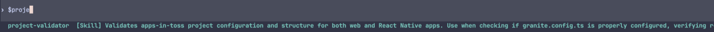


#### 2) 앱인토스 로그인 스킬 만들기

- skill-creator라는 코덱스 제공 스킬을 사용해서 만들어봤다.
- 대충 붙여넣어도 알아서 다 만들어준다. 몇 가지 오류가 발생하지만 proceed에 yes 해주면 알아서 진행한다.
- 가이드에서 제공한 프롬프트인데, 사용할 스킬을 선언한 뒤 그 스킬을 만들 때 참고해야 할 자료를 제공하고, 그 후에 세부 사항을 가이드해주는 방식이다. (다른 스킬 만들 때 참고!)

```bash
$skill-creator https://developers-apps-in-toss.toss.im/login/intro.html https://developers-apps-in-toss.toss.im/login/console.html https://developers-apps-in-toss.toss.im/login/develop.html https://developers-apps-in-toss.toss.im/login/qa.html https://developers-apps-in-toss.toss.im/api/refreshOauth2Token.html https://developers-apps-in-toss.toss.im/api/generateOauth2Token.html https://developers-apps-in-toss.toss.im/api/removeByUserKey.html https://developers-apps-in-toss.toss.im/api/removeByAccessToken.html https://developers-apps-in-toss.toss.im/api/loginMe.html https://developers-apps-in-toss.toss.im/bedrock/reference/framework/로그인/appLogin.html https://developers-apps-in-toss.toss.im/bedrock/reference/framework/로그인/getIsTossLoginIntegratedService.html , 클로드스킬베스트프랙티스 https://platform.claude.com/docs/en/agents-and-tools/agent-skills/best-practices 준수, 앱인토스 모든 로그인 공식문서를 e2e 준수하여 새로운 앱인토스 로그인 전용 스킬을 생성하라.
반드시 askuserquestion을 포함시켜서 충분한 컨텍스트를 수집하거나 반대로 유저가 토스로그인에대한 지식이 부족할경우에는 처음부터 끝까지 상세한 안내를하며 가이드역할까지 수행할 수 있게 하라.
유저의 mTLS파일은 루트경로에 , 복호화키는 .env에 저장하라고 알려주고 민감한정보들이니 안전하게 보관하여 로그인구현에 사용하라. 또한 서버는 vercel, 백엔드는 supabase를 사용하며 사용자가 vercel과 supabase 를 잘모를경우 둘다 가입부터 사용방법을 친절하게 안내하고 vercel은 반드시 새로운 신규 프로젝트를 생성하는것을 명시하고 편의상 터미널에서 vercel login 을 쳐서 vercel login 된상태로 ai에게 전권을주고 supabase는 supabase mcp 설치방법을 안내하여 supabase mcp에 인증 후 supabase mcp를 사용하여 이용자 테이블 생성 및 마이그레이션까지 모두 수행함을 전제로한다.
또한 토스콘솔에서 로그인기능 활성화에 필요한 약관작성 및 등록(url필요) , vercel 과 supabase 모두 배포완료후 basic auth 헤더와 콜백 url을 콘솔에 등록하는 등 유저 콜백처리등에 대한 안내도 상세하게 안내하여 연결끊기 콜백 테스트에 성공할 수 있게 안내하는등 단순히 토스로그인을 구현하는것에서 그치지않고 비개발자도 처음부터 끝까지 잘몰라도 구현할 수 있도록 안내하는 종합 가이드 역할까지 수행하게 하라. 이를위해 가능한 필요한 모든 토스공식문서들을 레퍼런스에 등록하여 항상 참조하게 하라
```

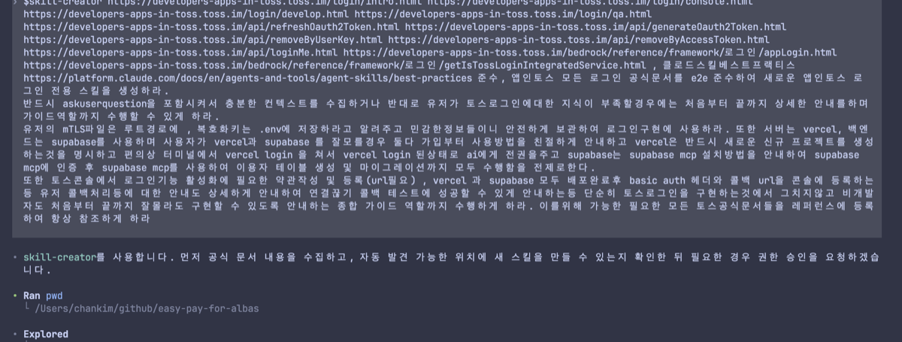

...

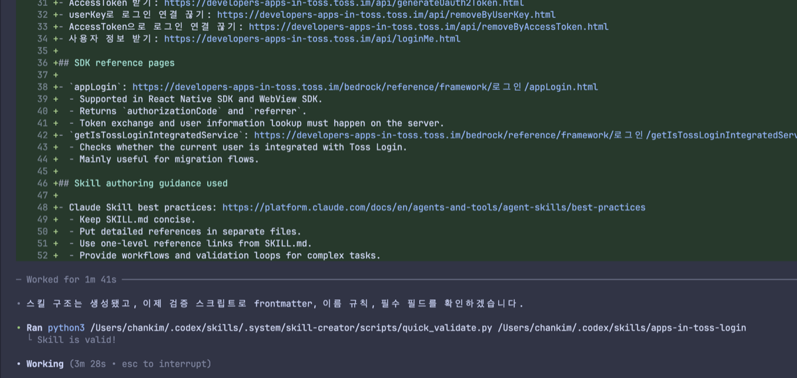

...

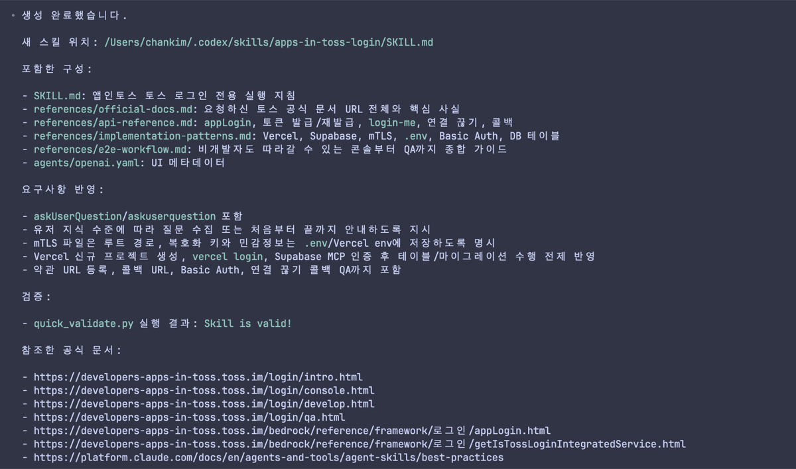

이렇게 새로운 스킬이 하나 만들어졌다!

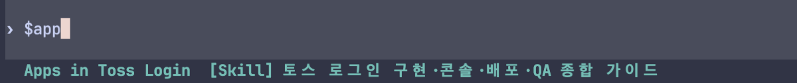


#### 3) 에이전틱 코딩을 위한 [superpower](https://github.com/obra/superpowers) + [andrej-karpathy-skills](https://github.com/forrestchang/andrej-karpathy-skills) 셋팅해두기

- 프로젝트 루트에 `AGENTS.md` 파일을 만들고 내용을 붙여넣는다.

  ````markdown
  ---
  name: karpathy-guidelines
  description: Behavioral guidelines to reduce common LLM coding mistakes. Use when writing, reviewing, or refactoring code to avoid overcomplication, make surgical changes, surface assumptions, and define verifiable success criteria.
  license: MIT
  ---
  
  # Karpathy Guidelines
  
  Behavioral guidelines to reduce common LLM coding mistakes, derived from [Andrej Karpathy's observations](https://x.com/karpathy/status/2015883857489522876) on LLM coding pitfalls.
  
  **Tradeoff:** These guidelines bias toward caution over speed. For trivial tasks, use judgment.
  
  ## 1. Think Before Coding
  
  **Don't assume. Don't hide confusion. Surface tradeoffs.**
  
  Before implementing:
  - State your assumptions explicitly. If uncertain, ask.
  - If multiple interpretations exist, present them - don't pick silently.
  - If a simpler approach exists, say so. Push back when warranted.
  - If something is unclear, stop. Name what's confusing. Ask.
  
  ## 2. Simplicity First
  
  **Minimum code that solves the problem. Nothing speculative.**
  
  - No features beyond what was asked.
  - No abstractions for single-use code.
  - No "flexibility" or "configurability" that wasn't requested.
  - No error handling for impossible scenarios.
  - If you write 200 lines and it could be 50, rewrite it.
  
  Ask yourself: "Would a senior engineer say this is overcomplicated?" If yes, simplify.
  
  ## 3. Surgical Changes
  
  **Touch only what you must. Clean up only your own mess.**
  
  When editing existing code:
  - Don't "improve" adjacent code, comments, or formatting.
  - Don't refactor things that aren't broken.
  - Match existing style, even if you'd do it differently.
  - If you notice unrelated dead code, mention it - don't delete it.
  
  When your changes create orphans:
  - Remove imports/variables/functions that YOUR changes made unused.
  - Don't remove pre-existing dead code unless asked.
  
  The test: Every changed line should trace directly to the user's request.
  
  ## 4. Goal-Driven Execution
  
  **Define success criteria. Loop until verified.**
  
  Transform tasks into verifiable goals:
  - "Add validation" → "Write tests for invalid inputs, then make them pass"
  - "Fix the bug" → "Write a test that reproduces it, then make it pass"
  - "Refactor X" → "Ensure tests pass before and after"
  
  For multi-step tasks, state a brief plan:
  ```
  1. [Step] → verify: [check]
  2. [Step] → verify: [check]
  3. [Step] → verify: [check]
  ```
  
  Strong success criteria let you loop independently. Weak criteria ("make it work") require constant clarification.
  ````

- superpower 플러그인 설치
  - 프롬프트창에 `/plugins`를 치고 superpowers를 검색하면 나온다.

  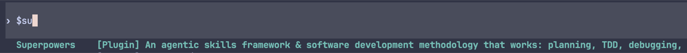

- 사용 예제
  - andrej-karpathy-skills는 `AGENTS.md`에 명시해뒀기 때문에 에이전트가 이를 항상 참조하고, 방금 추가한 superpowers 스킬을 사용해서 요구사항을 요청하면 된다.

    ```bash
    $superpowers-coding 과 $app-in-toss-docs 를 사용해.
    
    알바페이 MVP에서 고용주가 알바생을 등록하고 근무시간을 입력하면 예상 급여를 계산하는 화면을 구현해줘.
    
    규칙:
    - 먼저 AGENTS.md를 따르고
    - 앱인토스 관련 API는 app-in-toss-docs를 확인한 뒤 사용하고
    - 문서에 없는 API는 추측하지 말고 TODO로 남겨
    - 최소 변경으로 구현하고
    - 마지막에 lint/build 가능한지 확인해줘
    ```


### 3. 로그인 스킬 사용하기

- 처음에는 공식 스킬 하나로 시작하고, 시간이 지남에 따라 필요한 스킬을 직접 만들어 쓰는 방식을 권장한다.

- 참고 자료
  - https://github.com/obra/superpowers
  - https://github.com/msitarzewski/agency-agents
  - https://github.com/VoltAgent/awesome-claude-code-subagents

```bash
$apps-in-toss-login 로그인 기능구현 시작해줘
```

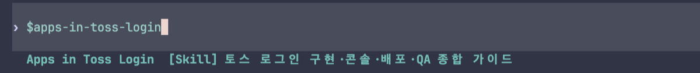

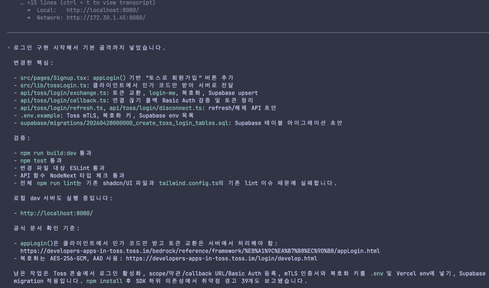
