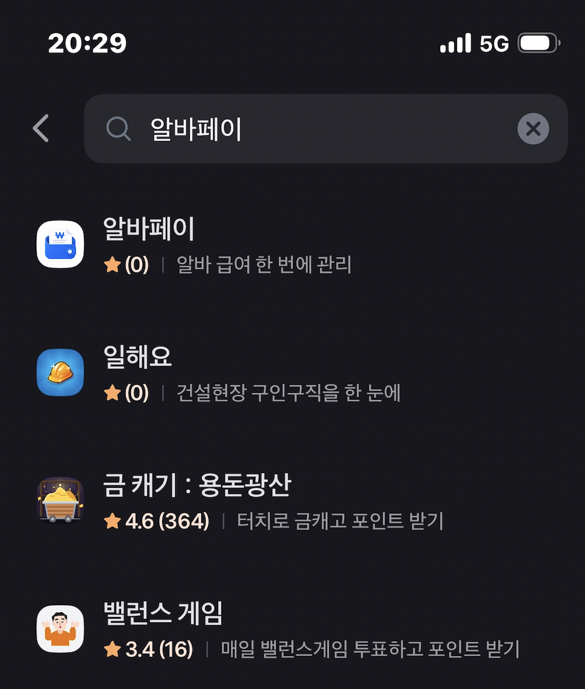
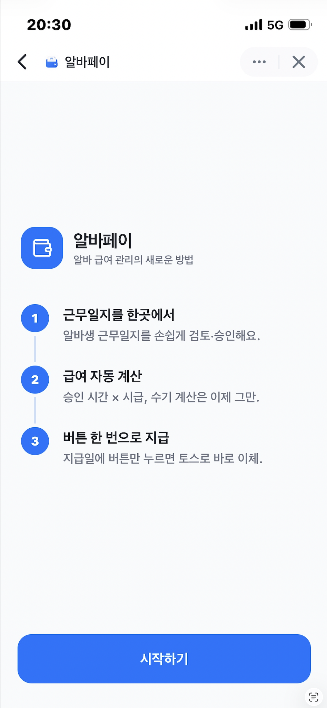
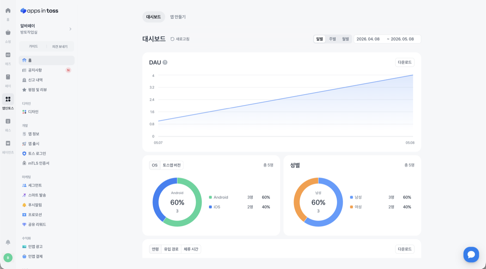
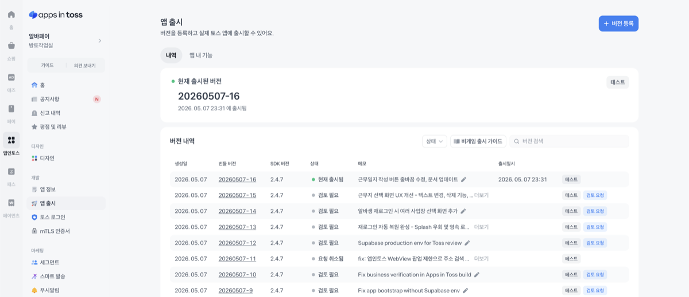

# 출시까지 마무리가 되었다

# 출시하면서...

ep.1에서 여러 기능을 붙이며 작업을 진행하고 있었는데, 진행이 조금 미뤄진 이유가 있었다. 이번 달부터 청년수당을 받기 시작해서 사업자를 낼 수 없었고, 초기 기획이었던 토스 로그인 연동이나 광고 수익 발생 등의 기능을 구현하기 어렵게 됐다. 그래서 일단 구현하고 배포하는 방향으로 전환했고, 어제와 그제 작업 후에 배포를 마칠 수 있었다.

## 배포하는 과정에서 느낀 것

생각보다 바이브 코딩만으로 배포하는 게 너무 편리하게 되어 있어서 특별히 어려운 점이 없었다. AI와 여러 방향을 고민하며 나눴던 대화들이 기획에 반영되고 나니 배포까지 굉장히 수월했고, 위의 캡처처럼 검토 단계에서 내 휴대폰으로 직접 테스트도 해볼 수 있었다. 다시금 토스가 정말 대단한 회사라는 생각이 들었던 순간이었다.

## 이후 작업할 것들

빠른 배포를 목적으로 했기 때문에 다양한 케이스를 테스트해보지 못했다. 바이브 코딩을 하다 보니 막상 배포하고 나서야 "아! 맞다!" 싶은 것들이 많이 떠올랐다. 이제부터 그런 작업들을 Phase를 나눠 하나씩 구현해볼 생각이다.

앱인토스를 보니 사장님들을 위한 이런 앱들이 여러 개 있었는데, 벤치마킹할 수 있는 것들은 최대한 참고하되, 무엇보다 고용주 연령대와 상황을 고려해서 가장 편한 UI/UX를 제공하는 것에 초점을 맞춰 진행할 예정이다. 물론 혼자 할 수 없으니 현재 구독 중인 Claude와 Codex를 적극 이용할 예정이다.

어차피 취업을 다시 하거나 청년수당을 받는 앞으로의 5개월 동안은 이 앱으로 수익화를 하기 어려울 것 같아서, 본 프로젝트의 주 목적을 포트폴리오로 삼고 일했던 가게 사장님에게 적극적인 피드백을 구해볼 예정이다. 그러고 나서 현재 가입해 있는 앱인토스 오픈톡방에 홍보를 하거나, 주변 가게 사장님들에게 사용 사례를 소개해서 올해 말에는 우리 동네 가게 10군데 정도가 이 앱을 사용하면 좋겠다는 생각도 가지고 있다.

## 지금 당장 생각나는 개선점들

### 기능 관련

- 알바생의 경우 최초 진입 단계에서 근무 중인 가게를 선택할 수 있도록 구현
- 초대 코드로 근무지에 알바생을 추가하는 방식이므로, 고용주 화면에서 근무자 추가 기능 삭제
  - 초대 코드를 받은 근무자가 본인 휴대폰으로 로그인해야 근무지와 매핑이 됨
- 근무자 추가 / 근무 일지 등록 / 승인 및 반려 시 각자에게 푸시 알림 발송
- 문서 관리 (근로계약서 / 보건증)

### 편의 관련

- 고용주분들이 대체로 연령대가 높은 경우가 많아, 글꼴 크기 변경 기능 추가
- 다크모드 / 라이트모드 토글 기능
- 앱 새로고침 없이도 DB에 반영된 변경 사항을 화면에 바로 표시할 수 있도록 API 호출 방식 변경
- 앱 전반에 TDS 적용
  - TDS 관련 스킬을 별도로 만들어볼 예정

# Phase 잘 나누기

일단 MVP는 구현이 된 것 같다. 자동 이체나 광고 수입 발생 등 아직 구현되지 않은 부분이 있지만, 위의 개선점들을 차차 반영하고 사용해보면서 에이전틱 코딩으로 이 프로젝트를 갈고닦을 예정이다. 잘 굴러가기 시작하면 수익화 방향도 자연스럽게 생길 것 같기도 하고.

이 프로젝트를 생각하게 된 계기는, 학생 때 아르바이트를 많이 해봤던 경험도 있고, 2026년에도 여전히 많은 가게에서 수기로 근무 일지를 작성하고 사장님이 직접 계산기를 두들기며 급여를 계산해 이체한다는 이야기를 들었기 때문이다. 가장 가까운 예가 우리 가게 사장님이었고, "큰돈 벌려는 게 아니니 경험 삼아 서비스를 만들어보자. 여기에 수요가 한두 명이라도 있으면 저기 어딘가에 몇 명 더 있지 않을까?" 하는 생각이었다.

암튼, 이런 마음을 가지고 좀 더 진행해보려 한다.

Phase를 잘 나누기 위해 고려해야 할 것들도 많다. 스킬을 덕지덕지 붙이고 하네스를 갖다 붙인다고 다 좋은 게 아니라는 이야기를 유튜브에서 자주 들어서, 어제 본 [바이브마피아님 유튜브 영상](https://www.youtube.com/watch?v=AuRDl5FGx-s)을 참고해 에이전트 친화적인 코드베이스로 먼저 리팩토링하려고 한다.

에이전틱 코딩을 할 때 여러 안전장치를 사전에 마련해두는 것이 좋다는 내용을 중점으로 다룬 라이브 영상인데, 집에서 차분히 따라해보면서 이 프로젝트에 적용해볼 예정이다. 그 이후에 위에서 말한 기능들을 하나씩 붙여 나가야겠다.

# 마무리하며

일단 배포는 됐고, 앱인토스 홈페이지를 보니 5월에 또 '귀여움'을 주제로 300만 원이 걸린 챌린지를 진행하고 있던데, 해볼 만한 아이디어가 뭐가 있을까 하는 생각이 들었다. 무엇보다 취준이 우선이라는 생각이 커서, 부담이 가지 않는 선에서 준비해보는 것도 좋지 않을까 싶다. 그러면서 이 앱도 가다듬어야겠다. 여기서 이 앱의 변천사를 기록하고, 개발하며 느낀 여러 가지를 남길 예정인데, 배포하기 참 편한 인프라를 토스에서 마련해줬으니 겸손하게 잘 이용해보고자 한다.
