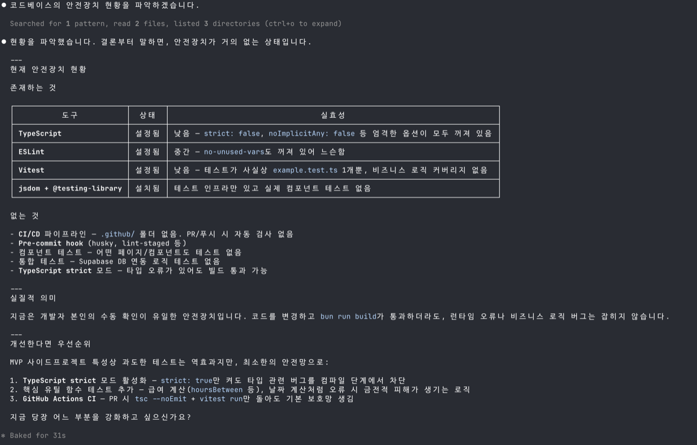
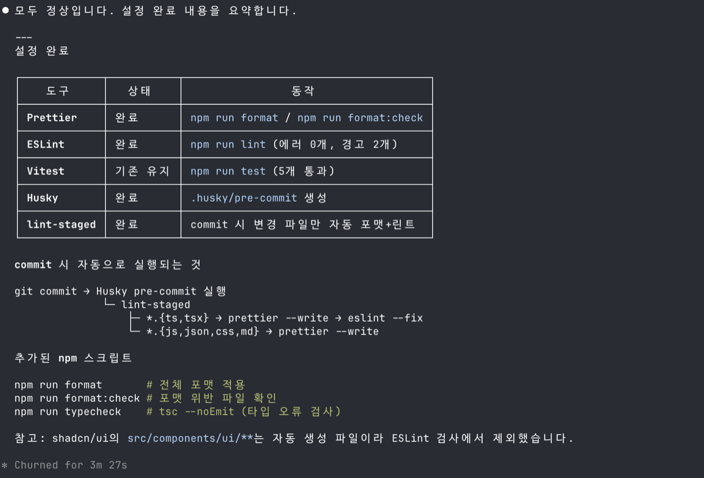
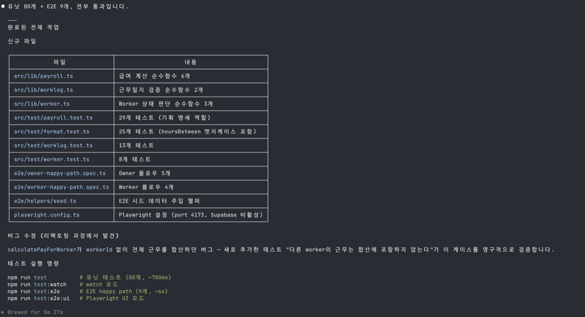
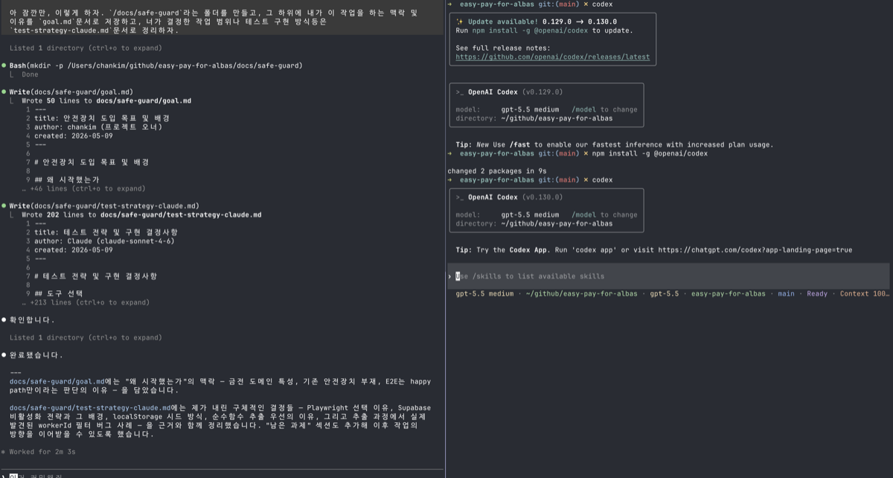
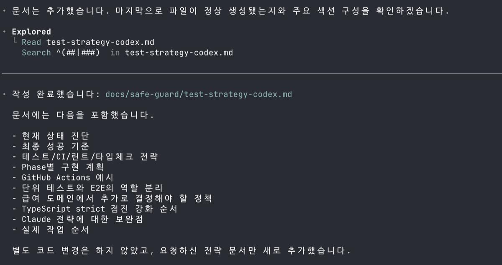
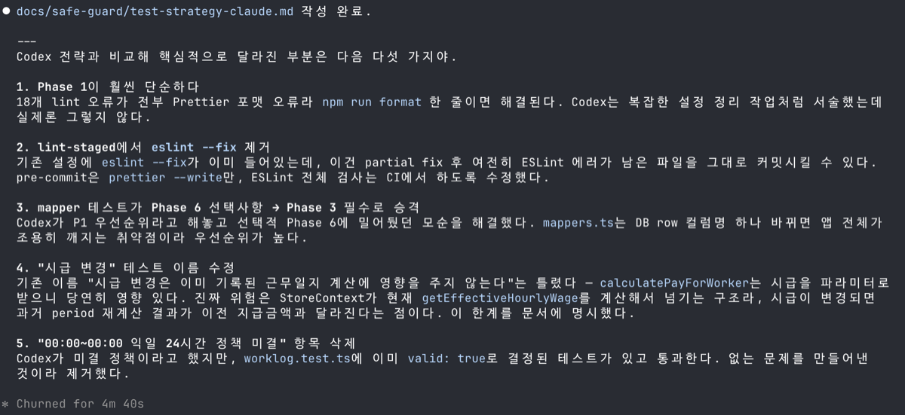
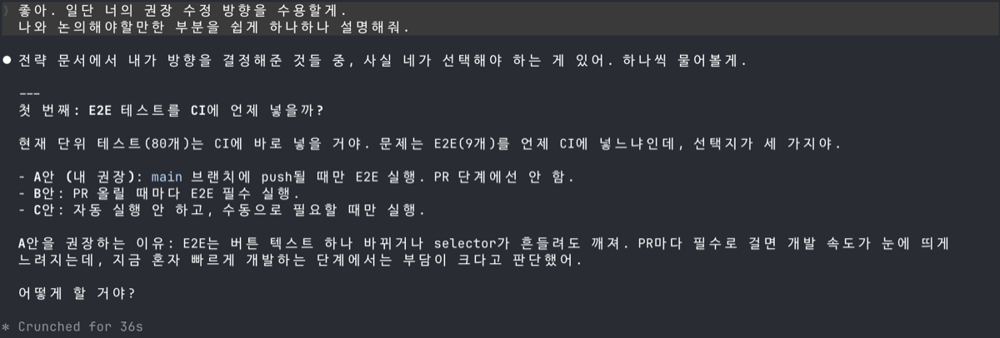
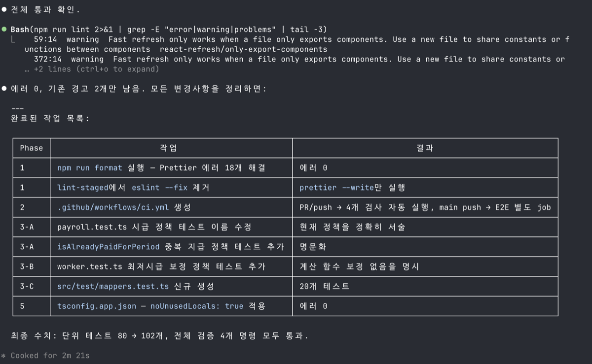
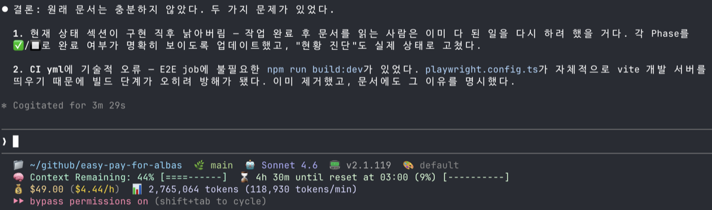

참고 영상 : https://www.youtube.com/watch?v=AuRDl5FGx-s

> 🤵 : 강사님의 프롬프트는 이 이모티콘을 사용했고요~
>
> 🧠 : AI 응답은 이 이모티콘을 사용했습니다

# 들어가며

회사에 신규 직원이 들어왔을 때 온보딩 프로세스가 필요하듯, 어떤 AI가 내 코드베이스를 보더라도 쉽게 파악하고 작업할 수 있도록 코드를 정돈하는 게 이번 시간의 목표입니다.

바이브마피아님의 영상에 따르면, 코드베이스를 정돈하고 검증 도구를 세팅한 뒤 모든 항목이 통과되면 OK가 되는 방식으로 개발을 진행한다고 합니다. 마치 에어백처럼 여러 겹의 안전장치를 미리 마련해두는 것이 이번 작업의 핵심입니다.


# 코드베이스 판단하기

``` 
🤵
이 코드베이스에 대해서, 기능 추가 또는 수정이 되었을때 해당 변경이 정말로 오류없이 잘 구현되었음을 보장하기 위한 안전장치가 어떻게 구현되어있는가?
```



- 아무것도 안 되어 있었구나...

## 필수적으로 필요한 코드베이스 검증 도구

- code formatter (prettier)
- linter (eslint)
- test : unit -> integration -> e2e (vitest)
- commit lint
- git hook (=husky)

```
검증도구로서 아래 내가 제시한 것들 중 적용가능한 것들 셋팅 바로 진행해줘.

  - code formatter (prettier)
  - linter (eslint)
  - test (vitest)
  - commit hook
  - git hook (=husky)
```



- 최소한의 방어책은 마련했다.


## 테스트를 위한 프롬프트 수행

```
🤵
e2e 테스트는 너무 무거우니 happy path가 정상작동함을 검증하는 수준으로만 사용하자.
그리고, core logic들의 edge case에 대해서는 이 주요 도메인 로직들을 순수 함수들로 분리해낸 뒤에, 이들을 unit test로서 검증하고 싶어. 이 test case가 이 서비스의 기획명세와도 같은 역할을 할 수 있을 것이다. 

이를 적용하기 위해 각각의 test유형에 대해 어떤 것들을 cover해야할지 구체화 해보자. 
```

```
🧠
⏺ 도메인 로직과 기존 코드를 파악한 뒤 구체화하겠습니다.

⏺ Explore(Codebase domain logic exploration)
  ⎿  Done (37 tool uses · 72.8k tokens · 1m 10s)
  (ctrl+o to expand)

⏺ 분석 완료. 코드베이스 전체를 파악했으니 테스트 전략을 구체화합니다.

  ---
  테스트 전략

  핵심 구조 문제 먼저

  StoreContext에 비즈니스 로직이 Supabase 호출과 뒤섞여 있어서 먼저 순수 함수 분리가 선행됩니다.

  src/lib/
    format.ts       ← 이미 순수함수 (hoursBetween 등)
    identity.ts     ← 이미 순수함수 (generateInviteCode 등)
    payroll.ts      ← 신규 추출 필요 (급여 계산 로직)
    worklog.ts      ← 신규 추출 필요 (근무일지 검증 로직)
    worker.ts       ← 신규 추출 필요 (worker 상태 로직)

  ---
  Unit Test — 추출할 순수함수 + 검증할 케이스

  1. payroll.ts — 급여 계산

  추출할 함수:
  calculatePayForWorklogs(worklogs: Worklog[], hourlyWage: number): number
  filterWorklogsForPeriod(worklogs: Worklog[], period: string): Worklog[]
  isAlreadyPaidForPeriod(payouts: Payout[], workerId: string, period: string): boolean

  테스트 케이스 (= 기획 명세):
  calculatePayForWorklogs
    ✓ 승인된 근무만 합산한다 (submitted, rejected 제외)
    ✓ 4시간 근무 × 시급 10,000원 = 40,000원
    ✓ 4.5시간 근무 (09:00~13:30) × 시급 10,000원 = 45,000원
    ✓ 익일 마감 근무 (22:00~02:00) = 4시간으로 계산한다
    ✓ 근무일지가 없으면 0원을 반환한다
    ✓ 모든 근무가 미승인이면 0원을 반환한다
    ✓ 시급 변경은 이미 기록된 근무일지에 영향 없다 (파라미터 분리 구조로 보장)

  filterWorklogsForPeriod
    ✓ "2026-05"를 넘기면 2026년 5월 근무일지만 반환한다
    ✓ 익일 마감 근무 (date="2026-04-30", endDate="2026-05-01")는 date 기준으로 분류한다
    ✓ 빈 배열이면 빈 배열을 반환한다

  isAlreadyPaidForPeriod
    ✓ 같은 period + 같은 workerId의 payout이 있으면 true
    ✓ 다른 period면 false
    ✓ 다른 workerId면 false
    ✓ payout이 없으면 false

  ---
  2. format.ts — 시간 계산 (이미 일부 존재, 케이스 보강)

  hoursBetween
    ✓ 09:00 ~ 13:30 (같은 날) = 4.5시간
    ✓ 22:00 ~ 02:00 (익일) = 4시간
    ✓ 00:00 ~ 00:00 (자정 ~ 자정, 익일) = 24시간
    ✓ 23:30 ~ 00:30 (30분 야간) = 1시간
    ✓ start === end (같은 날) = 0시간
    ✓ 분 단위 소수점 (08:00 ~ 09:20) = 1.333... (절삭 안 함, 호출자가 반올림)

  nextYMD
    ✓ "2026-01-31" → "2026-02-01" (월말 처리)
    ✓ "2026-12-31" → "2027-01-01" (연말 처리)
    ✓ "2026-02-28" → "2026-03-01" (평년)
    ✓ "2024-02-28" → "2024-02-29" (윤년)

  ---
  3. worklog.ts — 근무일지 검증

  추출할 함수:
  canWorkerSubmitWorklog(worker: Worker): boolean
  validateWorklogTime(start: string, end: string, isOvernight: boolean): { valid: boolean; error?: string }

  테스트 케이스:
  canWorkerSubmitWorklog
    ✓ status="approved" + workplaceId 있음 → true
    ✓ status="pending" → false (승인 전)
    ✓ workplaceId 없음 → false (사업장 미소속)

  validateWorklogTime
    ✓ 09:00 ~ 18:00, isOvernight=false → valid
    ✓ 09:00 ~ 09:00, isOvernight=false → invalid ("시작과 종료가 같습니다")
    ✓ 09:00 ~ 08:59, isOvernight=false → invalid ("종료가 시작보다 이릅니다")
    ✓ 22:00 ~ 06:00, isOvernight=true → valid
    ✓ 22:00 ~ 22:00, isOvernight=true → valid (24시간 근무, 허용)

  ---
  4. worker.ts — Worker 상태 전이

  추출할 함수:
  getEffectiveHourlyWage(worker: Worker, workplace: Workplace): number
  isWorkerPending(worker: Worker): boolean

  테스트 케이스:
  getEffectiveHourlyWage
    ✓ worker.hourlyWage > 0 이면 worker 시급 사용
    ✓ worker.hourlyWage가 없으면 workplace.hourlyWageDefault 사용
    ✓ 둘 다 없으면 최저시급 기본값(10,030) 사용

  isWorkerPending
    ✓ status="pending" → true
    ✓ status="approved" → false

  ---
  5. identity.ts — 코드 생성

  generateInviteCode
    ✓ 항상 6자리를 반환한다
    ✓ O, I, 0, 1이 포함되지 않는다 (혼동 방지)
    ✓ 대문자와 숫자(2-9)로만 구성된다
    ✓ 같은 코드가 연속 생성되지 않는다 (랜덤성 확인)

  ---
  E2E Test — Happy Path만 (Playwright 또는 Vitest + MSW)

  E2E는 "이 앱이 기본적으로 동작한다"를 보장하는 수준. 각 역할당 핵심 플로우 1개씩.

  Owner 플로우

  시나리오: 사업주가 알바생 급여를 지급한다
    1. 로그인 (사업자번호 + 비밀번호)
    2. 홈에서 대기 중인 근무일지 확인
    3. 근무일지 승인
    4. 급여 탭에서 지급 예정액 확인
    5. 지급 완료 처리
    → 기대: 지급 내역에 기록 생성됨

  Worker 플로우

  시나리오: 알바생이 근무일지를 제출한다
    1. 초대코드로 사업장 합류
    2. (Owner가 승인 - 별도 트리거)
    3. 근무일지 작성 (날짜, 09:00~18:00)
    4. 제출
    → 기대: 홈에서 예상 급여가 계산되어 보임

  ---
  요약 — 어디부터 시작할까

  ┌──────┬───────────────────────────────┬──────────────────────────────┐
  │ 순서 │             작업              │             이유             │
  ├──────┼───────────────────────────────┼──────────────────────────────┤
  │ 1    │ payroll.ts 추출 + 유닛 테스트 │ 금전 계산 오류가 가장 치명적 │
  ├──────┼───────────────────────────────┼──────────────────────────────┤
  │ 2    │ format.ts 케이스 보강         │ 이미 있는 인프라, 비용 낮음  │
  ├──────┼───────────────────────────────┼──────────────────────────────┤
  │ 3    │ worklog.ts + worker.ts 추출   │ 상태 로직 명세화             │
  ├──────┼───────────────────────────────┼──────────────────────────────┤
  │ 4    │ E2E happy path                │ 가장 나중 (인프라 필요)      │
  └──────┴───────────────────────────────┴──────────────────────────────┘

  1번부터 바로 시작할까요?
```

시간이 꽤 걸리긴 했지만, 아래와 같이 모두 성공했다. 이어서 진행해보자.



# 최종 목적 문서화 & 교차검증을 위한 문서화

```
🤵
지금까지 구체화한 내용을 `/docs` 경로에 적절한 이름의 마크다운 파일로 저장하자. 
이 파일에는 구체적인 결정사항을 포함해야하며, 왜 그러한 결정을 하였는지 너와 나의 의도가 정확히 담길 수 있도록 작성해야한다. 작성자(=Claude), 작성시점과 같은 frontmatter도 포함해라. 

아 잠깐만, 이렇게 하자. `/docs/safe-guard`라는 폴더를 만들고, 그 하위에 내가 이 작업을 하는 맥락 및 이유를 `goal.md`문서로 저장하고, 너가 결정한 작업 범위나 테스트 구현 방식등은 `test-strategy-claude.md`문서로 정리하자. 
```


## 생성된 `goal.md`

- 클로드로 작성된 문서를 이후에 코덱스로 교차 검증할 건데, 순수 내가 지금 작업하고 있는 목적(배경)은 AI의 개입 없이 오로지 사람인 나의 의도만 반영되어 있어야 한다.
- 이 말의 뜻은, 내가 프롬프트로 위와 같이 명령했기 때문에 `goal.md`에 내가 지금 작업을 진행하고자 밝혔던 나의 의도 외에 AI의 의견이 반영되었을 수도 있다는 것.
  - 이 점은 추후 코덱스가 "사람(나)이 이런 의도를 갖고 있었구나? 짝짝짝..." 하며 클로드한테 맞장구만 치는 상황이 발생할 수 있다. 그래서 AI가 추가해준 내용을 모두 삭제하고 순수 내가 직접 말했던 이 작업의 의도만 `goal.md`에 남긴다.
  - 어떤 문서를 작성하든 AI가 작성한 문서는 곧이곧대로 사용하면 안 된다! 순수 나의 의견과 AI가 부풀려준 의견을 명확히 구분할 줄 알아야 한다.
- 수정 전 / 후

```markdown
---
title: 안전장치 도입 목표 및 배경
author: chankim (프로젝트 오너)
created: 2026-05-09
---

# 안전장치 도입 목표 및 배경

## 왜 시작했는가

알바페이는 사이드 프로젝트로 빠르게 기능을 추가해오고 있다.
초기에는 "일단 돌아가면 된다"는 기조로 진행했고, 덕분에 개발 속도는 빨랐다.

하지만 시간이 지날수록 **기능을 추가하거나 수정했을 때 기존 동작이 깨지지 않는다는 보장이 전혀 없다**는 문제가 명확해졌다.
특히 이 앱은 급여 계산이라는 금전적으로 민감한 도메인을 다루기 때문에, 로직 오류가 실제 사용자의 급여에 영향을 줄 수 있다.

진단 결과 확인된 현황은 다음과 같았다:

- TypeScript는 켜져 있지만 `strict: false`로 사실상 형식적
- ESLint는 `no-unused-vars`도 꺼진 느슨한 상태
- Vitest 인프라는 있지만 실질적인 테스트는 `example.test.ts` 1개
- CI/CD 파이프라인 없음 (`.github/` 폴더 자체가 없음)
- Pre-commit hook 없음
- **유일한 안전장치는 개발자의 수동 확인**

## 무엇을 원했는가

단순히 "테스트를 추가하자"가 아니라, 아래 두 가지 목표를 함께 달성하고 싶었다.

### 1. 기능 변경 시 회귀를 막는 자동화된 안전망

코드를 수정했을 때 "이게 제대로 동작하는가?"를 사람이 매번 확인하지 않아도 되는 구조.
commit 또는 CI 단계에서 자동으로 잡아줘야 한다.

### 2. 테스트가 기획 명세 역할을 하도록

테스트 코드를 보면 이 서비스가 어떻게 동작해야 하는지 알 수 있어야 한다.
특히 급여 계산 로직처럼 "익일 마감 근무는 date 기준으로 분류한다", "승인된 근무만 급여에 반영한다"같은 비즈니스 규칙이 코드 주석이 아닌 테스트로 명문화되어야 한다.

## 범위 결정의 원칙

이 작업은 사이드 프로젝트이므로, 과도한 테스트 인프라로 개발 속도를 희생하지 않는 균형이 중요했다.

| 유형 | 범위 결정 |
|---|---|
| E2E 테스트 | Happy path만. "이 앱이 기본적으로 동작한다"를 보장하는 수준 |
| Unit 테스트 | 비즈니스 로직의 edge case를 전부 커버. 기획 명세 역할 |
| 포매팅/린팅 | commit 시 자동 적용. 코드 리뷰 비용 절감 |

E2E를 heavy하게 가져가지 않은 이유는, 이 앱의 핵심 위험은 UI 상호작용보다 **급여 계산, 근무 시간 산정, 지급 중복 방지 같은 순수 로직**에 있기 때문이다. 이 로직들은 unit test로 훨씬 빠르고 안정적으로 검증할 수 있다.

```

```markdown
---
title: 안전장치 도입 목표 및 배경
author: chankim (프로젝트 오너)
created: 2026-05-09
---

# 안전장치 도입 목표 및 배경

## 왜 시작했는가

알바페이는 사이드 프로젝트로 빠르게 기능을 추가해오고 있다.
앱인토스에 출시하기까지 "일단 돌아가면 된다"는 기조로 진행했고, 덕분에 개발은 빠르게 진행할 수 있었다.

하지만 앞으로 서비스를 고도화할 생각을 하니 본 서비스에 **기능을 추가하거나 수정했을 때 기존 동작이 깨지지 않는다는 보장이 전혀 없다**는 의심이 들었다.
이 앱은 급여 계산이라는 금전적으로 민감한 도메인을 다루기 때문에, 로직 오류가 실제 사용자의 급여에 영향을 줄 수 있다.
이 문제가 심각해지기 전에 조치를 취해야겠다고 판단하여 본 작업을 시작했다.

## 현황 진단

작업을 시작하기 전 진단 결과는 다음과 같았다:
부연 설명 : 러버블로 프로토타입을 받고, 바로 바이브코딩을 시작하면서 아래의 것들을 고려하지 않고 기능구현에만 몰두하여 진행하였고, 이에 아래와 같은 여러가지 빈틈이 발생하였다.

- TypeScript는 켜져 있지만 `strict: false`로 사실상 형식적
- ESLint는 `no-unused-vars`도 꺼진 느슨한 상태
- Vitest 인프라는 있지만 실질적인 테스트는 `example.test.ts` 1개
- CI/CD 파이프라인 없음 (`.github/` 폴더 자체가 없음)
- Pre-commit hook 없음

## 무엇을 원했는가

### 1. 기능 변경 시 회귀를 막는 자동화된 안전망

코드를 수정했을 때 "이게 제대로 동작하는가?"를 사람이 매번 확인하지 않아도 되는 구조.
commit 또는 CI 단계에서 자동으로 잡아줘야 한다.

### 2. 테스트가 기획 명세 역할을 하도록

이전까지 테스트 코드가 작성되지 않았지만 추후엔 TDD를 적용하고 싶다.
또한 테스트 코드를 보면 이 서비스가 어떻게 동작해야 하는지 알 수 있어야 한다.
특히 정말 중요한 급여 계산 로직처럼 "익일 마감 근무는 date 기준으로 분류한다", "승인된 근무만 급여에 반영한다"같은 비즈니스 규칙이 코드 주석이 아닌 테스트로 명문화되어야 한다.

## 범위 결정의 원칙

| 유형        | 범위 결정                                                   |
| ----------- | ----------------------------------------------------------- |
| E2E 테스트  | Happy path만. "이 앱이 기본적으로 동작한다"를 보장하는 수준 |
| Unit 테스트 | 비즈니스 로직의 edge case를 전부 커버. 기획 명세 역할       |
| 포매팅/린팅 | commit 시 자동 적용. 코드 리뷰 비용 절감                    |

```


## 생성된 `test-strategy-claude.md`

- 내가 클로드와 대화를 나누며 구현하기로 했던 결정사항들이 문서로 만들어졌다.

````markdown
---
title: 테스트 전략 및 구현 결정사항
author: Claude (claude-sonnet-4-6)
created: 2026-05-09
---

# 테스트 전략 및 구현 결정사항

## 도구 선택

### 포맷터 / 린터 / 커밋 훅

| 도구 | 선택 이유 |
|---|---|
| **Prettier** | 코드 스타일을 의견 없이 통일. 리뷰에서 포맷 논쟁 제거 |
| **ESLint + eslint-config-prettier** | 기존 ESLint를 유지하되 Prettier와 충돌 제거 |
| **Husky + lint-staged** | commit 시 변경된 파일만 포맷+린트 자동 적용. 전체 파일 실행 대비 속도 확보 |

commit 훅에서 테스트를 실행하지 않은 이유: 단위 테스트 80개가 현재 700ms 수준이지만, 향후 테스트가 늘어나면 commit 체감 속도에 영향을 준다. 테스트는 CI에서 돌리는 것이 맞다는 판단.

### 단위 테스트

**Vitest**를 그대로 유지했다. 이미 설치되어 있었고, Vite 기반 프로젝트에서 별도 설정 없이 `import.meta.env`와 path alias를 처리할 수 있다.

### E2E 테스트

**Playwright**를 선택했다. 이유:
- Vitest + Testing Library는 DOM 단위 테스트에 적합하지만, 실제 라우팅(React Router)과 localStorage 세션 복원 흐름을 검증하기 어렵다.
- Playwright는 실제 브라우저를 구동하므로 세션 복원 → 자동 redirect → 페이지 렌더링 전 과정을 한 번에 검증할 수 있다.

---

## 순수함수 추출 결정

### 왜 추출이 먼저였나

기존 `StoreContext.tsx`는 Supabase 호출, React 상태 관리, 비즈니스 로직이 혼재되어 있었다. 이 상태에서는 비즈니스 로직만 독립적으로 테스트할 수 없다. 순수함수로 분리하는 것이 테스트 작성보다 선행되어야 하는 이유다.

### 추출된 파일과 책임

```
src/lib/
  payroll.ts   — 급여 계산 (필터링, 합산, 원 단위 변환, 중복 지급 체크)
  worklog.ts   — 근무일지 제출 가능 여부 판단, 시간 유효성 검증
  worker.ts    — Worker 상태 판단, 유효 시급 결정
```

`format.ts`는 이미 순수함수였으므로 추출 없이 테스트만 보강했다.

### StoreContext의 변화

추출 전:
```typescript
// StoreContext 안에 중복 로직이 두 곳에 산재
const hours = worklogs
  .filter((wl) => wl.workerId === workerId && wl.status === "approved" && wl.date.startsWith(period))
  .reduce((acc, wl) => acc + hoursBetween(...), 0);
```

추출 후:
```typescript
const { hours, amount } = calculatePayForWorker(worklogs, workerId, wage, period);
```

`payoutForWorkerThisPeriod`와 `payWorker` 두 곳에 흩어진 동일 계산 로직이 하나의 함수로 통합되었다.

---

## 단위 테스트 설계 원칙

### 테스트가 명세다

테스트 케이스의 설명문(it 문자열)은 비개발자도 읽을 수 있는 수준으로 작성했다.

```typescript
it("익일 마감 근무를 정확히 계산한다 (22:00 ~ 02:00 = 4시간)")
it("다른 worker의 근무는 합산에 포함하지 않는다")
it("중복 지급을 방지한다 — 같은 worker의 이전 달 지급은 이번 달에 영향 없다")
```

이 문장들이 곧 비즈니스 규칙의 명문화다.

### Fixture 패턴

각 테스트 파일에 `makeWorklog`, `makeWorker`, `makePayout` 헬퍼를 두었다. 기본값을 가지면서 `overrides`로 테스트별 관심사만 지정하는 패턴이다.

```typescript
const makeWorklog = (overrides: Partial<Worklog>): Worklog => ({
  id: "wl_test",
  workerId: "worker_1",
  status: "approved",
  // ...기본값
  ...overrides,
});
```

이렇게 하면 테스트 코드에서 "이 테스트가 관심을 갖는 필드"만 명시적으로 드러난다.

### 커버리지 방향

테스트가 없던 상태에서 시작했으므로, 가장 치명적인 영역부터 우선순위를 잡았다:

1. **급여 계산** — 금전 오류는 가장 치명적. workerId 필터, 월 경계, 익일 마감 모두 포함.
2. **시간 계산** — 익일 마감, 월말/연말 경계를 명시적으로 커버.
3. **근무일지 검증** — 제출 가능 조건, 시간 유효성.
4. **Worker 상태** — 시급 우선순위 결정 로직.

---

## E2E 테스트 설계 결정사항

### Supabase 비활성화 전략

**가장 중요한 설계 결정이다.**

E2E 테스트에서 Supabase가 활성화된 상태로 실행하면, 앱이 실제 Supabase에서 데이터를 fetch해 테스트에서 주입한 localStorage 픽스처를 덮어쓴다. 이로 인해 테스트가 개발 환경의 실제 DB 상태에 의존하게 된다.

해결 방법: E2E 전용 서버(port 4173)를 Supabase 환경변수 없이 실행.

```typescript
// playwright.config.ts
webServer: {
  command: "VITE_SUPABASE_URL='' VITE_SUPABASE_ANON_KEY='' npx vite --port 4173",
  reuseExistingServer: false, // 항상 신선한 서버 사용
}
```

`reuseExistingServer: false`로 설정한 이유는, 개발 서버(8080)를 재사용하면 Supabase가 활성화된 상태가 섞일 수 있기 때문이다.

### localStorage 시드 전략

`page.addInitScript(fn, arg)`를 사용해 React 앱이 초기화되기 전 localStorage를 주입한다. 직렬화된 JSON 문자열로 넘기는 이유는 TypeScript 타입(`satisfies` 등)이 런타임에 존재하지 않아 직접 객체를 넘길 때 발생할 수 있는 직렬화 문제를 방지하기 위해서다.

```typescript
await page.addInitScript(
  ({ store, session, device }) => {
    localStorage.setItem("albapay_store_v2", store); // 이미 JSON.stringify된 문자열
    localStorage.setItem("albapay_current_user", session);
    localStorage.setItem("albapay_device_id", device);
    localStorage.removeItem("albapay_logged_out");
  },
  { store: JSON.stringify(fixtures.store), session: JSON.stringify(fixtures.owner.currentUser), ... }
);
```

### 세션 복원 흐름 처리

앱은 `loadState === "loading"` 동안 스피너를 보여주고, 세션 복원 후 `/` → `/owner` (또는 `/worker`)로 자동 redirect한다. 따라서 E2E 테스트는 직접 `/owner`로 navigate하는 대신, `/`에서 시작해 redirect를 기다린다.

```typescript
async function gotoOwnerHome(page) {
  await page.goto("/");
  await page.waitForURL("**/owner", { timeout: 8000 });
}
```

---

## 리팩토링 과정에서 발견된 버그

순수함수 추출 과정에서 `payoutForWorkerThisPeriod`에 **workerId 필터가 누락되는 버그**를 직접 도입했고, 이를 발견해 수정했다.

원래 StoreContext:
```typescript
worklogs.filter((wl) => wl.workerId === workerId && ...)
```

리팩토링 후 최초 버전 (버그):
```typescript
// workerId 필터 없이 전체 근무 합산
filterApprovedWorklogsForPeriod(worklogs, period)
```

수정 후:
```typescript
filterApprovedWorklogsForPeriod(worklogs, period).filter((wl) => wl.workerId === workerId)
```

이 버그를 잡은 것은 "다른 worker의 근무는 합산에 포함하지 않는다" 테스트 케이스였다. 테스트가 없었다면 멀티 worker 환경에서 급여가 잘못 계산되는 버그가 실제 서비스에 배포될 수 있었다. 순수함수 추출 + 테스트의 가치를 직접 보여주는 사례다.

---

## 테스트 현황 요약

```
Unit Tests (Vitest)         80개  ~700ms
  payroll.test.ts           29개  급여 계산 기획 명세
  format.test.ts            25개  시간/날짜 유틸 엣지케이스
  worklog.test.ts           13개  근무일지 검증 규칙
  worker.test.ts             8개  Worker 상태 로직
  example.test.ts            5개  인프라 확인용

E2E Tests (Playwright)       9개  ~6s
  owner-happy-path.spec.ts   5개  사업주 핵심 플로우
  worker-happy-path.spec.ts  4개  알바생 핵심 플로우
```

## 남은 과제

- `src/lib/identity.ts`의 `generateInviteCode` 테스트 (O, I, 0, 1 제외 검증)
- GitHub Actions CI 파이프라인 추가 (PR 시 unit test + typecheck 자동 실행)
- TypeScript `strict: true` 활성화 (현재 `strict: false`)

````


# Codex에게 검증해달라고 해보기

- 한쪽에 코덱스를 같이 켰고, 프롬프트의 목적은 클로드랑 이런 목적으로 계획까지 짰는데, 최대한 코덱스 네가 깐깐하게 검토해줘라... 하는 것.

  

  ```markdown
  🤵
  내가 이 프로젝트에 대해 안전장치를 강화하는 작업을 하려해. 가장 먼저 나의 의도는 docs/safe-guard/goal.md를 읽어서 파악해줘. 
  
  이 작업에 대해 claude가 docs/safe-guard/test-strategy-claude.md와 같이 계획 및 전략을 세워줬거든? 근데 난 이게 정말 합리적이면서도 내 코드베이스를 안전하게 만들어줄만한 신뢰도 높은, 전문적인 전략일지 의심돼. 너무 과하게 작성해서 현실성이 없거나, 아니면 너무 부족해서 이걸 마쳐도 내 코드베이스가 딱히 안전해지지 않을까봐 걱정이야. 
  
  claude의 계획은 최대한 비판적으로 검토하고, 개선해야할만한 부분을 정리해서 일단 내게 한번 알려줘. 그 후 티키타카하면서 최선의 방향성이 무엇일지 논의해보자.
  ```

- 코덱스의 **검증 결과**

  ```
  🧠
  
  • 검토 결론: Claude의 방향은 꽤 합리적입니다. 특히 StoreContext에서 급여/근무일지 판단 로직을 순수 함수로 빼고 Vitest로 명세화한 건
    이 프로젝트 목표와 잘 맞습니다. 다만 "이 정도면 안전장치가 생겼다"고 보기엔 아직 부족합니다. 핵심 결함은 테스트 전략보다 게이트가
    실제로 막아주는 구조가 아직 완성되지 않았다는 점입니다.
  
    가장 중요한 지적
  
    1. CI가 없어서 자동 안전망이 아직 없다
       .github/가 없습니다. 즉 PR/merge 시 test, typecheck, lint가 강제되지 않습니다.
       목표 문서의 "commit 또는 CI 단계에서 자동으로 잡아줘야 한다" 기준에는 아직 미달입니다.
    2. 현재 npm run lint가 실패합니다
       Prettier 오류 16개로 lint가 깨집니다.
       Unit test 80개와 E2E 9개는 통과했지만, lint 게이트는 아직 작동 가능한 상태가 아닙니다. 이 상태로 CI를 추가하면 바로 빨간불입니
       다.
    3. TypeScript 안전망은 여전히 약합니다
       tsconfig.app.json:1에 strict: false, noImplicitAny: false, noUnusedLocals: false가 남아 있습니다.
       npm run typecheck는 통과하지만, 현재 설정상 "많은 실수를 잡지 않도록 설정된 typecheck가 통과한 것"에 가깝습니다.
    4. E2E의 Supabase 비활성화 전략은 현실적이지만 한계가 큽니다
       localStorage 시드 기반 E2E는 빠르고 안정적인 smoke test로 좋습니다. 하지만 실제 Supabase read/write, mapper, API 응답 shape, 인
       증/세션/배포 환경 문제는 거의 못 잡습니다.
       따라서 Claude 문서의 E2E는 "앱 기본 화면과 주요 흐름이 깨지지 않는다" 수준이지, "프로덕션 통합이 안전하다" 수준은 아닙니다.
    5. 급여 도메인 테스트 방향은 좋지만, 아직 빠진 고위험 규칙이 있습니다
       현재 payroll, worklog, worker, format 테스트는 좋은 출발입니다. 다만 금전 도메인이라면 추가로 봐야 할 영역이 있습니다:
        - 최저시급 미만 입력/표시/계산 정책
        - 시급 변경 시 과거 근무분을 어떤 시급으로 계산할지
        - 지급 후 근무일지 수정/승인 취소 가능 여부
        - 월 경계, 한국 시간 기준 날짜 문제
        - Supabase 저장값과 localStorage 타입 변환 차이
        - 중복 지급 방지를 클라이언트 로직만으로 볼지, DB constraint까지 둘지
  
    제 판단은 이렇습니다.
  
    Claude 계획은 과하지 않습니다. 오히려 현재 프로젝트 상태와 금전 도메인을 생각하면 단위 테스트 + happy path E2E는 적절한 최소선입니
    다. 하지만 부족한 부분이 명확합니다. 특히 CI, lint 통과 상태, strict 점진 활성화, Supabase 통합 검증이 빠져 있어서 "끝내면 안전해진
    다"보다는 "이제 안전장치의 1층을 깔았다"가 정확합니다.
  
    내가 추천하는 방향성은:
  
    1. 먼저 현재 변경분을 정리해서 format:check, lint, typecheck, test가 모두 통과하게 만든다.
    2. 바로 GitHub Actions CI를 추가해서 PR마다 npm ci, format:check, lint, typecheck, test를 강제한다.
    3. E2E는 지금처럼 happy path만 유지하되, CI에서는 비용을 보고 test:e2e를 PR 필수 또는 수동/주요 브랜치 필수로 정한다.
    4. TypeScript strict: true는 한 번에 켜기보다 noImplicitAny, strictNullChecks 순서로 점진 적용한다.
    5. 급여/지급/승인/시급 변경 정책을 먼저 문서로 확정하고, 그 정책만 unit test로 추가한다.
  
    검증 결과:
    npm test 통과, npm run typecheck 통과, npm run test:e2e 통과.
    npm run lint는 Prettier 오류로 실패했습니다.
  ```

  ```markdown
  좋아. 그럼 너의 의견을 전부 반영한 최종문서를 `test-strategy-codex.md`로 작성해줘. 피드백 내용만 작성하지 말고, `goal.md`와 새로 생성될 테스트 전략 문서만으로도, 안전장치 강화 작업을 시작할 수 있을만큼 구체적이고 빠지는 내용 없이 작성해줘. 
  ```

- 

- 작업이 완료되면 처음에 클로드가 만들어준 `docs/safe-guard/test-strategy-claude.md` 파일은 더 이상 필요가 없다. 삭제! → 코덱스가 이를 모두 보완한 파일을 방금 만들어줬기 때문.


## 코덱스가 만든 문서를 다시 클로드에게 검증해달라고 하기

- 새로운 세션으로 진행하기 위해 `/clear` 수행
- 코덱스의 결과물이 걱정되니, 클로드 네가 다시 검증해줘 하는 게 목적

```markdown
🤵
내가 이 프로젝트에 대해 안전장치를 강화하는 작업을 하려해. 가장 먼저 나의 의도는 `docs/safe-guard/goal.md`를 읽어서 파악해줘.

이 작업에 대해 codex가 `docs/safe-guard/test-strategy-codex.md`와 같이 계획 및 전략을 세워줬거든? 근데 난 이게 정말 합리적이면서도 내 코드베이스를 안전하게 만들어줄만한 신뢰도 높은, 전문적인 전략일지 의심돼. 너무 과하게 작성해서 현실성이 없거나, 아니면 너무 부족해서 이걸 마쳐도 내 코드베이스가 딱히 안전해지지 않을까봐 걱정이야.

codex의 계획은 최대한 비판적으로 검토하고, 개선해야할만한 부분을 정리해서 일단 내게 한번 알려줘. 그 후 티키타카하면서 최선의 방향성이 무엇일지 논의해보자.

---

좋아. 그럼 너의 의견을 전부 반영한 최종문서를 `test-strategy-claude.md`로 작성해줘. 피드백 내용만 작성하지 말고, `goal.md`와 새로 생성될 테스트 전략 문서만으로도, 안전장치 강화 작업을 시작할 수 있을만큼 구체적이고 빠지는 내용 없이 작성해줘.

```

- 결과물 확인

  

  ```markdown
  🤵
  좋아. 일단 너의 권장 수정 방향을 수용할게. 
  나와 논의해야할만한 부분을 쉽게 하나하나 설명해줘.  
  ```

  > 매번 이렇게 멀티 에이전트 턴으로 해야만 하는가? 는 잘 모르겠고, 다만 에이전트가 코드 수정을 쉽게쉽게 할 수 있도록 안전장치를 코드베이스에 잘 해놔야 한다고 강사님이 말씀하셨다.

  

  ```markdown
  전부 추천대로 해줘. 
  ```

  

## 보강

```markdown
🤵
해당 문서가 피드백 내용만 작성하지 말고, `goal.md`와 새로 생성될 테스트 전략 문서만으로도, 안전장치 강화 작업을 시작할 수 있을만큼 구체적이고 빠지는 내용 없이 구체적으로 작성되었는가?
```



- 클로드에게 코덱스가 만들어준 문서를 최종적으로 나의 목적에 맞게 작성되었는지 물어보았다.
- 클로드의 의견은 두 가지 문제가 있었고, 이를 자체적으로 수정해줬다.


# 정리

53분 30초까지 보고 포스팅을 다음 편으로 나눠보려 한다. 내용이 길어지는 것 같아서.

일단 여기까지, `goal.md`에 맞는 `test-strategy`를 클로드와 코덱스를 번갈아 활용하며 재차 검증하고 보강해 나갔다. 영상 속 강사님은 이미 코드베이스가 어느 정도 다져진 상태라 내가 AI에게 받은 답변과 다른 부분이 있긴 하지만, 큰 틀에서의 목적은 같다. 이번에 코드베이스를 위한 에어백을 잘 만들어두면 앞으로 에이전틱 코딩을 조금 더 수월하게 할 수 있을 것 같다는 생각이 든다. 남은 내용은 다음 편에서 마저 정리하겠습니다!
