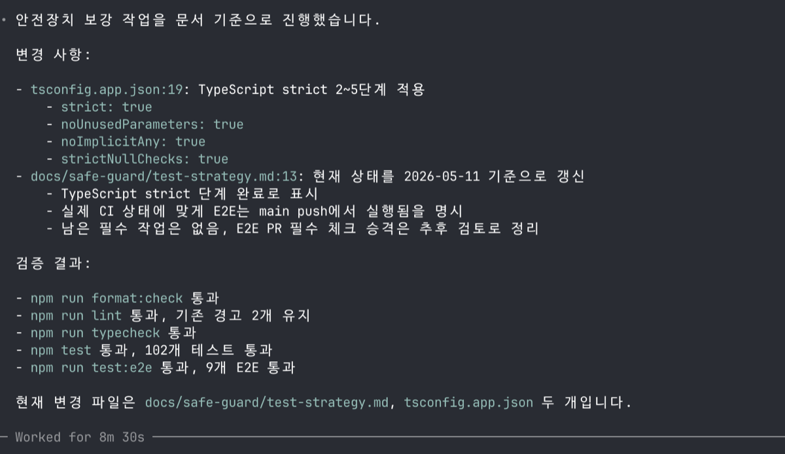
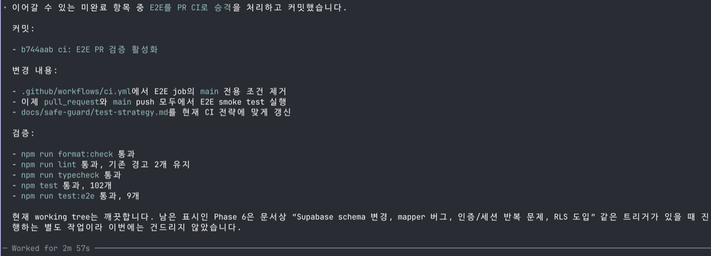
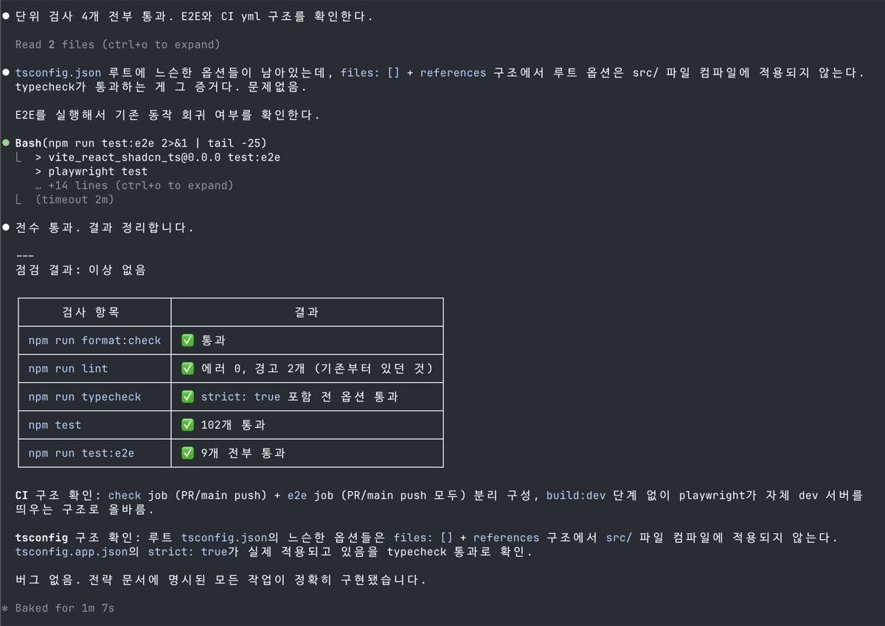
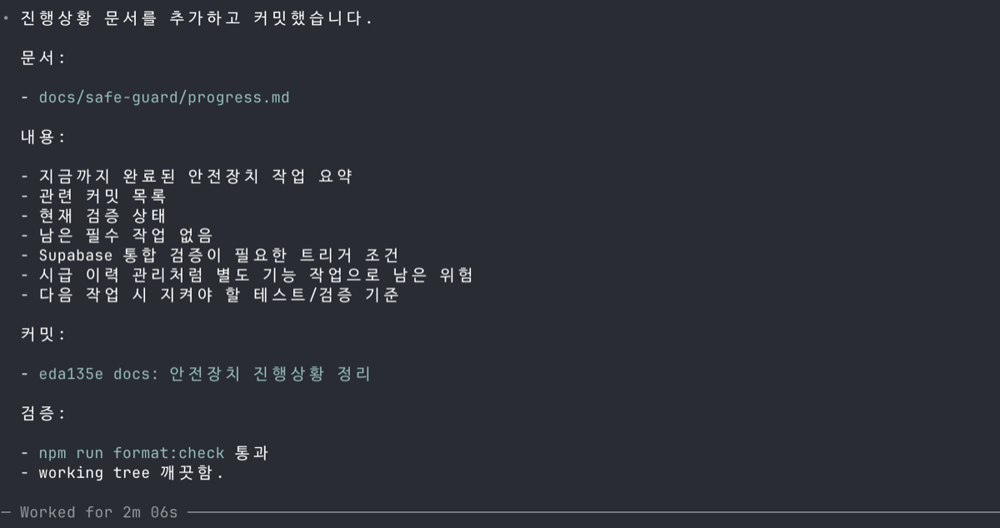
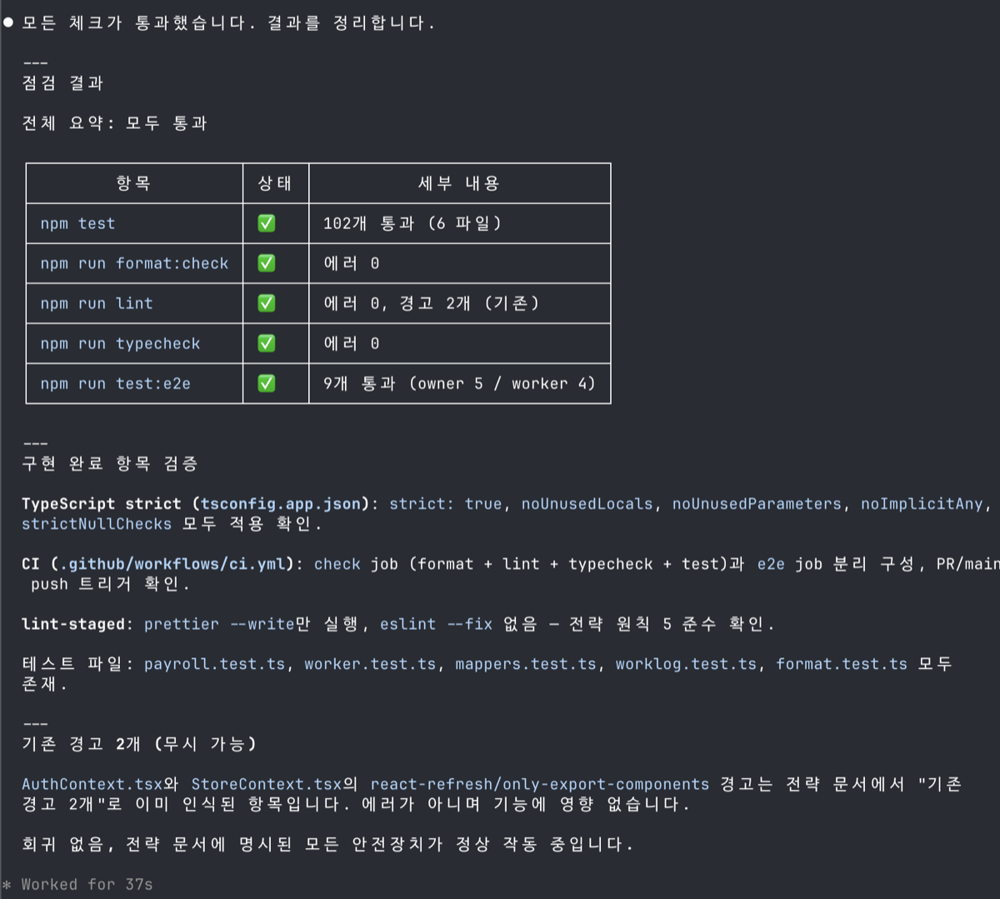
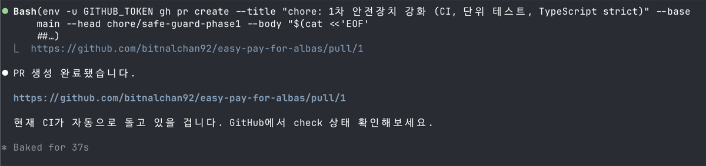
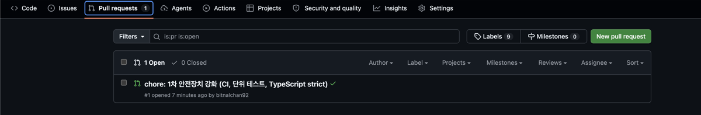
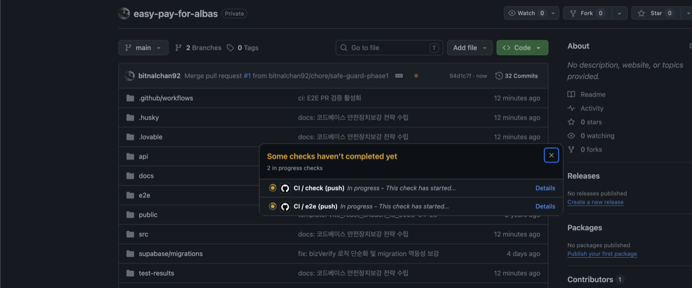
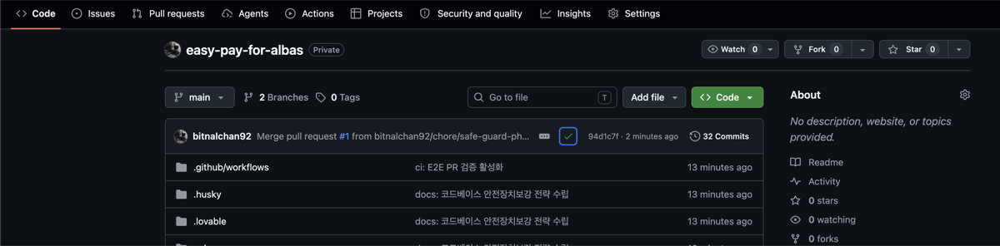
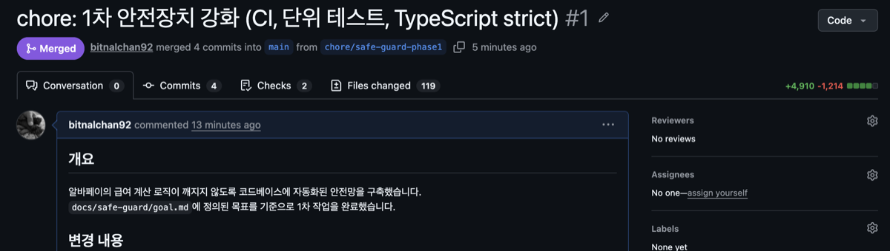

참고 영상 : https://www.youtube.com/watch?v=AuRDl5FGx-s

> 🤵 : 강사님의 프롬프트는 이 이모티콘을 사용했고요~
>
> 🧠 : AI 응답은 이 이모티콘을 사용했습니다


# ep.3에 이어서...

53분 30초 이후 이어지는 내용을 강사님을 따라 하며 제가 받은 결과물들을 포스팅하려 합니다.

> 강사님은 이미 이 코드베이스에 대해 어느 정도 이해도가 있으니 바로바로 툭툭 넘어가는데, 코드베이스에 대한 이해가 부족하다면 AI가 해준 답변을 그냥 넘어가지 말고 제대로 다시 한번 물어보고 진행해야 합니다.

- 클로드에게 마지막 검증을 맡겼으니, 클로드가 참고했던 `docs/safe-guard/test-strategy-codex.md`는 지우고 다음 작업을 진행합니다. 마지막으로 검증돼 추가된 파일이 `docs/safe-guard/test-strategy-claude.md`인데 이 파일의 이름을 `docs/safe-guard/test-strategy.md`로 변경합니다.

````markdown
---
title: 안전장치 강화 테스트 전략
created: 2026-05-09
updated: 2026-05-09
---

# 안전장치 강화 테스트 전략

> `goal.md`와 이 문서만으로 안전장치 강화 작업을 시작할 수 있어야 한다.

---

## 현재 상태 (2026-05-09 기준)

| 항목                   | 상태                                                               |
| ---------------------- | ------------------------------------------------------------------ |
| 단위 테스트            | **102개 통과** (`npm test`)                                        |
| E2E 테스트             | 9개 (owner 5 / worker 4), 로컬 실행 가능                           |
| `npm run format:check` | 통과                                                               |
| `npm run lint`         | 통과 (에러 0, 기존 경고 2개)                                       |
| `npm run typecheck`    | 통과                                                               |
| CI                     | **추가됨** — `.github/workflows/ci.yml` (PR/push 시 자동 실행)     |
| TypeScript strict      | `noUnusedLocals: true` 적용, 나머지 strict 옵션은 단계적 진행 예정 |
| pre-commit hook        | `npx lint-staged` → `prettier --write` (staged files)              |

**현황 진단**: 1차 안전장치 작업(lint 정리, CI 추가, 비즈니스 규칙 테스트 명문화, mapper 테스트 추가, TypeScript strict 1단계)은 완료됐다. 남은 작업은 TypeScript strict 2~5단계 진행이다.

---

## 전략 원칙

### 원칙 1. 게이트가 먼저다

테스트가 있어도 CI와 pre-commit에서 강제되지 않으면 안전장치가 아니다. 검증 명령이 안정적으로 통과하는 상태를 만든 뒤 CI로 자동화한다.

### 원칙 2. 단위 테스트는 비즈니스 명세다

테스트 이름만 읽어도 이 앱의 업무 규칙이 이해되어야 한다.

```ts
// 좋은 테스트 이름
it("승인된 근무일지만 이번 달 급여에 포함한다");
it("익일 마감이어도 시작 date 기준 월로 분류한다");
it("같은 worker + period에 지급 내역이 있으면 중복 지급을 막는다");

// 피해야 할 이름
it("filterApprovedWorklogsForPeriod returns filtered array");
it("calculatePayForWorker calls calculateTotalHours");
```

### 원칙 3. E2E는 smoke test다

E2E는 "사업주/알바생의 핵심 흐름이 브라우저에서 깨지지 않는다"를 보장하는 수준에 제한한다. 현재 E2E는 Supabase 없이 localStorage 시드 기반으로 실행하며, 이는 DB 통합 검증이 아니다. 급여 계산 edge case, 시간 유효성, 중복 지급 판단은 단위 테스트에서만 검증한다.

### 원칙 4. TypeScript strict는 단계적으로 강화한다

strict 옵션을 한 번에 켜면 대량 타입 오류가 터지고, 그 수정이 안전장치 작업 자체를 위험하게 만든다. 한 단계씩 올리고, 단계마다 typecheck + test를 통과시킨다.

### 원칙 5. pre-commit은 포맷만, ESLint 전체 검사는 CI에서

pre-commit에서 `eslint --fix`를 실행하면 partial fix 후 ESLint가 여전히 에러를 남길 때 오류 상태의 파일이 그대로 커밋된다. pre-commit은 `prettier --write`만 실행하고, ESLint는 CI에서 전체를 검사한다.

---

## 작업 범위

### 1차 작업 완료 항목 (2026-05-09)

- ✅ lint 실패 해결 (`npm run format` 실행, Prettier 에러 18개 → 0개)
- ✅ lint-staged에서 `eslint --fix` 제거 (`prettier --write`만 실행)
- ✅ GitHub Actions CI 추가 (`.github/workflows/ci.yml`)
- ✅ 비즈니스 규칙 단위 테스트 보강
  - `payroll.test.ts`: 시급 정책 테스트 이름 수정, 중복 지급 정책 테스트 추가
  - `worker.test.ts`: 최저시급 보정 정책 테스트 추가
  - `mappers.test.ts`: 신규 생성 (20개)
- ✅ TypeScript strict 1단계: `noUnusedLocals: true` 적용

### 남은 작업

- TypeScript strict 2~5단계 진행 (별도 PR로)
- E2E를 main push CI에 정식 등록 (E2E 안정화 확인 후)

### 전체 작업에서 제외

- 모든 화면의 E2E 테스트 추가
- Supabase 실 DB를 붙인 통합 테스트
- DB migration 또는 RLS 재설계
- UI 컴포넌트 단위 테스트
- 커버리지 퍼센트 목표 강제

---

## 구현 계획

### ✅ Phase 1. lint 초록색으로 만들기 (완료)

**수행한 작업**:

```bash
npm run format  # Prettier 에러 18개 자동 수정
```

`package.json` lint-staged 수정 — `eslint --fix` 제거:

```json
{
  "lint-staged": {
    "*.{ts,tsx,js,json,css,md}": ["prettier --write"]
  }
}
```

ESLint는 CI에서만 전체 검사한다. pre-commit은 Prettier 자동 포맷에 집중한다.

**결과**: `npm run format:check`, `npm run lint`, `npm run typecheck`, `npm test` 전부 통과.

---

### ✅ Phase 2. GitHub Actions CI 추가 (완료)

`.github/workflows/ci.yml` 생성 완료. PR과 main push마다 자동 실행된다.

```yaml
name: CI

on:
  pull_request:
  push:
    branches:
      - main

jobs:
  check:
    runs-on: ubuntu-latest
    steps:
      - uses: actions/checkout@v4
      - uses: actions/setup-node@v4
        with:
          node-version: 22
          cache: npm
      - run: npm ci
      - run: npm run format:check
      - run: npm run lint
      - run: npm run typecheck
      - run: npm test

  e2e:
    runs-on: ubuntu-latest
    if: github.ref == 'refs/heads/main'
    steps:
      - uses: actions/checkout@v4
      - uses: actions/setup-node@v4
        with:
          node-version: 22
          cache: npm
      - run: npm ci
      - run: npx playwright install --with-deps chromium
      - run: npm run test:e2e
```

**E2E CI 전략**: E2E는 PR 필수로 넣지 않는다. main push에서만 별도 job으로 실행한다.
이유: E2E는 selector 하나에도 깨질 수 있어서, PR마다 필수로 걸면 개발 속도를 크게 떨어뜨린다.
E2E가 충분히 안정화되면 PR job으로 승격한다.

**주의**: `playwright.config.ts`의 `webServer` 설정이 `npx vite --port 4173`을 자동 실행하므로, CI에서 별도 빌드 단계는 필요 없다.

---

### ✅ Phase 3. 비즈니스 규칙 단위 테스트 보강 (완료)

**목표**: 금전적으로 위험한 정책을 테스트 명세로 고정하고, DB 연동 취약점인 mapper도 테스트로 잡는다.

#### 3-A. 급여 계산 정책 명문화 (`payroll.test.ts`)

**수정한 항목**: 기존 테스트 이름 `"시급 변경은 이미 기록된 근무일지 계산에 영향을 주지 않는다"` 를 수정했다.
`calculatePayForWorker`는 시급을 파라미터로 받으므로, 시급이 바뀌면 결과가 달라지는 것이 정상이다.
실제 정책 위험은 다른 곳에 있다: StoreContext가 지급 시점의 `getEffectiveHourlyWage`를 계산해 넘기므로, 시급이 변경되면 같은 period를 다시 계산했을 때 이전 지급금액과 달라질 수 있다. 이 함수 수준에서 해결할 수 없는 문제이므로, 테스트 이름을 현재 정책을 정확히 반영하도록 수정했다.

```ts
// 수정 전 (오해를 유발하는 이름)
it("시급 변경은 이미 기록된 근무일지 계산에 영향을 주지 않는다");

// 수정 후 (정책을 정확히 서술)
it(
  "현재 정책: 급여 계산은 호출 시점에 전달된 시급을 사용하므로, 시급이 바뀌면 같은 기간 재계산 결과가 달라진다"
);
```

**추가한 테스트**:

```ts
it("지급 완료 후 같은 period에 추가 승인된 근무일지가 생겨도 중복 지급 대상으로 본다");
// 현재 정책: workerId + period 단위로만 체크하므로, 지급 후 근무일지가 추가 승인돼도 막힌다
```

#### 3-B. 시급 결정 정책 명문화 (`worker.test.ts`)

**추가한 테스트**:

```ts
it(
  "worker 시급이 최저시급보다 낮아도 계산 함수는 보정하지 않는다 — 최저시급 미만 방어는 UI 입력 단계의 역할이다"
);
```

최저시급 미만 입력은 UI 입력 단계에서 막는 것이 원칙이며, 계산 함수가 조용히 보정하지 않음을 명시한다.

#### 3-C. mapper 단위 테스트 신규 추가 (`src/test/mappers.test.ts`)

`src/lib/mappers.ts`는 Supabase DB row를 TypeScript 타입으로 변환한다. 컬럼명이 바뀌거나 null 처리가 틀리면 앱 전체가 조용히 깨진다.

각 테스트는 실제 Supabase row 모양의 fixture를 입력으로 사용한다:

```ts
const rawWorklogRow = {
  id: "wl_1",
  worker_id: "worker_1",
  workplace_id: "wp_1",
  date: "2026-05-07",
  end_date: null,
  start_time: "09:00:00", // DB는 HH:MM:SS, 앱은 HH:MM
  end_time: "18:00:00",
  memo: null,
  rejection_reason: null,
  status: "approved",
};
```

검증하는 핵심 항목:

- snake_case → camelCase 변환 정확성
- null → undefined 변환 (optional 필드)
- null → null 유지 (nullable 필드)
- `start_time`/`end_time` HH:MM:SS → HH:MM 슬라이스
- `end_date: null`이면 `endDate`를 `date`와 같은 값으로 설정

---

### ✅ Phase 4. E2E smoke test 안정적 유지 (완료)

현재 E2E 9개는 로컬에서 통과한다. 앞으로 유지할 원칙만 명확히 한다.

**유지할 사업주 happy path (5개)**:

- `/`에서 세션 복원 후 `/owner`로 이동
- 사업주 홈에 사업장명과 지급 예정액 표시
- 대기 중인 근무일지 승인 가능
- 급여 지급 예정액 확인 가능
- 급여 지급 후 지급 완료 상태 표시

**유지할 알바생 happy path (4개)**:

- `/`에서 세션 복원 후 `/worker`로 이동
- 알바생 홈에 소속 사업장과 예상 급여 표시
- 근무일지 작성 및 제출 가능
- 제출한 근무일지의 대기 상태 확인 가능

**E2E 작성 규칙**:

- role 기반 selector 우선 (`getByRole`, `getByText`)
- localStorage seed는 `page.addInitScript`로 React 초기화 전에 주입
- Supabase 환경변수 없이 실행 — 외부 DB 상태와 분리 (`playwright.config.ts`의 `webServer` 설정이 자동 처리)
- 도메인 edge case(급여 계산, 시간 유효성, 중복 지급)는 E2E에 넣지 않음

**로컬 실행**: `npm run test:e2e` 한 줄이면 된다. `playwright.config.ts`가 Supabase 없는 vite 개발 서버를 자동으로 띄운다.

---

### 🔲 Phase 5. TypeScript strict 점진 강화 (진행 중 — 1단계 완료)

**목표**: 타입 시스템이 실제 안전망 역할을 하도록 만든다.

**대상 파일**: `tsconfig.app.json` (src/ 코드에 적용되는 config)

**진행 순서** (각 단계마다 `npm run typecheck && npm test` 통과 확인, 별도 commit):

| 단계 | 옵션                         | 상태                 |
| ---- | ---------------------------- | -------------------- |
| 1    | `"noUnusedLocals": true`     | ✅ 완료              |
| 2    | `"noUnusedParameters": true` | 🔲                   |
| 3    | `"noImplicitAny": true`      | 🔲 변경량 클 수 있음 |
| 4    | `"strictNullChecks": true`   | 🔲 변경량 클 수 있음 |
| 5    | `"strict": true`             | 🔲                   |

**각 단계 작업 원칙**:

- typecheck 실패한 오류만 최소한으로 수정한다
- 주변 코드를 리팩토링하지 않는다
- `as any`로 우회하지 않는다 — 타입 오류가 의미 있는 버그일 수 있다
- localStorage parse 결과, Supabase row 등 외부 입력은 mapper를 통과시키거나 명시적으로 검증한다

---

### 🔲 Phase 6. Supabase 통합 검증 (트리거 기반 별도 작업)

다음 조건 중 하나가 발생하면 별도 작업으로 진행한다. 현재 필수 범위가 아니다.

- Supabase schema 컬럼명이 변경된다
- mapper 관련 버그가 실제로 발생한다
- 인증/세션 문제가 QA에서 반복된다
- RLS 정책이 도입된다

검증 방법 후보 (조건 발생 시 선택):

- 테스트용 Supabase 프로젝트를 사용한 통합 테스트
- 배포 환경변수 검증 스크립트
- API route handler 단위 테스트

---

## 로컬 vs CI 역할 분리

| 구간            | 역할                              | 명령                                   |
| --------------- | --------------------------------- | -------------------------------------- |
| pre-commit      | Prettier 자동 포맷 적용           | `prettier --write` (staged files)      |
| 로컬 개발       | 빠른 단위 검증                    | `npm run test:watch`                   |
| PR 전 로컬 확인 | 전체 검증                         | 아래 5개 명령                          |
| CI (PR/push)    | 자동 게이트                       | format:check + lint + typecheck + test |
| E2E             | main push 시 자동, 또는 로컬 수동 | `npm run test:e2e`                     |

**PR 전 로컬 확인 명령 (5개 모두 통과해야 CI도 통과)**:

```bash
npm run format:check
npm run lint
npm run typecheck
npm test
npm run test:e2e
```

---

## 테스트 추가 기준

새 기능을 추가할 때 아래 기준으로 테스트 위치를 결정한다.

### 단위 테스트를 작성해야 하는 경우

- 급여 금액이 달라질 수 있는 로직
- 근무 시간 계산이 달라질 수 있는 로직
- 승인/반려/대기 상태 판단
- 중복 지급 여부 판단
- worker와 workplace의 관계 판단
- Supabase row → 앱 타입 변환 (mapper)
- 날짜, 기간, 월 경계 판단

### E2E 테스트를 추가해야 하는 경우

- 사용자가 반드시 완료해야 하는 핵심 흐름이 새로 생긴 경우
- 라우팅, 세션 복원, 화면 간 이동이 핵심인 기능
- 단위 테스트로는 검증하기 어려운 브라우저 상태 변화

### 테스트를 추가하지 않아도 되는 경우

- 단순 문구 변경
- 시각적 간격 조정
- shadcn/ui 컴포넌트의 내부 동작
- 테스트된 순수 함수를 단순히 화면에 표시하는 얇은 UI 변경

---

## 위험도별 우선순위

### P0. 반드시 자동화해야 하는 영역 (테스트 존재, 유지 필수)

- 급여 계산 금액 (`calculatePay`, `calculatePayForWorker`)
- 승인된 근무만 급여에 포함하는 규칙 (`filterApprovedWorklogsForPeriod`)
- workerId별 근무 분리
- period별 지급 분리
- 중복 지급 방지 (`isAlreadyPaidForPeriod`)
- 익일 마감과 월 경계 처리

### P1. 1차 작업에서 보강 완료

- 시급 결정 우선순위 명문화 (worker → workplace → 최저시급)
- `calculatePayForWorker` 시급 정책 테스트 이름 수정
- 지급 후 추가 승인 근무의 중복 지급 정책 명문화
- mapper 변환 정확성 (`mappers.test.ts` 신규)
- 시간 입력 유효성 (`validateWorklogTime`)
- worker 상태 판단

### P2. 필요할 때 추가하는 영역

- 상세 UI 컴포넌트 동작
- 빈 상태 화면 렌더링
- Supabase 네트워크 실패 처리
- API timeout/retry

---

## 이 전략이 달성하는 것과 달성하지 못하는 것

### 달성하는 것

- 급여 계산 로직의 핵심 규칙이 코드가 아닌 테스트로 명문화된다
- 코드 수정 시 CI가 자동으로 회귀를 감지한다
- Supabase row → 앱 타입 변환 오류를 DB 없이 잡을 수 있다
- 브라우저 수준의 기본 사용자 흐름이 깨지지 않음을 smoke test로 보장한다

### 달성하지 못하는 것

- Supabase 실 DB와의 통합 오류 (RLS, 네트워크, 인증 흐름)
- 배포 환경변수 누락 문제
- 시급 이력 관리 — 지급 시점 이후 시급이 변경되면 재계산 결과가 달라지는 문제. 이는 `Worklog`에 당시 시급을 저장하는 스키마 변경이 필요한 별도 기능 작업이다

````


# 코드베이스 보강하기

```markdown
🤵
docs/safe-guard/goal.md와 docs/safe-guard/test-strategy.md 문서를 참고해서, 이 프로젝트의 안전장치를 보강하자. 문서 내용을 정확히 파악한 뒤 오차 없이 하나하나 진행해라. 

context가 모자라지 않도록 적절한 최적화 기법을 사용하며 진행하라. 
```




```markdown
🤵
좋아. 기존에 정의했던 규칙에 맞게 commit도 잘 해두자. 참고로 커밋 메시지는 최근의 것들을 참고해서 알아서 잘 어색하지 않고 잘 어우러지게 작성해줘. 
```

> 요즘 하네스를 어떻게 만들지 고민을 많이 하는데, 이렇게 안전장치를 여러 개 잘 만들어 두는 게 더 선행되어야 한다. 코드베이스가 안전하지 않은 상태에서 하네스를 깎아도 크게 의미가 없다고 생각한다.
>
> 코드베이스의 문제를 과도한 프롬프트나 과도한 검증 루프로 덮어버릴 가능성이 크다. 코드베이스가 더럽다는 이유로 너무 기괴하고 거대한 토큰을 잡아먹는 괴물이 탄생할지도 모른다.


```markdown
🤵
좋아. 그럼 이제 완수하지 않은 작업들을 이어서 하자. 적절한 시점에 커밋도 하고, 검증도 잘 해라.
```




> 애초에 설계나 전략 문서를 디테일하게 작성해서, 이 작성 시점에 내가 줄 수 있는 의견을 최대한 담아 놓은 상태에서 시작하면, 이후 구현 단계에서는 딱히 검증할 게 없도록 만드는 게 포인트다.


# 클로드에게 검토 요청

이전 단계에서 코덱스가 `goal.md`와 `test-strategy.md`를 토대로 구현한 결과물이 문서에 명시된 조건을 충족하는지 클로드에게 검토를 요청한다.

```markdown
🤵
@docs/safe-guard/goal.md와 @docs/safe-guard/test-strategy.md에 명시된 작업을 진행하였다. 진행했던 내용은 commit history를 참고하면 된다. 

이들이 정확히 구현되었으며, 기존 작동에 버그를 만들지는 않았는지 점검을 부탁합니다.
```




# 코덱스에서 마무리 작업 진행하기

```markdown
🤵
좋아. 지금까지의 진행 상황과 남은 작업들에 대한 설명을 별도 문서로 남겨두자. 
```




## 클로드의 마지막 점검

```markdown
🤵
@docs/safe-guard/goal.md 와 @docs/safe-guard/test-strategy.md 에 명시된 작업을 진행하였다. 진행했던 내용은 commit history를 참고하면 된다.

이들이 정확히 구현되었으며, 기존 작동에 버그를 만들지는 않았는지 점검을 부탁합니다.
```




# 신규 PR

```markdown
🤵
지금까지 @docs/safe-guard/goal.md, @docs/safe-guard/test-strategy.md에 따라 작업을 해왔다. 신규 브랜치를 만들고, 한 작업에 대한 PR을 생성하자. 
```






## main에 merge






# 마무리하며...



결과물로 4,910줄이 추가되고 1,214줄이 삭제되었다.

사실 코드베이스를 조금 안정화하는 첫 번째 작업이 완료된 것이고, 저 정도 라인이 추가되어 main에 머지됐을 때 서비스가 안정적으로 돌아갈 거라 보장할 수는 없다. 몇 가지 안전장치를 더 두어야 한다고 강사님이 말씀하셨는데, 아마 다음 라이브 때 이곳에서 이어서 이를 좀 더 강화하는 영상을 해주실 것 같다. 그때 좀 더 보강하며 기능을 붙여보고자 하고, 오늘 적용한 것들을 활용해서 기능을 계속 이어나가 보겠다. 감사합니다, 강사님~
