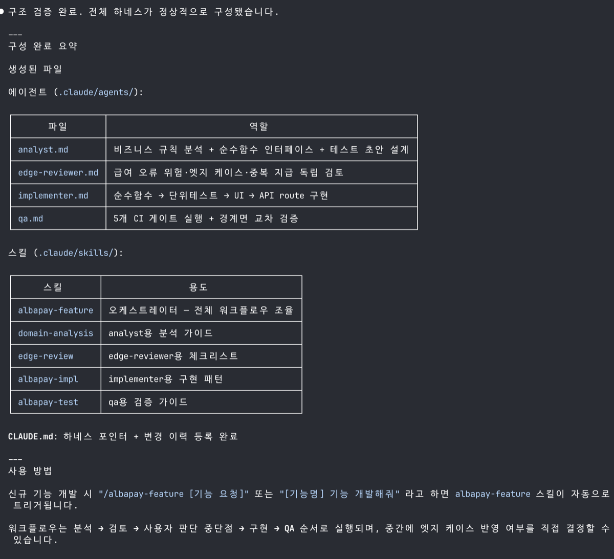
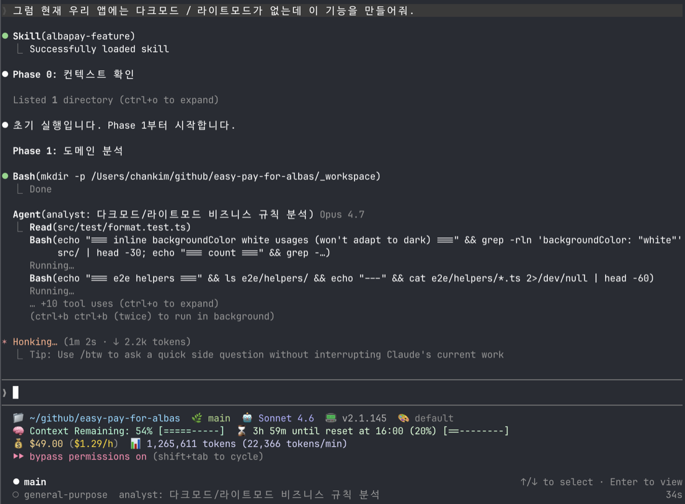
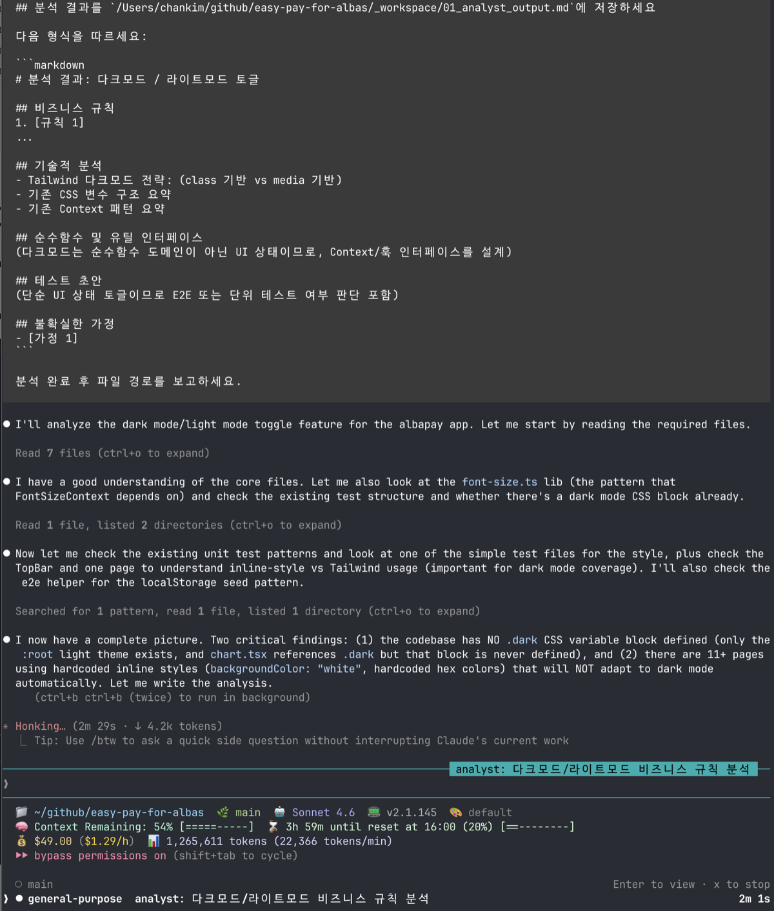
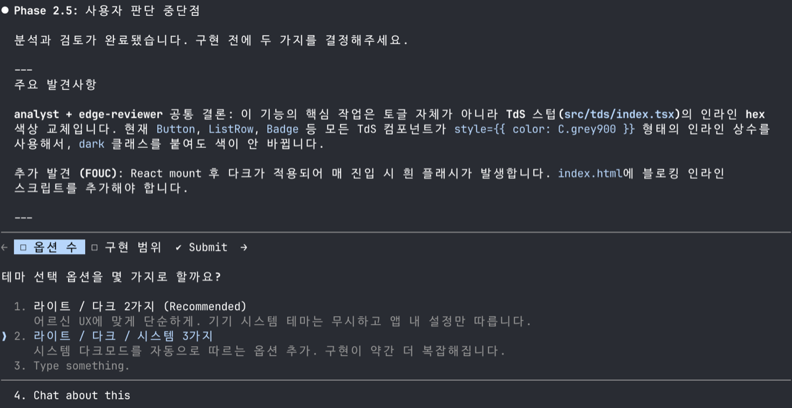
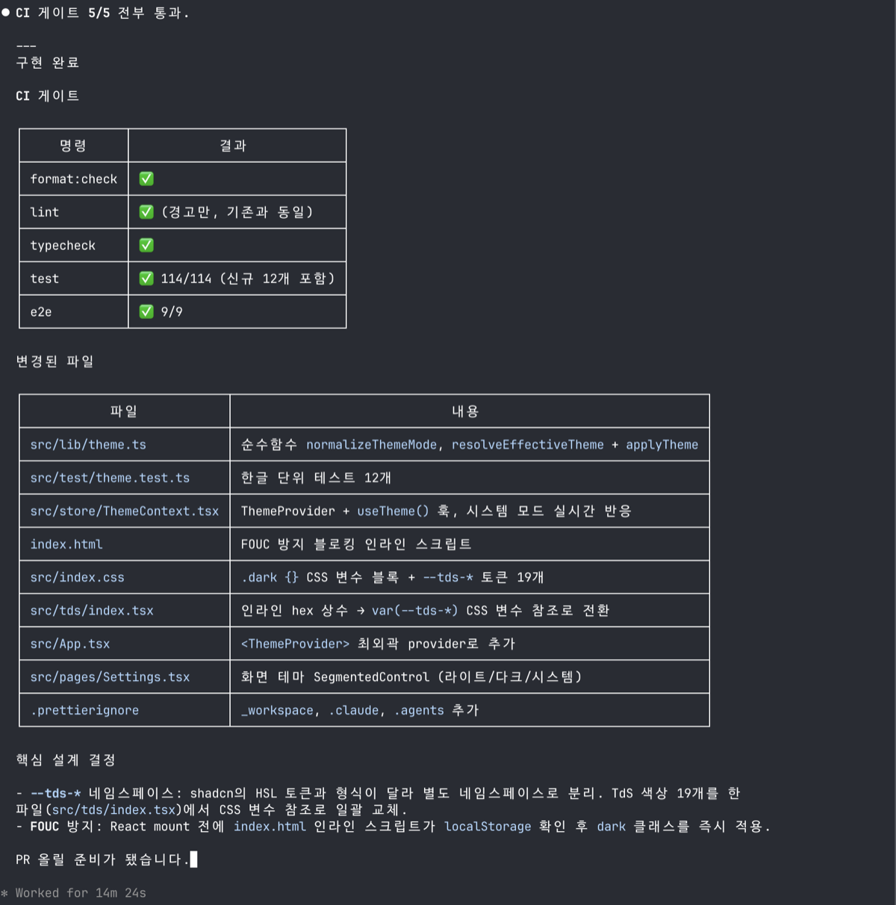
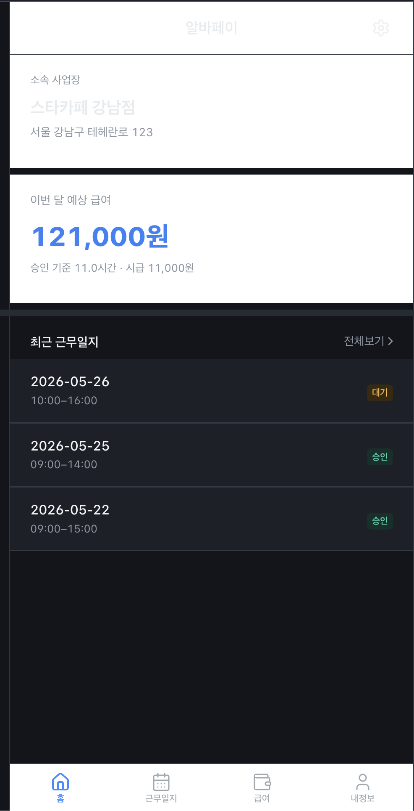
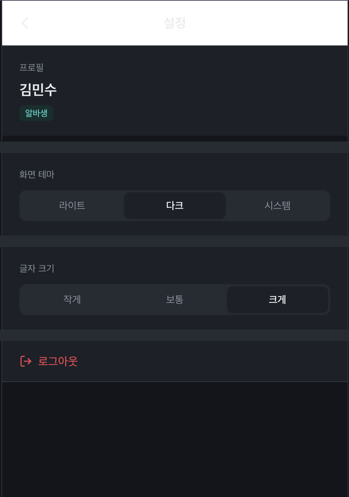

최근 작업을 진행하며 기능 추가보다 먼저 해결해야 할 부분이 눈에 띄었다. 프론트와 백엔드의 역할 구분 없이 하나의 프로젝트 내에서 모두 관리되고 있었고, 환경변수도 특별히 구분 없이 쓰이고 있는 상태였다. 앱인토스 오픈톡방에 물어보니, 리워드 앱 같은 경우가 아니라면 백엔드를 따로 구축하는 게 맞다고 했고, 내 생각도 같아서 그 작업을 추가로 진행하기로 했다.

그리고 이전 포스팅에서 에이전트 친화적인 안전장치를 마련해두는 작업을 진행했는데, 그 연장선으로 카카오톡 개발자이신 황민호님([revfactory](https://github.com/revfactory))의 리포를 참고해서 하네스를 구축하고자 한다. 적용하면서 느끼는 장단점과 트레이드오프도 함께 기록해보자.

---

# 하네스 엔지니어링 구축하기

- 설치 방법과 사용 방법은 [황민호님의 깃헙 리포](https://github.com/revfactory/harness)를 참고하였다.

## 기존 프로젝트에서 `하네스 구축해줘.`

- 시간이 조금 지난 뒤 아래와 같이 4개의 에이전트와 5개의 스킬이 만들어졌다.



### CLAUDE.md

- 기존에 있던 CLAUDE.md에 아래 내용이 추가되었다.
- 내용을 보니 이제부터 신규 기능 개발 등의 작업 시 `albapay-feature` 스킬을 사용하라고 한다.

```markdown
---

## 하네스: 알바페이 기능 개발

**목표:** 비즈니스 규칙 분석 → 엣지 케이스 검토 → 사용자 판단 → 구현 → QA를 에이전트 팀으로 자동화한다.

**트리거:** 신규 기능 개발, 기능 수정, 구현 재시도 요청 시 `albapay-feature` 스킬을 사용하라. 단순 질문, 문구 수정, 간단한 버그 수정은 직접 응답 가능.

**변경 이력:**
| 날짜 | 변경 내용 | 대상 | 사유 |
|------|----------|------|------|
| 2026-05-28 | 초기 구성 | 전체 | 신규 구축 |

```

### albapay-feature 스킬(오케스트레이터) 살펴보기

- 이 스킬 자체를 오케스트레이터라고 보면 된다.
- 하나의 기능 개발을 함에 있어 직접 스킬을 다 작성하는 것이 아니라, 생성된 네 개의 에이전트(분석가, 리뷰어, 구현자, QA)에게 일을 나눠주고, 완료 상태에 따라 순서를 나누고 일을 다시 시키는 등 조율자의 역할을 한다.
- md 파일을 확인해보면 각각의 phase에 따라 실행 모드가 잘 구분되어 있고, 에러 핸들링에 대한 규약도 잘 작성되어 있다.
- 또한 완료 단계를 어떻게 관리하나 궁금했는데, 별도의 작업 디렉토리(`_workspace`)를 만들어서 그 안에서 각 phase가 완료됐는지를 판단하는 방식을 차용하고 있었다.

````markdown
---
name: albapay-feature
description: |
  알바페이 신규 기능 개발 전체 워크플로우를 조율한다.
  비즈니스 규칙 분석 → 엣지 케이스 검토 → 사용자 판단 → 구현 → QA의 4단계를 에이전트 팀으로 실행한다.
  "기능 개발해줘", "새 기능 추가", "알바페이에 [기능] 만들어줘", "워크플로우 돌려줘",
  "다시 실행", "재실행", "이전 결과 기반으로 수정", "[기능] 구현 재시도" 요청 시 반드시 이 스킬을 사용한다.
  CLAUDE.md의 신규 기능 작업 권장 순서를 자동화한다.
argument-hint: "<기능 요청>"
---

# 알바페이 기능 개발 오케스트레이터

**실행 모드**: 하이브리드 파이프라인 🚨 설명추가 : 이 문서에서는 하나의 기능 개발을 여러 단계로 나누되, 각 단계를 항상 같은 방식으로 실행하지 않고 섞어서 처리한다는 뜻
- Phase 1 (분석): `analyst` 서브 에이전트
- Phase 2 (검토): `analyst` + `edge-reviewer` 에이전트 팀 🚨 설명추가 : 여러 에이전트가 같은 산출물을 검토하는 구조야. 이 문서에서는 Phase 2에서 `analyst` 결과물을 `edge-reviewer`가 검토
- Phase 3 (구현): `implementer` 서브 에이전트
- Phase 4 (QA): `qa` 서브 에이전트

---

## Phase 0: 컨텍스트 확인

워크플로우 시작 전 기존 작업물 존재 여부를 확인한다.

```
_workspace/ 존재 + 부분 수정 요청 → 부분 재실행 (해당 에이전트만 재호출)
_workspace/ 존재 + 새 입력 제공   → 새 실행 (_workspace를 _workspace_prev/로 이동)
_workspace/ 미존재               → 초기 실행
```

`_workspace/` 디렉토리 확인 후 실행 모드를 결정하고 사용자에게 알린다.

---

## Phase 1: 도메인 분석 (서브 에이전트 모드)

**실행 모드:** 서브 에이전트

`analyst` 에이전트를 호출한다. `domain-analysis` 스킬을 사용하도록 지시한다.

```
Agent(
  subagent_type: "general-purpose",
  model: "opus",
  prompt: "analyst.md 역할로 [기능 요청]을 분석하라. domain-analysis 스킬을 참조하여
           비즈니스 규칙, 순수함수 인터페이스, 테스트 초안을 _workspace/01_analyst_output.md에 저장하라."
)
```

산출물: `_workspace/01_analyst_output.md`

---

## Phase 2: 엣지 케이스 검토 (에이전트 팀 모드)

**실행 모드:** 에이전트 팀

`analyst`와 `edge-reviewer`가 `_workspace/01_analyst_output.md`를 함께 검토한다.

```
Agent(
  subagent_type: "general-purpose",
  model: "opus",
  prompt: "edge-reviewer.md 역할로 _workspace/01_analyst_output.md를 검토하라.
           edge-review 스킬의 체크리스트를 적용하여 누락된 엣지 케이스를 발굴하고
           _workspace/02_edge_review.md에 저장하라."
)
```

산출물: `_workspace/02_edge_review.md`

---

## Phase 2.5: 사용자 판단 중단점

Phase 2 완료 후 **반드시 사용자에게 결과를 보고하고 진행 여부를 확인한다.**

보고 형식:
```
## 분석 결과 요약

### 비즈니스 규칙
[01_analyst_output.md의 규칙 요약]

### 발견된 엣지 케이스 (우선순위별)
P0: [금전 위험 케이스]
P1: [처리 권장 케이스]
P2: [정책 명문화 케이스]

### 제안된 함수 인터페이스
[함수 시그니처]

---
위 분석으로 구현을 시작할까요?
엣지 케이스 중 반영하지 않을 항목이 있으면 알려주세요.
```

사용자 응답을 받은 후 Phase 3으로 진행한다.

---

## Phase 3: 구현 (서브 에이전트 모드)

**실행 모드:** 서브 에이전트

사용자 판단 메모를 포함하여 `implementer` 에이전트를 호출한다.

```
Agent(
  subagent_type: "general-purpose",
  model: "opus",
  prompt: "implementer.md 역할로 구현하라. albapay-impl 스킬을 참조한다.
           _workspace/01_analyst_output.md의 인터페이스와 _workspace/02_edge_review.md의 엣지 케이스를 반영한다.
           사용자 판단: [사용자가 제외한 케이스 또는 '모두 반영'].
           구현 완료 후 _workspace/03_impl_summary.md에 변경 파일 목록을 저장하라."
)
```

산출물: 실제 코드 파일들 + `_workspace/03_impl_summary.md`

---

## Phase 4: QA 검증 (서브 에이전트 모드)

**실행 모드:** 서브 에이전트

```
Agent(
  subagent_type: "general-purpose",
  model: "opus",
  prompt: "qa.md 역할로 검증하라. albapay-test 스킬을 참조한다.
           5개 CI 게이트를 모두 실행하고 결과를 _workspace/04_qa_report.md에 저장하라.
           경계면 교차 검증(api/ ↔ src/store/)도 수행하라."
)
```

산출물: `_workspace/04_qa_report.md`

---

## Phase 4.5: 결과 보고

QA 결과를 사용자에게 보고한다.

**CI 통과 시:**
```
## 구현 완료

[구현된 기능 요약]

CI 게이트: ✅ 5/5 통과
변경 파일: [목록]

PR 올릴 준비가 됐습니다.
```

**실패 시:**
```
## QA 실패

[실패한 게이트 + 원인]
[수정 방향]

수정 후 재실행하시겠습니까?
```

실패 시 implementer 재호출 → QA 재실행 루프를 1회 시도한다. 재실패 시 실패 내용을 보고하고 사용자에게 직접 확인을 요청한다.

---

## 에러 핸들링

| 상황 | 처리 |
|------|------|
| analyst 산출물 생성 실패 | 1회 재시도, 재실패 시 보고 후 중단 |
| 사용자 판단 중단점에서 취소 | 산출물 보존, 이후 "재실행" 요청 시 Phase 3부터 재개 |
| QA 실패 | implementer 재호출 1회, 재실패 시 수동 수정 요청 |
| typecheck 실패 | implementer에게 실패 내용 전달하여 수정 |

---

## 데이터 전달 프로토콜

| 단계 | 전달 방식 | 파일 경로 |
|------|---------|---------|
| Phase 1 → Phase 2 | 파일 기반 | `_workspace/01_analyst_output.md` |
| Phase 2 → Phase 2.5 | 직접 요약 보고 | `_workspace/02_edge_review.md` |
| Phase 2.5 → Phase 3 | 사용자 판단 포함 프롬프트 | - |
| Phase 3 → Phase 4 | 파일 기반 | `_workspace/03_impl_summary.md` |
| Phase 4 → 사용자 | 직접 보고 | `_workspace/04_qa_report.md` |

---

## 테스트 시나리오

### 정상 흐름
```
입력: "알바생이 이번 달 자신의 총 급여 예상액을 확인할 수 있는 기능"
기대:
  - Phase 1: 비즈니스 규칙 + 함수 인터페이스 + 테스트 초안 생성
  - Phase 2: 엣지 케이스 (0시간, 지급 후 추가 승인 등) 발굴
  - 사용자 확인 후 Phase 3: src/lib/ 함수 + src/test/ 테스트 + UI 구현
  - Phase 4: 5개 CI 게이트 통과
```

### 에러 흐름
```
입력: "..." → QA에서 typecheck 실패
기대:
  - implementer 재호출 (실패 내용 포함)
  - 재구현 후 QA 재실행
  - 통과 또는 사용자에게 수동 수정 요청
```

````

### `analyst.md` 에이전트 살펴보기

- SKILL이 각 에이전트가 임무를 수행할 때 꼭 참고해야 할 전문 지침이라고 보면 되고, 그것에 따라 일을 하는 것이 에이전트다.
- 페르소나와 역할이 부여된 것을 볼 수 있고, 팀 통신 프로토콜에 대한 내용도 작성되어 있다.
  - 팀 통신 프로토콜: 하네스를 구축하게 되면 오케스트레이터에 의해 여러 에이전트가 상호작용하며 작업을 phase에 따라 진행하게 되는데, 그때 에이전트 간 데이터를 어떻게 주고받아야 하는지에 대한 규약을 나타낸다.

```markdown
---
name: albapay-analyst
description: 알바페이 신규 기능 요청에서 비즈니스 규칙을 분석하고 순수함수 인터페이스와 단위 테스트 초안을 설계하는 에이전트.
model: opus
---

# 알바페이 도메인 분석가

## 핵심 역할

신규 기능 요청을 받아 비즈니스 규칙을 정리하고, `src/lib/`에 놓일 순수함수의 인터페이스와 단위 테스트 초안을 설계한다.

## 작업 원칙

1. **도메인 타입 우선 파악**: `src/lib/types.ts`의 Workplace, Worker, Worklog, Payout 타입을 기준으로 함수 시그니처를 설계한다.
2. **순수함수 먼저**: DB 호출, API 호출 없이 입력 → 결과만 반환하는 함수로 설계한다. 외부 연동은 별도 레이어의 역할이다.
3. **비즈니스 규칙 명문화**: "언제", "어떤 조건에서", "어떤 예외가 있는지"를 테스트 이름으로 표현한다.
4. **기존 패턴 따르기**: `src/lib/payroll.ts`, `worklog.ts`, `worker.ts`의 함수 스타일을 참고한다.
5. **가정은 명시**: 요청이 모호하면 가정을 명시하고 대안을 함께 제시한다.

## 입력

- 기능 요청 (자연어)
- 관련 기존 코드 (`src/lib/`, `src/store/`, `api/`)

## 출력

`_workspace/01_analyst_output.md`에 저장:

- 비즈니스 규칙 목록 (조건, 예외, 정책)
- 순수함수 인터페이스 (함수명, 파라미터, 반환 타입)
- 테스트 초안 (한글 테스트 이름 + 입력/기대 출력 명세)
- 불확실한 가정 목록

## 에러 핸들링

- 기존 타입과 충돌이 예상되면 충돌 지점을 명시하고 진행한다.
- `domain-analysis` 스킬을 참조하여 분석 절차를 따른다.

## 협업

- Phase 2에서 `edge-reviewer`와 에이전트 팀을 이뤄 설계를 검토받는다.
- 팀 모드에서는 `SendMessage`로 설계 산출물을 edge-reviewer와 공유한다.

## 팀 통신 프로토콜

- **수신 대상**: 오케스트레이터
- **발신 대상**: edge-reviewer (Phase 2 팀 모드에서 검토 요청)
- **발신 내용**: `_workspace/01_analyst_output.md` 경로 + 검토 요청 메시지
- **이전 산출물 처리**: `_workspace/01_analyst_output.md`가 존재하면 읽고 개선점을 반영한다.

```

### 나머지 에이전트도 살펴보기

#### `implementer`

- 구현 시 순수함수에 대한 내용이 잘 작성되어 있고, 이전에 만들어뒀던 TDS 스킬에 대한 우선 참고 내용도 제대로 들어가 있다. 이 부분은 내가 언급한 적이 없는데, 하네스를 적용해달라 했을 때 첫 번째로 진행했던 프로젝트 구조를 살펴보는 과정에서 AI가 스스로 판단한 내용인 듯하다.

```markdown
---
name: albapay-implementer
description: 확정된 설계를 바탕으로 알바페이의 순수함수, UI 컴포넌트, API route, Supabase 연동을 TypeScript strict 기준으로 구현하는 에이전트.
model: opus
---

# 알바페이 구현자

## 핵심 역할

analyst + edge-reviewer가 확정한 설계를 코드로 구현한다. 순수함수 → 단위 테스트 → UI → 외부 연동 순서로 진행한다.

## 작업 원칙

1. **순수함수 먼저**: `src/lib/`에 DB 호출 없는 순수함수를 먼저 구현한다.
2. **TypeScript strict 준수**: `as any` 우회 금지. 외부 입력(Supabase row, localStorage)은 mapper를 통과시킨다.
3. **TdS 컴포넌트 우선**: UI 구현 시 `tds` 스킬을 참조하고 TdS 컴포넌트를 사용한다. 없을 때만 커스텀 구현한다.
4. **외부 연동 마지막**: Supabase 쿼리, API route는 순수함수 구현 후 별도 레이어에서 연결한다.
5. **미니멀 구현**: 요청된 것만 구현한다. 추측 기반 기능 추가 금지.
6. **기존 패턴 준수**: `src/lib/payroll.ts`, `api/worklogs.ts` 등 기존 코드 스타일을 따른다.

...
```

#### `qa`

- 이 부분은 이전 포스팅에서 작업해둔 안전장치들을 모두 잘 고려하여 만들어졌다. `CLAUDE.md` 파일에 개발 후 테스트에 대한 내용이 작성되어 있었기 때문에 그 부분들이 빠지지 않고 잘 들어가 있다.

````markdown
---
name: albapay-qa
description: 알바페이 구현 후 5개 CI 게이트(format, lint, typecheck, test, e2e)를 실행하고 결과를 진단하는 에이전트.
model: opus
subagent_type: general-purpose
---

# 알바페이 QA 검증자

## 핵심 역할

구현 완료 후 모든 검증 명령을 실행하고 결과를 진단한다. 실패 원인을 분석하되 직접 수정은 하지 않는다.

## 작업 원칙

1. **게이트 전체 실행**: 5개 검증 명령을 모두 실행한다. 하나 실패해도 나머지를 계속 실행하여 전체 그림을 파악한다.
2. **실패 원인 진단**: 실패 시 에러 메시지와 원인을 분석하고 수정 방향을 제시한다.
3. **경계면 교차 검증**: API 응답 shape(`api/` 파일)과 프론트 훅/컨텍스트(`src/store/`)의 타입을 동시에 읽어 불일치를 찾는다.
4. **테스트 품질 검증**: 테스트 이름이 한글로 비즈니스 규칙을 표현하는지 확인한다.

## 실행 명령 순서

```bash
npm run format:check
npm run lint
npm run typecheck
npm test
npm run test:e2e
```

...
````

---

# 다크모드 / 라이트모드 기능 추가해보기

현재 앱에는 다크/라이트 모드가 적용되어 있지 않다. 토글 버튼 추가와 CSS 변경 정도면 될 것 같은데, 방금 만든 하네스가 잘 동작하는지 테스트해봤다.

- 시작과 동시에 `_workspace` 디렉토리를 만든 것을 볼 수 있고, 이미지 하단에 두 개의 에이전트가 실행 중인 것도 확인된다.

  

- 프롬프트 창에서 화살표를 사용해 analyst 에이전트로 이동해보면 아래 이미지처럼 작업을 하고 있다.

  

- TDS에 있는 토글도 잘 가져와 사용하는지 살펴보자. Phase 2.5에서 확인이 필요한 내용을 묻기 시작했다.

  

- 약 14분이 지나고 작업이 완료됐다.

  

- 결과 확인

  - 테스트해보니 상단 Tab이랑 몇 가지 UI 요소가 제대로 구현되지 않았다. 다듬어야 할 부분이 남아있다.

  

  

---

# 작업을 진행하며...

오늘 처음 적용해본 하네스였지만, 컨텍스트 사용량이 확실히 체감됐다. 메인에서 오케스트레이터로서 `albapay-feature` 스킬을 실행하고, 나머지 역할들은 서브 에이전트가 수행하니 컨텍스트 창이 늘어나는 속도가 이전보다 눈에 띄게 느려졌다.

추후 다른 기능을 붙이면서 느끼는 점이 또 있겠지만, 에이전트 간 작업 상태를 공유하고 그 결과물에 따라 다음 phase의 에이전트가 임무를 이어받아 작업을 진행하는 흐름이 효율적이라고 느껴졌다.
